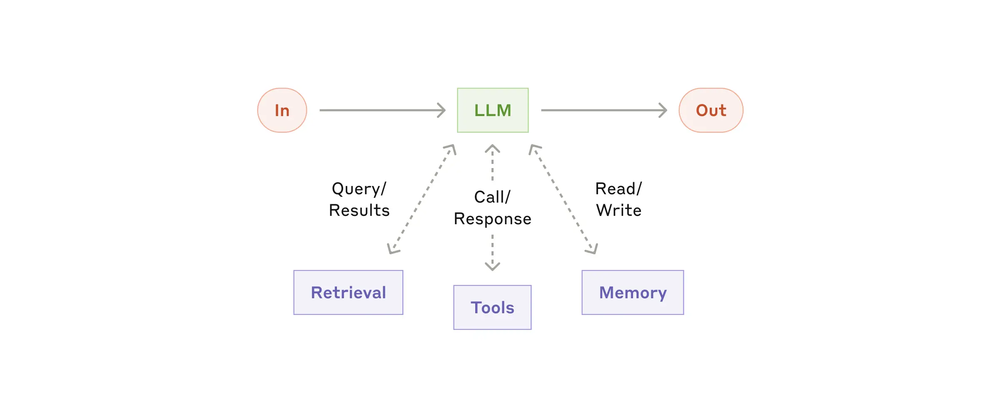
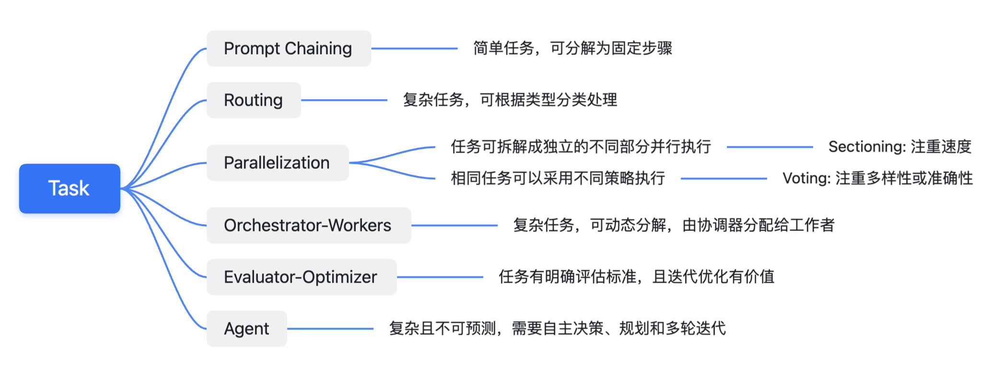
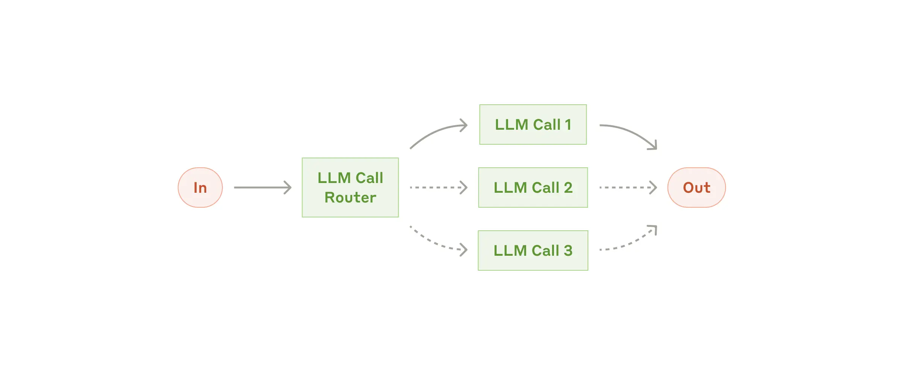
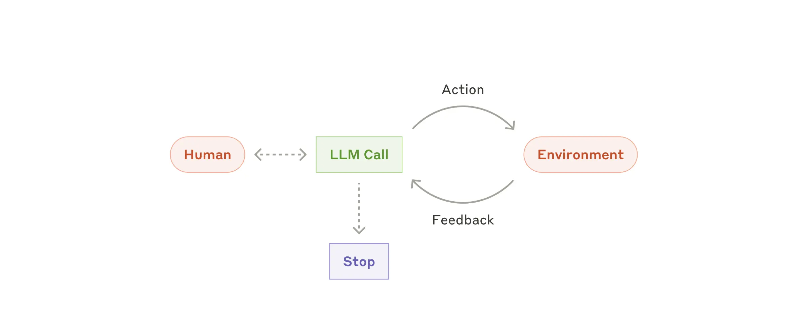

# LLM Best Practice：从 Workflows 到 Agents，一文读懂 Anthropic 的最佳实践。

`⏰: 40min`

**原文链接：**[Anthropic: Building effective agents](https://www.anthropic.com/research/building-effective-agents)

读书报告，添加了一些自己的思考和补充。

## Intro

在过去的一年里，我们与数十个跨行业的团队合作构建大型语言模型（LLM）智能体（Agent）。我们发现，那些最成功的应用案例并非依赖于复杂的框架或专门的库，而是基于简单、可组合的模式进行构建的。

在这篇文章中，我们将分享从与客户合作及自身构建 agents 过程中所学到的经验，并为开发者们**提供关于构建高效 agents 的实用建议。**

## What are agents?

“智能体”（Agent）的定义多种多样。一些客户将智能体定义为**完全自主的系统**，能够在较长时间内独立运行，利用各种工具来完成复杂的任务。另一些客户则用这个术语来描述遵循预定义工作流程、更具规范性的实现。在 Anthropic，我们将所有这些变体都归类为智能体系统（Agentic Systems），但在架构上，我们对工作流（Workflows）和智能体（Agents）进行了重要的区分：

- **Workflows** 是由预定义的代码路径来编排 LLM 和工具的系统。

- **Agents** 则是 LLM 动态指导自身流程和工具使用的系统，它们掌控着自己完成任务的方式。

下文中，我们将详细探讨这两种类型的智能体系统。在附录1（“智能体的实际应用”）中，我们将描述客户发现使用这些系统特别有价值的两个领域（客户支持 agent 和代码 agent）。

## When (and when not) to use agents

**在使用 LLM 构建应用程序时，我们建议找到尽可能简单的解决方案，只有在必要时才增加复杂性**。这甚至可能意味着完全不构建 agentic systems。Agentic systems 通常会牺牲延迟和成本（例如 token-cost）来换取更好的任务性能，因此您应该考虑这种权衡何时有意义。

当需要处理更复杂任务时，Workflows 为定义明确的任务提供了可预测性和一致性（复现），而当需要大规模的灵活性和模型驱动的决策时，agents 则是更好的选择。**然而，对于绝大部分应用程序来说，通过检索（RAG）和在 prompt 中添加上下文示例（Prompt Engineering）来优化单个 LLM 调用通常就足够了。**

## When and how to use frameworks

有许多框架可以简化 agentic system 的实现，包括：

- LangChain 的 [LangGraph](https://langchain-ai.github.io/langgraph/)。
- Amazon Bedrock 的 AI Agent 框架。
- [Rivet](https://rivet.ironcladapp.com)，一个拖放式，带 UI 的 LLM 工作流构建器。
- [Vellum](https://www.vellum.ai)，另一个用于构建和测试复杂工作流的图形界面工具。

这些框架通过简化调用大语言模型、定义和解析工具以及链式调用等标准底层任务，使开发者能够轻松上手。然而，这些框架往往会创建**额外**的抽象层，这可能会使底层的提示和响应变得模糊，增加调试难度。同时，它们也可能诱使开发者过度设计，在一些本可以用简单方案解决的场景中引入不必要的复杂性。

**我们建议开发者首先直接基于 LLM API 进行开发（而非使用框架）**：许多常见模式只需要几行代码就能实现。如果你决定使用框架，请确保充分理解其底层代码。对框架内部运作机制的**错误假设**是客户常见的错误来源之一。

欢迎参考我们的使用手册中的[示例实现](https://github.com/anthropics/anthropic-cookbook/tree/main/patterns/agents)。

## Building blocks, workflows, and agents

在本节中，我们将探讨生产环境中智能代理系统的常见模式。我们将从基础构建模块——增强型大语言模型开始，逐步深入介绍从简单的组合工作流到自主 agents 等复杂应用。

### Building block: The augmented LLM

Agentic system 的基础构建模块是经过增强的 LLM，这些增强包括**检索**、**工具**和**记忆**等能力。我们当前的模型可以主动运用这些能力：生成自己的搜索查询、选择合适的工具，并决定需要保留哪些信息。



我们建议在实现时重点关注两个方面：将这些能力定制化以适应你的具体使用场景，并确保为 LLM 提供简单且文档完善的接口。虽然实现这些增强功能的方法有很多，但其中一种方式是通过我们最近发布的模型上下文协议（[Model Context Protocol](https://www.anthropic.com/news/model-context-protocol)）。该协议只需要简单的[客户端实现](https://modelcontextprotocol.io/tutorials/building-a-client#building-mcp-clients)，就能让开发者与不断发展的第三方工具生态系统进行集成。

在本文剩余部分，我们将假设每个大语言模型调用都能够访问这些增强功能。

接下来的章节，Anthropic 会介绍几种 workflow 的应用，我会用一个简单的思维导图来做指引。



### Workflow: Prompt chaining

提示链将任务分解为一系列步骤，每个大语言模型调用都会处理前一步的输出。你可以在任何中间步骤添加程序化检查（见下图中的"gate"），以确保整个流程仍在正确轨道上。

> 这里的 Gate 可能是 LLM 或者非 LLM 的 ML 模型乃至是**基于规则的系统**。本质上就是添加一个检查，来保障符合我们的预期。当不符合预期时，可以退出或者依据错误给出一个更新后的 prompt 让 LLM 重新尝试。


**何时使用这种工作流：** 这种工作流最适合那些可以轻松且清晰地分解为固定子任务的场景。其主要目标是通过将每个大语言模型调用变成更简单的任务，以延迟为代价来换取更高的准确性。

**Prompt chaining 的实用场景：**

- 生成营销文案 `->` 然后将其翻译成其他语言。
- 编写文档大纲 `->` 检查大纲是否符合特定标准 `->` 然后根据大纲撰写文档。

### Workflow: Routing

路由会对输入进行分类，并将其引导到专门的后续任务。这种工作流实现了**关注点分离（separation of concerns）**，并能构建更专业的提示。如果不采用这种工作流，为某一类输入优化可能会影响其他输入的性能。

> 刚开始没太看懂这个术语，后面发现这里的 *separation of concerns* 指的是**关注点分离**，它是软件工程中的一个重要原则。简单来说，就是**将一个复杂的问题或系统分解成多个独立的、职责单一的模块或组件，每个模块或组件只关注于解决一个特定的子问题或实现一个特定的功能。**这里的 routing 实现的是分类不同的关键点并进行路由。

**何时使用这种工作流：** 路由特别适用于复杂任务，这些任务具有需要分别处理的不同类别，并且分类可以通过大语言模型或传统的分类模型/算法准确完成。

**Routing 的实用场景：**

- 将不同类型的客服查询（一般问题、退款请求、技术支持）引导到不同的下游处理流程、不同的 LLM prompt 以及不同的工具。
- 将简单/常见问题路由到 Claude 3.5 Haiku 等较小模型，将困难/罕见问题路由到 Claude 3.5 Sonnet 等更强大的模型，以优化成本和速度。

> 可能有时候感觉网页端的模型降智就是因为我的问题被判定为“弱智问题”  :-)

### Workflow: Parallelization

大语言模型有时可以同时处理一个任务，并通过程序化方式整合其输出。这种并行化工作流主要有两种关键变体：

- **切分（Sectioning）**：将任务拆分为可并行运行的独立子任务。（下图每个 LLM Call 代表的是不同的子任务）
- **投票（Voting）**：多次运行相同任务以获得多样化的输出。（下图每个 LLM Call 代表的是相同任务，但可能有不同的 in-context prompt）

**何时使用这种工作流：** 当子任务可以并行处理以提高速度，或需要**多个视角或尝试**来获得更高置信度的结果时，并行化特别有效。对于**涉及多个考虑因素的复杂任务**，让每个 LLM Call 专注处理特定方面通常会表现得更好。

**Parallelization 的实用场景：**

- Sectioning

  - 实现安全护栏 (guardrails)，一个模型实例处理用户查询，而另一个筛查不当内容或请求。这比让同一个 LLM 同时处理安全护栏和核心响应表现更好。
  - 自动化评估 LLM 性能，每个 LLM Call 评估模型在特定 prompt 下的不同表现方面。

> 这里有一个小思考是：**为什么分开处理比一起处理效果更好？**这可能涉及到**认知负荷**的问题。让一个 LLM 同时处理多个任务（生成响应和审查内容）可能会导致性能下降，因为模型需要在不同的目标之间切换注意力。而将任务分离可以让每个 LLM 专注于一个目标，从而提高准确性和效率。可以联想到人类的多任务处理能力也是有限的。

- Voting

  - 审查代码漏洞，使用多个 LLM Call（不同的 prompt）来审查代码并在发现问题时标记代码存在漏洞。
  - 评估给定内容是否不当，使用多个 prompt 评估不同的方面，或要求不同的投票阈值来平衡假阳性和假阴性。

> 这里评估内容是否不当稍微需要一些理解成本，我来尽量简单的解释下。
>
> 想象一下，我们有一个内容审核团队，但团队成员都是 LLM。为了判断一条内容是否“**不当**”，我们不会只让一个机器人来判断，而是让多个机器人（多次 LLM Call）从不同的角度 (即多个 Prompt，例如是否暴力、是否色情、是否是广告等) 分别进行评估。
>
> 每个机器人都会给出自己的意见 (投票)。我们再设定一个规则 (投票阈值)，例如 “超过半数机器人认为是，则判定为不当”。
>
> 这样做的好处是可以更全面地评估内容，避免单个机器人的偏见。但是，我们也需要考虑两种可能的错误：
>
> - **误报 (假阳性):** 把正常内容当成不当内容。
> - **漏报 (假阴性):** 没有识别出不当内容。
>
> 我们可以通过调整 “投票规则” 来控制这两种错误的比例。如果规则很严格 (例如需要所有机器人都认为是不当才算)，那么误报会减少，但漏报会增加。如果规则比较宽松 (例如只要有一个机器人认为是不当就算)，那么漏报会减少，但误报会增加。
>
> 所以，我们需要根据实际情况来选择合适的 “投票规则”，在 “误报” 和 “漏报” 之间找到一个平衡点。显然，Claude 的道德感比较强，投票规则是比较严格的。

### Workflow: Orchestrator-workers

在协调器 - 工作者工作流中，中央 LLM 动态分解任务，将其委派给工作 LLM，并合成它们的结果。


**何时使用这种工作流：** 这种工作流非常适合那些**无法预测所需子任务**的复杂任务（例如在编码中，需要更改的文件数量和每个文件中的更改性质可能取决于具体任务）。虽然在拓扑结构上与 Parallelization workflow 类似，但关键区别在于其**灵活性**——子任务不是预定义的，而是由协调器根据具体输入确定。

**Orchestrator-workers 模式的实用场景：**

- 每次需要对多个文件进行复杂更改的编码产品。
- 涉及从多个来源收集和分析可能相关信息的搜索任务。

> 这里给的 example 描述的太简略了，我们来简单的深入下。第二个比较容易理解，我们重点分析下第一个：”每次需要对多个文件进行复杂更改的编码产品”。
>
> 例如最近比较火爆的 cursor，其复杂性可能包括：
>
> - **跨文件更改:** 大型软件项目通常由多个文件组成，这些文件之间相互依赖。一个功能的修改或添加可能需要同时修改多个文件，例如修改一个函数定义，同时需要修改所有调用该函数的文件。
> - **依赖关系复杂:** 文件之间可能存在复杂的依赖关系，修改一个文件可能会影响到其他文件中的调用，需要仔细考虑修改的顺序和方式。
>
> 所以，一种可能的设计方式如下，并且这样也正好契合了上文所说的降低**认知负荷**，让每个 LLM 专注于一个目标。
>
> - **Orchestrator (编排器):** 接收用户的需求（例如 “添加一个新功能”），分析代码库，确定需要修改哪些文件，以及每个文件需要做什么样的修改，并将这些修改任务分配给相应的 Worker。
> - **Workers (工作器):** 接收 Orchestrator 分配的任务，对指定的文件进行具体的修改，并将修改后的代码返回给 Orchestrator。

### Workflow: Evaluator-optimizer

在评估器-优化器工作流中，一个 LLM Call 生成响应，而另一个在循环中提供评估和反馈。


**何时使用这种工作流：** 当我们有明确的评估标准，并且迭代优化能带来可衡量的价值时，这种工作流特别有效。判断是否适合使用的两个标志是：

- 首先，当人类明确表达反馈时， LLM 的响应能够得到明显改善；
- 其次，LLM 能够提供这样的反馈。这类似于人类作者在创作精良文档时经历的迭代写作过程。

**Evaluator-optimizer 模式的实用场景：**

- 文学翻译，其中存在翻译 LLM 最初可能无法捕捉的细微差别，但评估 LLM 可以提供有用的评价。
- 需要多轮搜索和分析才能收集全面信息的复杂搜索任务，评估器决定是否需要进一步搜索（也就是当前的信息是否足够得到检索答案）。

### Agents

随着大语言模型在关键能力上的成熟 ——**理解复杂输入、进行推理和规划、能够可靠地使用工具以及从错误中恢复**—— Agents 正在生产环境中崭露头角。Agents 通过用户的指令或与用户的交互对话开始工作。一旦任务明确，Agents 就会独立规划和运作，必要时会向人类寻求更多信息或判断。在执行过程中，Agents 需要在每一步从环境中获取"**真实情况**"（ground truth）（如工具调用结果或代码执行情况）来评估其进展。Agents 可以在检查点或遇到障碍时暂停以获取人类反馈。任务通常在完成时终止，但也常常包含停止条件（如最大迭代次数）以保持控制。

Agents 能够处理复杂任务，但其实现却往往很简单。它们通常只是在循环中基于环境反馈使用工具的 LLMs（**They are typically just LLMs using tools based on environmental feedback in a loop.** 我认为这句话很好的解释了 agents）。因此，清晰且深思熟虑地设计工具集及其文档至关重要。我们将在附录2（“工具的提示工程”）中详细介绍工具开发的最佳实践。



**何时使用智能代理：** Agents 适用于难以或无法预测所需步骤数量，且无法硬编码固定执行路径的开放性问题。LLM 可能需要多轮操作，你必须对其决策能力有一定信任。Agents 的自主性（autonomy）使其非常适合在**可信环境**中扩展任务。

> 什么是可信环境（trusted environments）呢？
>
> 我认为这里指的是 **Agent 运行的环境是相对安全、可控、并且其行为的后果是可以预测和管理的**。在这种环境下，我们可以对 Agent 的自主性给予一定程度的信任，允许它独立执行任务，而不用担心它会造成严重的负面影响。

Agents 的自主特性意味着更高的成本，以及潜在的累积错误。我们建议在沙盒环境中进行广泛的测试，并设置适当的安全护栏 (guardrails)。

**Agents 的实用场景：** 

以下是我们自己的实现案例：

- 用于解决 [SWE-bench](https://www.anthropic.com/research/swe-bench-sonnet) 任务的 coding agent，需要根据任务描述对多个文件进行编辑。
- 我们的 ["computer use" reference implementation](https://github.com/anthropics/anthropic-quickstarts/tree/main/computer-use-demo)，即 Claude 使用计算机完成任务。


> 阅读到这里的时候，我发现 Agents 的实用场景中 SWE-bench 的所做的事情和 Orchestrator-workers workflow 有点相似。
>
> 而它们的不同我认为，Orchestrator-workers workflow **更像是“分而治之”(Divide and Conquer) 的策略，将复杂任务分解成一系列定义明确的子任务，然后分配给 Workers 执行。** 这种模式的重点在于任务的分解和并行执行，适用于那些可以**预先规划或根据输入进行确定性分解的任务**。而 Agents 则是解决更灵活开放性问题，比如其中还包括向人类寻求更多的信息的部分。

### Combining and customizing these patterns

这些构建模块并非固定不变。它们是开发者可以根据不同用例调整和组合的常见模式。与任何 LLM 功能一样，成功的关键在于衡量性能和迭代实现。重申一点：**你应该*仅在*能够明显改善结果时才考虑增加复杂性。**

## Summary

在 LLM 领域取得成功不在于构建最复杂的系统，而在于构建适合你需求的**正确**系统。从简单的 prompt 开始，通过全面评估优化它们，只有在更简单的解决方案不够用时才添加 multi-step agentic systems（多步智能代理系统）。

而当实现 Agents 时，我们尽力遵循三个核心原则：

1. 保持 agent 设计的**简单性**。（Maintain **simplicity** in your agent's design.）
2. 应清晰展现智能体的规划过程，确保其决策透明。（Prioritize **transparency** by explicitly showing the agent’s planning steps.）
3. 通过全面的工具**文档和测试**来精心打造 agent-computer interface（ACI, 代理-计算机接口）。（Carefully craft your agent-computer interface (ACI) through thorough tool **documentation and testing**.）

框架可以帮助你快速入门，但当转向生产环境时，**可以直接减少你代码中的抽象层并使用基本的组件进行构建**（*don't hesitate to reduce abstraction layers and build with basic components as you move to production*）。遵循这些原则，你可以创建不仅强大而且可靠、可维护，并且受用户信任的 agents。

### Acknowledgements

Written by Erik Schluntz and Barry Zhang. This work draws upon our experiences building agents at Anthropic and the valuable insights shared by our customers, for which we're deeply grateful.

## Appendix 1: Agents in practice

我们与客户的合作揭示了 AI agents 两个特别有前景的应用领域，这些应用很好地展示了前文讨论的模式的实际价值。这两个应用都说明了agents 在什么情况下能创造最大价值：**需要对话和行动相结合、具有明确的成功标准、能够实现反馈循环，并且集成有意义的人类监督的任务。**

### A. Customer Support

客户支持将熟悉的聊天机器人界面与通过工具集成实现的增强功能相结合。这非常适合更开放式的 agents，原因如下：

- 客户支持天然具有对话属性，但也需要访问外部信息和执行具体操作；
- 可以集成工具来获取客户数据、订单历史和知识库文章；
- 可以通过程序化方式处理退款或更新工单等操作；
- 用户问题是否得到解决，是衡量成功的明确标准。

一些公司甚至采用 “按成功解决次数收费” （*usage-based pricing models that charge only for successful resolutions*）的定价模式，充分体现了他们对自家 agents 能力的信心。

### B. Coding agents

软件开发领域已经展现出 LLM 功能的巨大潜力，其能力已经从代码补全发展到自主解决问题。Agents 在该领域特别有效的原因是：

- 代码解决方案可以通过自动化测试进行验证；
- 智能体可以使用测试结果作为反馈来迭代解决方案；
- 问题空间定义明确且结构化；
- 输出质量可以客观地衡量。

在我们自己（Anthropic）的实现中，Agents 现在可以仅根据拉取请求 (pull request) 描述来解决 [SWE-bench Verified](https://www.google.com/url?sa=E&q=https%3A%2F%2Fswe-bench.com%2Fverified) 基准测试中的实际 GitHub 问题。不过，虽然自动化测试可以验证功能，但人工审核对于确保解决方案满足更广泛的系统要求，依然是不可或缺的。

## Appendix 2: Prompt engineering your tools

无论你在构建何种智能代理系统，工具都可能是代理的重要组成部分。[工具](https://www.anthropic.com/news/tool-use-ga)使 Claude 能够通过在我们的 API 中指定其确切结构和定义来与外部服务和 API 交互。当 Claude 响应时，如果它计划调用工具，会在 API 响应中包含[工具使用块](https://docs.anthropic.com/en/docs/build-with-claude/tool-use#example-api-response-with-a-tool-use-content-block)。工具的定义和规范应该获得与 overall prompts 同等程度的工程优化关注。在这个简短的附录中，我们将介绍如何对工具进行**提示工程**。

指定同一个操作通常有多种方式。例如，你可以通过编写 diff 或重写整个文件来指定文件编辑。对于结构化输出，你可以在 markdown 或 JSON 内返回代码。在软件工程中，这些差异只是表面的，可以无损地从一种格式转换为另一种。然而，某些格式对大语言模型来说比其他格式更难编写。编写 diff 需要在写入新代码之前知道 chunk header 中有多少行在变化。在 JSON 中编写代码（相比markdown）需要额外转义换行符和引号。

diff 代码类似如下样式：

```diff
+ print("")
- print()
```

关于决定工具格式，我们有以下建议：

- 给模型足够的 token 来“思考”，避免它把自己逼到死胡同。
- 保持格式接近模型在互联网文本中自然遇到的形式。
- 确保没有格式上的"额外开销"，比如需要保持对数千行代码的准确计数，或对它写的任何代码进行字符串转义。

一个经验法则是，考虑到人机界面（HCI, human-computer interfaces）投入了多少努力，就要计划在创建良好的**代理**-计算机界面（ACI, agent-computer interfaces）上投入相同的努力。以下是一些实现建议：

- **站在模型的角度思考**。基于当前的描述和参数，你能否很清晰的调用这个工具，或者你还是需要仔细思考？如果是后者，那么对 LLM 来说也可能如此。一个好的工具定义通常包括使用示例、边界情况、输入格式要求，以及与**其他工具的清晰界限**。
- **如何通过改变参数名称或描述使事情更清楚？**把这想象成：为你们团队中的“菜鸟”写一个出色的文档（docstring）。当使用许多类似的工具时，这一点尤为重要。
- **测试模型如何使用你的工具**：在我们的 [workbench](https://console.anthropic.com/workbench) 中运行许多示例输入，看看模型会犯什么错误，然后进行迭代。
- **对你的工具进行防错设计（[Poka-yoke](https://en.wikipedia.org/wiki/Poka-yoke)）。** 更改参数，使其更难犯错。

> **Q：**如何理解 HCI 和 ACI 呢？
>
> **人机界面（HCI）：** 想象你在使用手机或电脑时看到的一切：按钮、菜单、图标等。这就是人机界面，它就像是人类和计算机之间的"翻译官"，让我们能够轻松地告诉电脑我们想要做什么，同时也能理解电脑给我们的反馈。
>
> **代理-计算机界面（ACI）：** 如果说人机界面是为人类设计的，那么代理-计算机界面就是为AI助手（也就是"agents"）设计的。就像我们需要容易理解的按钮和图标一样，AI代理也需要清晰的"指令"和"工具"来和计算机打交道。举个例子，就像我们在入职一家新公司期望有一份详细的工作指南一样，ACI 就是要给 AI 助手一份它能够准确理解和执行的"使用说明书"，告诉它该如何正确地使用计算机的各种功能。
>
> 更简单来说：
>
> - HCI 是让人类能轻松使用电脑的设计。
> - ACI 是让 AI 能准确使用电脑的设计。
>
> **Q：**如何理解"clear boundaries from other tools"（与其他工具的清晰界限）？
>
> 想象你的厨房里有两个很像的工具：一个是切菜的刀，一个是削皮的刀。
>
> 如果你没有明确告诉别人哪个刀具体用来做什么，很容易混淆和误用。同样的道理，当我们给 AI 设计工具时，每个工具都需要有明确的"专属职责"，不能模棱两可。比如：
>
> - 一个工具专门用来读取文件
> - 另一个专门用来写入文件
> - 而不是一个模糊的"处理文件"的工具
>
> 这样可以避免AI在使用时产生困惑："我到底该用哪个工具来完成这个任务？"
>
> **Q：**如何理解"Poka-yoke your tools" (工具的防错设计)？
>
> Poka-yoke是一个来自丰田生产系统的概念，简单说就是"防呆设计"或"防错设计"。举个生活中的例子：
>
> - USB 3.0接口设计成只能一个方向插入，这就是防错设计
> - 反面插是插不进去的，这样就避免了损坏设备

在构建我们的 [SWE-bench](https://www.anthropic.com/research/swe-bench-sonnet) agent 时，我们实际上花在优化工具上的时间比优化 overall prompt 更多。例如，我们发现当 agent 移出根目录后，模型在使用相对文件路径的工具时会犯错。为了解决这个问题，我们修改了工具，始终要求使用绝对文件路径 —— 结果发现模型完美地使用了这种方法。

