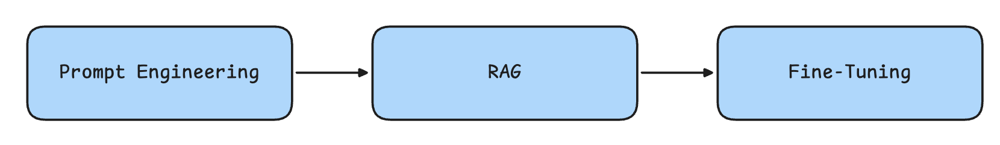

# LLM Best Practice：LLM Accuracy Optimization (1) - 思维模型与优化起点

`⏰ Read: 30min`

LLM Accuracy Optimization 是一个如此复杂的议题，怎么可能一篇就讲清楚？我也是这样认为的。

考虑到内容的丰富性和读者的认知负荷，我决定将这个主题拆分为几篇阅读时间在 30 分钟左右的博客。无论是 Prompt Engineering 还是 RAG，每个领域都有大量精细的优化技术。与其深入技术细节，我认为更重要的是帮助读者快速找准优化方向 - 因为一旦方向明确，具体的优化执行反而相对简单。

在经历多次思考清楚优化方向后轻松解决问题后，我认为在优化之前心中得有优化之道。在看了 OpneAI 的 Dev Talk 和阅读了对应博客后，我觉得它们讲述的内容就是某种“优化之道”，在我们对 AI 应用的优化时中颇有用处。

## 优化 LLM 的困境

优化 LLM 并非易事，优化工作之所以困难，这里借 OpenAI 的说法，归结为以下几点原因：

1. 如何开始优化准确性（Knowing **how to** start optimizing accuracy）  
2. 在何时选择何种优化方法（**When to use** what optimization method）  
3. 生产环境中需要达到何种准确性水平（What level of accuracy is **good enough** for production）

如同开头所说，我希望介绍的是优化之道而非具体的技术细节，主要是为了形成一个 LLM Accuracy Optimization 的思维脉络，提供了一个**思维模型**。该系列将探讨以下几种方法：提示工程 (Prompt Engineering)、检索增强生成 (RAG, Retrieval-Augmented Generation) 和微调 (Fine-Tuning)。此外，我们还将重点说明每种技术的适用场景和使用时机，并分享一些常见的陷阱。

## 优化 LLM 的二维思维模型

> 如果你现在有一个需要优化的 LLM 任务，你会如何进行呢？

许多关于优化的“操作指南”通常将这一优化过程描述为一个简单的线性流程：从 Prompt Engineering 开始，然后进入 RAG，最后是 Fine-Tuning，如下图所示：

然而，实际情况往往并非如此。这些方法各自解决不同的问题，要想朝**正确的方向**优化，就需要正确选择和使用这些方法。线性的，生搬硬套的进行优化，往往效果不佳。

我们可以把 LLM Accuracy 的优化（后面统称 LLM 的优化）当作一个二维问题，因此我们引入的思维模型，本质上也就是一个“二维矩阵”（有两个方向需要考虑）。如下图所示：

**通常的 LLM 任务从矩阵的左下角开始**，以 prompt engineering 为起点。在这一阶段，我们将通过测试、学习和评估，建立一个初步的 baseline。基于 baseline 反映的结果，我们可以选择对应的优化方向。

1. **上下文优化 (Context Optimization)** 在以下情况下需要优化上下文（此优化方向的目标是**最大化响应准确性**）：  
   - 模型缺乏上下文知识，因为训练集中没有包含相关内容；  
   - 模型的知识已经过时；  
   - 模型需要使用专有信息。  

2. **LLM 优化 (LLM Optimization)** 在以下情况下需要优化模型本身（此优化方向的目标是**提高行为的一致性**）：  
   - 模型生成的结果格式不一致或错误；  
   - 文本的语气或风格不符合需求；  
   - 推理结果不一致或缺乏逻辑性。  

回答上面的问题（***如果你现在有一个需要优化的 LLM 任务，你会如何进行呢？***），LLM 的优化并不是一个简单的线性流程，而是一个迭代优化的过程。在这个过程中，我们需要不断地评估、假设、验证和调整，就像一个螺旋上升的循环。每一轮迭代都建立在前一轮的基础之上，通过持续的反馈来指导下一步的优化方向。下面是一个实际的优化案例：

在该流程中，我们依次完成以下步骤：

1. 从 prompt engineering 开始，评估其性能；  
2. 添加静态的少样本示例 (Few-Shot Examples)，以提高结果的一致性；  
3. 添加检索步骤（RAG），通过动态引入与问题相关的 few-shot examples，增强上下文的相关性，从而提升性能；  
4. 准备 50 个以上的示例数据集，对模型进行 fine-tuning，以进一步提高一致性；  
5. 调整 RAG，添加事实核查步骤，识别和修正“幻觉”(Hallucinations) 以实现更高的准确性；  
6. 将增强后的 RAG 输入纳入新训练数据，并重新训练微调后的模型。

> **解释：** 这里的"Few-shot Examples"（少样本示例）指在 prompt 中提供少量任务示例帮助模型理解任务要求。后文中的 example 中也会给出相应的示例。就像教孩子识别动物时，先展示几张典型图片作为参照。这类方法在简单任务中效果显著，但在处理复杂多变场景时容易失效。

我认为这个流程足以覆盖绝大部分 LLM 优化的场景，它足够典型，尤其是在面对复杂的业务问题时。**我们需要判断究竟是缺乏相关上下文，还是需要提升模型行为的可预测性**。明确问题本质后，就能精准选择首要的优化手段。

确定了整体的优化流程（思维模型），接下来的事情就简单很多了。我们只需要了解对应的三板斧（技术细节），就可以应对大部分的优化场景。我们将从第一板斧也是通常情况下最容易开始的：**Prompt Engineering** 开始。

## Prompt Engineering：优化 LLM 的起点

> **Prompt Engineering 通常是优化 LLM 的最佳起点。**

对于一些场景，如摘要生成、翻译和代码生成，通常我们只需要应用 prompt engineering 优化。使用零样本 (Zero-Shot) 方法，即可达到生产环境所需的准确性和一致性。

> **解释**：Zero-shot Learning（零样本学习）指的是模型在**没有接收过任何特定任务示例**的情况下，仅凭任务描述就能完成任务的能力。
>
> 这就像让一个从未见过斑马的人，仅凭“斑马是一种长得像马，身上有黑白条纹的动物”这样的描述，就能在看到斑马时将其认出来。在 LLM 的语境下，Zero-shot 指的是直接给模型一个任务指令，而**不提供任何示例**，模型就能根据其预训练的知识和推理能力来理解并执行任务（比如要求输出为 `json` 格式而不提供 example）。

Prompt Engineering 的关键在于：**清晰地定义任务成功的标准（即什么是正确的输出，你期望得到什么样的结果）**。从最基础的步骤开始，即提供输入，然后评估输出是否符合你的预期。如果输出结果不理想，**通常可以根据其中的问题来指导我们下一步如何优化**。

为了能确定模型性能不如预期的具体原因，我们应该从一个简单的 prompt 和期望的输出开始。然后通过添加**上下文 (Context)**、**指令 (Instructions)** 或 **示例 (Examples)** 来逐步优化提示，直到达到理想效果。并且，在逐步的优化过程中，我们更容易发现模型当前需要在哪个维度进行优化。

在优化 prompt 时，可以借助来自 [OpenAI 提示工程指南](https://platform.openai.com/docs/guides/prompt-engineering) 的优化策略。每种策略可以分别作用于 Context optimization 或 LLM Optimization 或者两者兼有：

| **策略**                     | **Context Optimization** | **LLM Optimization** |
|-------------------------------|----------------|--------------|
| 编写清晰的指令               |                | ✅            |
| 将复杂任务拆解为简单子任务   | ✅              | ✅            |
| 给模型“思考”的时间           |                | ✅            |
| 系统性地测试更改             | ✅              | ✅            |
| 提供参考文本                 | ✅              |              |
| 使用外部工具                 | ✅              |              |

> 关于 prompt engineering 的不同策略，其中有几个可能存在一些理解障碍，仅给出我的理解作为参考。
>
> **给模型“思考”的时间（Give GPTs time to "think"）**
>
> 通过让模型一步步推理而不是直接给出答案，模型的表现会更可靠。例如：
>
> 问题：“2 个苹果每个 3 元，3 个橙子每个 5 元，总共多少钱？”
>
> Bad prompt：直接告诉模型“计算总金额”。
>
> Advanced prompt：分步骤写出计算逻辑，例如：
>
> - 计算苹果的总金额。
> - 计算橙子的总金额。
> - 将两者相加得到总金额。
>
> **系统性地测试更改（Test changes systematically）**
>
> 这就像做科学实验，一次只改变一个变量，观察结果的变化。修改 prompt 时，一次只改一个地方，然后测试效果，这样才能知道哪个改动起了作用。

简单表格有点像信息的堆砌，我们很难直观的感受到 prompt engineering 的效果，接下来我们将通过一个实际的例子进行测试。

### 使用 Prompt Engineering 优化语言纠错

冰岛语错误语料库 ([Icelandic Errors Corpus](https://repository.clarin.is/repository/xmlui/handle/20.500.12537/105)) 包含了一系列带有错误的冰岛语句子及其对应的正确版本。我们将使用基础的 GPT-4 模型来尝试解决这个任务，并应用不同的优化技术来提升模型的表现。

对于给定的冰岛语句子，我们期望模型能返回经过纠正的句子版本。我们使用 BLEU (Bilingual Evaluation Understudy) 分数来衡量翻译的相对质量。

> 解释： BLEU 分数是一种广泛使用的机器翻译评估指标。它通过比较机器翻译结果与人工参考译文的相似度来给出评分，分数范围从 0 到 1，越接近 1 表示翻译质量越好。简单的介绍下 BLUE 的原理：通过比较机器翻译的句子和人工翻译的句子中**重叠的词或短语的数量**来评估翻译质量。重叠越多，说明机器翻译得越好，分数也就越高。

|system|user|ground_truth|assistant|BLEU|
|---|---|---|---|---|
|The following sentences contain Icelandic sentences which may include errors. Please correct these errors using as few word changes as possible.|Sörvistölur eru nær hálsi og skartgripir kvenna á brjótsti.|Sörvistölur eru nær hálsi og skartgripir kvenna á brjósti.|Sörvistölur eru nær hálsi og skartgripir kvenna á brjósti.|1.0|

在第一次尝试中，我们使用没有示例的 GPT-4 进行测试，其表现尚可，获得了 62 的 BLEU 分数。接下来，我们添加了一些少样本示例，通过展示而不是直接告知的方式来教导模型我们期望的风格。

| SYSTEM | The following sentences contain Icelandic sentences which may include errors. Please correct these errors using as few word changes as possible.  # Examples |
|---|---|
| USER | Stofnendurnir séu margir og eru fulltrúar hennar frá Englandi, Grikklandi, Rússlandi, Svíþjóð og fleiri löndum Evrópu. |
| ASSISTANT | Hann segir að stofnendur leynireglunnar séu margir og að fulltrúar hennar séu frá Englandi, Grikklandi, Rússlandi, Svíþjóð og fleiri löndum Evrópu. |
| USER | Helsta fæða bjúgorma eru hægfara lífverur sem eru á sama búsvæði og bjúgormarnir, oft smærri ormar eins og burstormar (fræðiheiti: Polychatete). |
| ASSISTANT | Helsta fæða bjúgorma eru hægfara lífverur sem eru á sama búsvæði og bjúgormarnir, oft smærri ormar eins og burstaormar (fræðiheiti: Polychatete). |
| USER | Sörvistölur eru nær hálsi og skartgripir kvenna á brjótsti. |
| ASSISTANT | Sörvistölur eru nær hálsi og skartgripir kvenna á brjósti. |
| USER | \[input user query here\] |

（这里用表格来进行展示，本质上在进行 request 的时候就是一个 prompt）在添加了 few-shot examples 后，整体翻译质量得到了提升，BLEU 分数提高到了 70（提升 8%）。这个结果相当不错，表明向模型提供任务示例确实帮助它更好地学习。

如上文所说，重要的是观察结果，该结果告诉我们，我们需要**优化的是模型的行为方式** - 它已经具备了解决问题所需的知识，因此提供更多的示例可能是我们需要的优化方向。（提示我们尝试 RAG 相关优化）

这个 example 也会出现在后续的文章中，以测试我们更先进的优化方法如何处理这个用例。

### Prompt Engineering 的局限性

提示工程虽然是个不错的起点，也能通过一些技巧达到不错的效果，但它最大的短板在于**难以扩展**。当我们面对复杂的问题时，仅靠在提示词里堆砌上下文是不够的 - 我们需要能动态调整的上下文支持。同时，用几个示例（few-shot）来教会模型完成任务的方式也不够稳定，我们需要一个更可靠的方案。

那么 prompt engineering 的上限到底是多高？这个答案取决于我们如何进行**结果的评估**。

### 评估：为进阶优化做准备

Prompt Engineering 这个阶段最理想的产出是**一个优质的 prompt，以及配套的评估问题集和标准答案**。如果我们有 20 个以上的问题和答案，并且深入分析了失败案例，形成了对失败原因的假设，那么我们就为采用更高级的优化方法奠定了正确的基础。

> 💡 这里的 20 是一个随机给出的数字，它代表我们需要一定量的评估集用来保证评估出来的问题是普遍的且有价值的。同时，20 并不是一个非常夸张的数字，这也是因为 prompt engineering 本身是一个 quick method，过大的评估集反而与不够快捷与轻便。

在采用更复杂的优化方法前，建立自动化评估机制以加速迭代周期尤为重要（因为我们不可能去人为的对比 LLM 的输出和标准答案）。当然，我认为自动评估并不是本文的讨论重点，在这里为了不影响阅读的流畅性，我就跳过这个部分并给出相关的补充资料。

> 相关资料如下，这一部分可以简单理解为：**“最基础的文本匹配 (ROUGE)，到考虑语义的相似度计算 (BERTScore)，再到模拟人类评判的模型评估 (G-Eval)”**
>
> - [OpenAI 的评估指南](https://cookbook.openai.com/examples/evaluation/how_to_eval_abstractive_summarization)
> - [ROUGE](https://aclanthology.org/W04-1013/)
> - [BERTScore](https://arxiv.org/abs/1904.09675)
> - [G-Eval](https://arxiv.org/abs/2303.16634)

## 总结与引子

**问题：看完这一段，你再思考开头的引言，为什么 prompt engineering 是优化 LLM 的起点？**

**思考：** Prompt Engineering 的核心优势在于成本低、见效快。RAG 需要额外的开发成本，Fine-tuning 需要额外的数据支持，而 Prompt Engineering 只需要调整提示内容，任何人都可以快速开始，并且能够快速评估模型行为，从而发现模型的能力边界。确定当前模型缺什么，然后进行优化。这完美的符合了我们的思维模型，快速的分辨出我们应该在哪个维度上发力。

例如，如果模型输出格式不稳定，可以通过添加指令或示例来规范；如果模型缺乏特定领域的知识，则可能需要考虑引入外部信息源。然而，Prompt Engineering 的局限性在于**难以处理大规模或动态场景**。试想，如果你的任务需要模型理解并运用成千上万条规则，或者需要根据用户不断变化的需求实时调整输出，仅仅依靠 prompt 就显得力不从心了。所以，这也说明了 Prompt Engineering 是优化 LLM 的起点，但绝非终点。

**问题：当你发现 Prompt Engineering 的效果仍然有限，下一步该怎么做？**

**思考：** Prompt Engineering 的局限性在于难以在**大规模或动态上下文**场景中持续保证高准确性，也很难在**行为一致性**方面实现更进一步的精准控制。这就引出了我们下一篇博客将要探讨的内容 —— **RAG（Retrieval-Augmented Generation，检索增强生成）和 Fine-tuning（微调）**

- **若核心问题是“缺上下文”** —— 例如需要引用最新信息或专有知识库内容，此时可以考虑使用 RAG 在推理时“检索”到相关知识，以最大化模型对真实世界信息的利用。
- **若核心问题是“行为不一致”** —— 例如在格式、风格、逻辑推理的稳定性上还有更高要求，此时就需要进一步使用 Fine-Tuning，以通过系统化的训练数据让模型内化目标行为，获得更高一致性和更好推理能力。

在后续文章中，我们将系统介绍 **RAG** 和 **Fine-Tuning** 的原理、适用场景、常见陷阱，并探讨在生产环境中如何结合这两种方法来得到最优效果。

参考文献可以回到引文中查看：

https://zhuanlan.zhihu.com/p/20552545134
