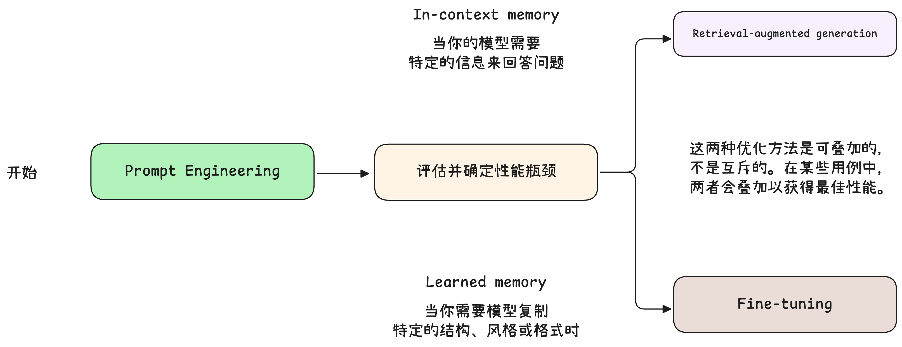
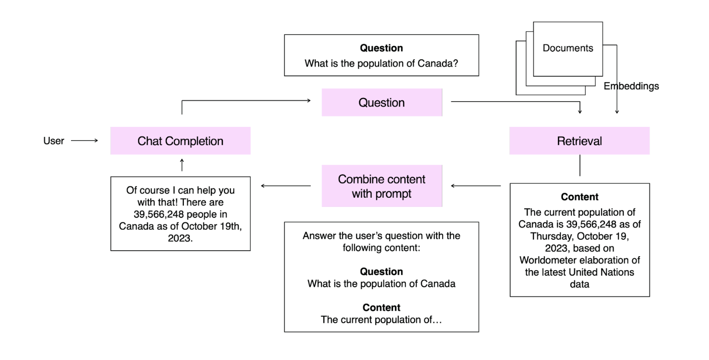
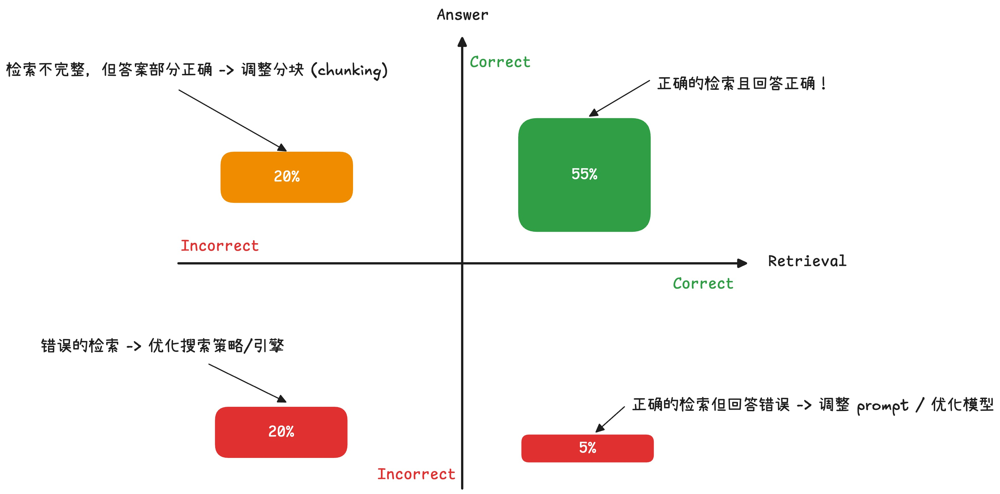
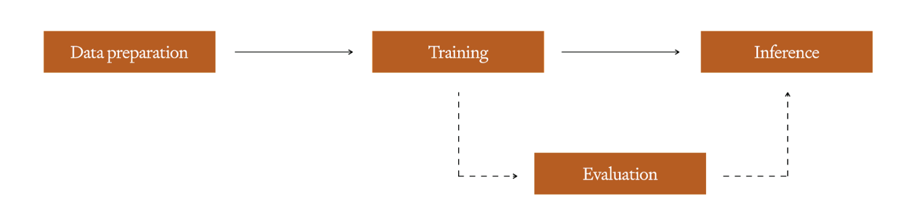
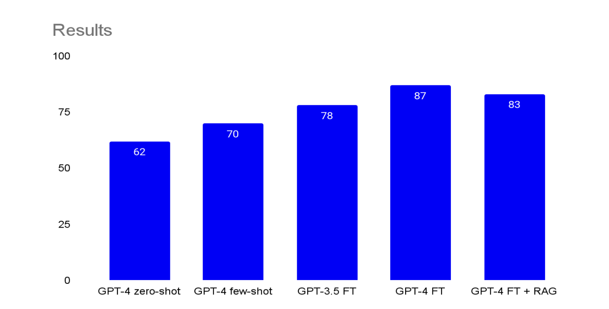

# LLM Best Practice：LLM Accuracy Optimization（中）—— RAG 与微调进阶

在上一篇中，我们介绍了 LLM Accuracy 优化的思维模型，将 LLM 优化抽象为一个二维矩阵模型（分别对应上下文优化和模型能力优化），也介绍了为什么 prompt engineering 是优化 LLM 的起点。通过 Prompt engineering 我们能快速的确定性能 baseline 以及发现模型能力的边界，给出优化方向的指引。

如果没有阅读过，或有一些内容忘记了推荐重新扫一遍第一篇博客：

本篇我们将聚焦到两个问题上：

- 在 prompt engineering 之后，模型仍然不能满足需求，我们该如何优化？ 对于这个问题我们将介绍 RAG 和 fine-tuning 两种方法。重点介绍的是这两种方法背后对应的优化方向。
- 我们是否可以避免复杂的探索，直接叠加多种优化技术来实现最佳性能？ 比如直接使用 RAG + FT（Fine-tuning）的组合？这个问题我会基于最后的 Example 中给出回答。

下面我们会介绍 LLM 优化三板斧的剩下两个。需要重新强调的是，技术细节不是本文的目的，我更希望强调的是 Why 和 What 而不是 How，也就是帮助读者快速找准优化方向而非深入技术细节。

## 1. 进阶双斧

在上篇中，我们已经完成了 **prompt engineering**，也准备好了 **eval set**，但模型仍未达到要求。接下来最重要的步骤是诊断模型在哪些环节失效（方向），以及哪种**工具**最适合提升其性能。


参考上篇提到的思维模型，我们有两个不同的优化角度，基于此给出以下基本框架：



然后，我们可以分析评估集中所有没有通过的问题。将每个未通过评估的问题分别视为 **in-context memory problem (上下文记忆问题)** 或 **learned memory problem (学习记忆问题)**。打个比方，想象你正在参加考试，你可以通过两种方式提示你的成绩：

- 就像你在过去半年中认真听课，多次接触同一个概念的例子（真题）一样。这就是 **learned memory** ——在大语言模型中，我们通过向模型展示带有期望答案的示例来进行学习，以解决特定问题。
- 就像你可以随时翻阅课本查找答案一样。这就是 **in-context memory** ——在大语言模型中，我们通过在上下文窗口（prompt）中添加相关信息来解决问题，这可以通过静态的 prompt engineering 实现，也可以借助工业级的 **RAG (检索增强生成, Retrieval-Augmented Generation)** 技术实现。

这两种优化方法是**互补而非互斥的** ——它们能够相互配合，在某些应用场景下，你可能需要同时使用这两种方法才能获得最好的效果。（思考下文初的问题，那我们为什么不直接把两者结合起来，直接使用 RAG + FT 的组合？）

如果我们要解决短期记忆的问题，我们就可以使用 **RAG** 技术。

### 1.1 Retrieval-Augmented Generation：为 LLM 注入实时知识

RAG 的原理非常直观，如果你自己有从零搭建过简单的 RAG pipeline 你会有所体会。我这边可以给一个非常简单的伪代码，同时 Anthropic 也在它的 Agentic System 最佳实践中推荐大家基于最简单的 LLMBlock 进行构建。本质上，就是**按需注入**一些相关的信息到 prompt 中，让模型能够获取与解决问题相关的知识。

```python
# 假设已经定义好了一个最基础的 LLMBlock

def RAG_pipeline(query):
    # 1. 检索：从知识库中查找与查询相关的内容
    # 可以是搜索引擎，也可以是向量数据库，也可以进行一些后处理。
    retrieved_docs = retrieve_documents(query)

    # 2. 增强：将查询与检索到的内容组合成增强后的 prompt
    prompt_template = """
    [系统指令] 基于以下知识回答问题：
    {knowledge}
    
    [用户问题] {question}
    [回答要求] 严格依据知识，简明扼要
    """
    augmented_prompt = prompt_template.format(
        knowledge=retrieved_docs,
        question=query,
    )

    # 3. 生成：调用 LLM 模型生成答案
    answer = LLMBlock.generate(augmented_prompt)

    return answer

# 示例调用
query = "加拿大的人口是多少？"
result = RAG_pipeline(query)
print(result)
```

更为准确的定义，RAG 是一种在生成答案之前，通过 **R**etrieving（检索）内容来 **A**ugmenting（增强） LLM prompt，再进行 **G**enerating（生成）答案的过程。它用于为模型提供**特定领域上下文的访问权限**以解决任务。

RAG 是一种极为有价值的工具，可以显著提升 LLM 的准确性和一致性 —— OpenAI 的许多大规模客户部署仅依靠 Prompt engineering 和 RAG 实现。而且，如果标题所言，RAG 可以**动态的注入信息**，相比训练模型的 GPU 等开销，这样的成本很低廉。在一些对于**及时信息要求较高的场景**，RAG 可以很好地解决这个问题（比如基于消息面的问答，乃至信息驱动的金融交易）。

如果你对于 RAG 还是有困惑，让我来通过一个简单的流水线让你快速理解：



用户询问“加拿大有多少人口”，一般情况下模型对于这种数字相关的问题很容易犯错误（幻觉），所以我们可以基于知识库或者搜索引擎（类似于 Google）来检索出最相关的内容，然后注入到 prompt 中。这样模型就能基于这些信息给出正确的答案。

> [!NOTE]
> 如果 prompt 中给出了相关的信息但是模型仍然犯错，那应该怎么解决呢？

实现 RAG 时，我们原有的思维模型也会进行对应的更新，从原来的上下文优化变为了**检索能力优化**。要让 RAG 发挥最大作用，我们既要为模型提供恰当的上下文信息，也要评估模型的回答质量。下图展示了一个简化的评估框架：



在实际应用中，RAG 系统可能会遇到两个主要问题：

| 领域 | 问题                                                         | 解决方案                                                     |
| ---- | ------------------------------------------------------------ | ------------------------------------------------------------ |
| 检索 | 系统可能检索到不准确的上下文信息，导致模型无法给出正确答案；或者检索到**过多无关信息**，反而会干扰模型判断，产生虚假内容。 | 可以从以下几个方面优化检索策略：<br> - 优化检索算法以提高结果准确性；<br> - 改进过滤机制以降低噪声；<br> - 优化检索结果的信息密度。<br><br>这些只是基础优化方法。实际上，RAG 系统的优化已经发展成为一个专门领域，像 LlamaIndex、LangChain 这样的工具库都提供了丰富的优化方案。 |
| LLM  | 即使模型获得了准确的上下文信息，有时也可能无法正确理解和运用这些信息。 | 这种情况下，我们可以通过 **prompt engineering** 来改进模型的指令和使用方法。如果通过示例学习能提升效果，还可以考虑使用 **fine-tuning** 来进一步优化。 |

你会发现 RAG 的引入确实能在某些场景优化 LLM 的性能，但是同样也让问题逐步的复杂化。但是整个优化过程的核心思路和我们之前讨论的模型是一致的：**先找出问题所在，再针对性地进行改进。不同之处在于使用 RAG 时，我们还需要重点关注检索质量这个关键因素。**

> [!TIP]
> 你有没有发现一个有趣的现象，在上面表格的 LLM 行，即使我们引入了 RAG 技术，我们仍可能需要重新回到 prompt engineering 的优化方向。（这在第一篇中被我们归到了优化模型的左下角，即开始位置），这也说明了 LLM 的优化并不是一个简单的线性过程，我们要工程化，系统化的记录每个优化尝试，需要我们反复的迭代。

RAG 虽然能够很好地解决知识获取的问题，但它并不能帮助模型更好地**学习特定任务**。同样，我们有时候还得考虑 token-cost 的问题。在 Prompt engineering 中，为了构建“完美”的 prompt，我们的 prompt token 数可能不可避免地膨胀。引入 RAG 只会让这个问题更为凸显。

在很多应用场景中，我们更需要让模型掌握某项具体任务，并在执行时保持稳定可靠的表现，或者我们希望模型内化相关知识以避免大量的 token-cost。为了解决这个问题，我们需要借助 **fine-tuning (微调, fine-tuning)** 技术。

### 1.2 Fine-tuning：让 LLM 掌握特定任务

为了解决 learned memory 问题，许多开发者会在一个较小、特定领域的数据集上继续对 LLM 进行训练，以针对特定任务进行优化。这一过程被称为 fine-tuning (FT)。

如上章结尾所述，通常进行微调的原因有两个：

- **提高模型在特定任务上的准确性**：通过在任务特定的数据上训练模型，向其展示大量正确执行该任务的示例，从而解决 learned memory 问题，就像高中数学小章节测试，你去刷该章节的题目，准确率可以快速提高（前提是你能像机器一样认真 :）。
- **提高模型效率**：以更少的 token 或使用更小的模型实现相同的准确性。

微调过程首先从准备一组训练示例数据集开始 —— 这是最关键的一步，因为你的微调示例必须准确反映模型在实际应用中将遇到的情况。

OpenAI 的许多客户采用一种称为 **prompt baking (提示预烘)** 的方法，在试运行期间详细记录提示的输入和输出，然后将这些日志筛选整理成包含真实示例的高效训练集。

> [!NOTE]
> **问题**：如何理解 prompt baking？
>
> **回答**: 想象一下，最近你在做一道菜 —— 你会把所有的尝试都记录下来，记录下每个步骤和每次调料的用量（prompt）。后来，你会仔细品尝、挑选出那些最好吃、最成功的做法和步骤（筛选 output）。把这些精华部分整理成一份完善的食谱（golden data），方便以后重复做出美味的菜肴（fine-tuning）。
>
> 看起来有点像左脚踩右脚（因为你是拿模型自己的输出训练自己），但本质上有点类似人机协作，模型生成初步结果，人工负责筛选和指导，再利用这些高质量数据对模型进行再训练，从而达到更好的效果。有点类似 RLHF 的感觉，都是人类监督，只不过 RLHF 是基于强化学习的打分，而 prompt baking 是基于人工筛选的数据集进一步训练。



有了这个经过清理的数据集后，就可以开始进行训练了。这个过程和其他机器学习模型类似，你可以根据所用的平台或框架来调整各种超参数。为了避免过拟合，我们建议**预留一部分数据作为验证集**。如果你想了解更多关于如何构建优质训练集的建议，可以参考 OpenAI 的微调文档[指南](/docs/guides/fine-tuning#analyzing-your-fine-tuned-model)。训练完成后，这个经过微调的模型就可以用于推理了。

下面我们重点介绍一些在实践中总结出的**💎 微调优化的最佳实践**。这些经验主要来自 OpenAI 的模型定制产品，但也同样适用于其他厂商的产品和开源方案：

- **先做好 prompt engineering（Start with prompt-engineering）**：在开始微调之前，先建立一个可靠的 prompt engineering 测试集作为基准。这种方法投入小、见效快，能帮你确认基础提示是否合适。
- **重质不重量，循序渐进（Start small, focus on quality）**：微调基础模型时，数据质量比数量更重要。建议先用 50 个以上的示例做测试评估；如果准确率还不够理想，且**主要问题出在模型行为或一致性上而不是上下文理解上**，再逐步增加训练数据。
- **注意数据代表性（Ensure your examples are representative）**：最常见的误区是训练数据缺乏代表性，比如用于微调的示例在格式或表现形式上与实际生产环境中的数据有细微差异。举个例子，如果你在开发 RAG 应用，就应该在微调数据中包含 RAG 相关的示例，这样模型才能更好地学会如何处理上下文信息。

### 1.3 综合应用

上述这些技术是可以组合使用的。如果你在前期评估时发现系统在上下文理解和行为表现两个方面都存在不足，那么在实际应用中很可能需要同时使用 **微调** 和 **RAG** 技术。这种组合使用是完全合理的，因为不同技术可以互相弥补短板。主要好处包括：

- 通过微调可以**减少提示词工程所需的 token 数量**。具体来说，就是用大量训练样本来替代原本需要的指令和少量示例，从而让模型形成稳定的行为模式。
- **可以通过大规模微调来训练复杂的行为模式**。
- 使用 RAG 技术来**补充必要的上下文信息**，包括最新数据或者其他针对具体应用场景所需的专业知识。

## 2. 进阶案例：语言纠错优化实践

我们延续前篇中的冰岛语纠错案例，通过对比实验验证两种优化方法：

- **基础假设**：该任务属于行为优化问题，因此优先尝试模型微调。实验将同时使用 gpt-3.5-turbo 和 gpt-4 两个版本
- **对比方案**：同步测试 RAG 方法，假设通过相关示例提供上下文可提升模型表现，但此方案预期成功率较低

### 2.1 Fine-tuning 方案实践

在具体应用场景中进行模型微调时，我们构建了包含1000个样本的训练集，这些示例与上篇的 few-shot examples 类似：

```plaintext
SYSTEM

The following sentences contain Icelandic sentences which may include errors. Please correct these errors using as few word changes as possible.

USER

"Hið sameinaða fyrirtæki verður einn af stærstu bílaframleiðendum í heiminum."

ASSISTANT

"Hið sameinaða fyrirtæki verður einn af stærstu bílaframleiðendum heims."
```

通过 1000 个样本对两个模型进行微调后，验证集评估结果证实了初始假设 —— 两个模型的性能均显著提升。值得注意的是，微调后的gpt-3.5-turbo 甚至比 gpt-4 with 3 few-shot examples baseline 模型高出8分：

| 实验 | 方法                                   | BLEU 分数 |
| ---- | -------------------------------------- | --------- |
| 1    | gpt-4 zero-shot                        | 62        |
| 2    | gpt-4 使用 3 个 few-shot examples      | 70        |
| 3    | gpt-3.5-turbo 使用 1000 个示例进行微调 | 78        |
| 4    | gpt-4 使用 1000 个示例进行微调         | 87        |

这表明我们的当前方案已接近工业级准确度要求。为进一步探索性能上限，我们尝试在提示工程中融入RAG技术进行补充优化。

### 2.2 混合优化方案：微调 + RAG

在最后的优化尝试中，我们额外准备了 1000 个示例（区别于训练集和验证集），将它们编码后存入向量数据库。然后我们用这些数据测试经过微调的 gpt-4 模型，结果却出人意料：

  

有趣的是，加入 RAG 反而**降低了模型的准确率**，使得经过微调的 GPT-4 模型的 BLEU 得分从 87 分下降到了 83 分。这个反直觉现象揭示了两个重要结论：

1. **方法适配性原则**：不同问题需要匹配特定的优化方案，各类方法都存在独特的优势与风险
2. **信息干扰效应**：当模型通过微调已充分掌握任务规律时，额外上下文可能引入冗余信息，反而干扰模型判断

目前，我们的模型性能已经接近生产环境的要求。如果还想进一步提升，可以考虑扩大训练样本的规模和多样性。

## 3. 总结与引子

通过前面的讨论，相信你已经对 RAG 和 微调有了更深入的理解，也知道了它们各自的适用场景。像上文一样，我们有几个问答来做总结和引子。

**✨** **问题1：在 prompt engineering 之后，模型仍然不能满足需求，我们该如何优化？**

**思考：**当 prompt engineering 无法满足需求时，需基于以下两步优化：

1. **问题诊断**：
   - **上下文记忆问题**（如动态知识、实时数据需求）：采用 **RAG**，通过检索外部知识增强上下文。
   - **学习记忆问题**（如任务行为固化、复杂指令理解）：采用 **微调（Fine-tuning）**，用高质量训练数据内化任务模式。
2. **方法选择**：
   - RAG 适用于需动态知识注入的场景（如实时问答、领域专业知识补充）。
   - 微调适用于需稳定任务行为或减少 token 成本的场景（如语言纠错、格式规范化）。
   - 若两者共存（如既需领域知识又需任务固化），可组合使用，但需验证效果（如案例中 RAG 反而干扰微调后的模型）。

**✨** **问题2：在使用 RAG 和微调时有什么需要注意的点？**

**思考：**在决定使用这些技术时，还需要考虑到它们会影响开发迭代的速度：

- 使用 RAG 时，你需要同时优化**检索策略**和 LLM 的行为；
- 选择微调方案时，每次需要调整都要**重新**进行训练，同时还要妥善管理**训练数据集和验证数据集**。

这两种方法都可能会耗费大量时间和精力，而且随着 LLM 应用变得越来越复杂，可能会出现**性能回退**（regression）的问题。回到开头那个问题，如果说本文要传达的**🔥最重要一点**，那就是：**在考虑采用复杂的 RAG 或微调方案之前，应该先充分利用基础方法（prompt engineering）来提升准确率。以可量化的准确率指标（如BLEU）作为优化基准，避免陷入"技术复杂度崇拜"（仅仅因为 RAG 和微调的组合看起来更高级就贸然使用）**。

**✨** **问题3：我们是否可以避免复杂的探索，直接叠加多种优化技术来实现最佳性能？ 比如直接使用 RAG + FT（Fine-tuning）的组合？**

**思考：**不能。直接叠加多种优化技术并不一定能带来最佳性能，甚至可能适得其反。冰岛语纠错案例就是一个很好的例子，RAG + 微调的组合反而降低了模型的准确率。**优化技术需要与具体问题相匹配，盲目叠加只会增加系统的复杂性，甚至引入冗余信息，干扰模型判断**。

**✨** **问题4：优化问题有时候和做艺术一样，在任何细节上我们都可以花费许多时间，那么我们如何判断当前的优化是成功了？结束了？**

这个话题很有意思，之前自己做小项目的时候很容易钻牛角尖，在一些 ROI 不高的点上花费很多很多时间。所以，我觉得这个话题值得进一步展开讨论。我认为优化终点需满足以下条件：

1. **业务指标达标**：如准确率（BLEU）、响应时间、成本等符合业务需求。
2. **边际效益递减**：继续优化（如增加数据量、调整 RAG 策略）带来的提升小于投入成本。

当然还有稳定性等问题，我的结论是：**以终为始，避免完美主义。当优化成本超过收益时，即为终点**。我们将在下一篇介绍相关内容。

