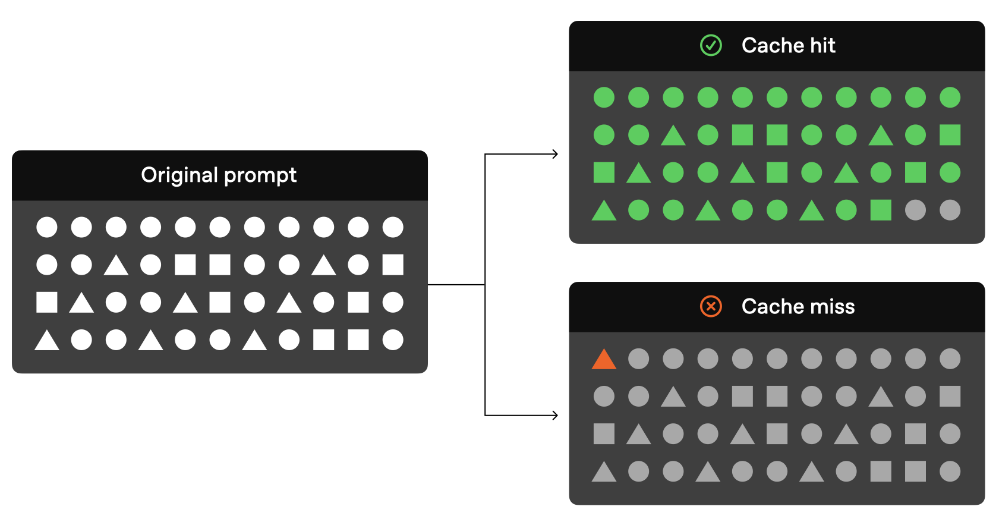
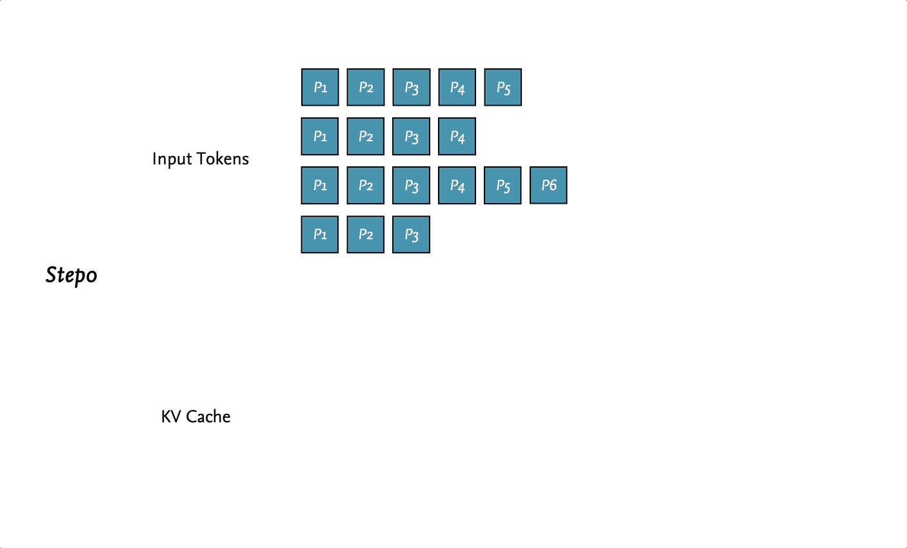
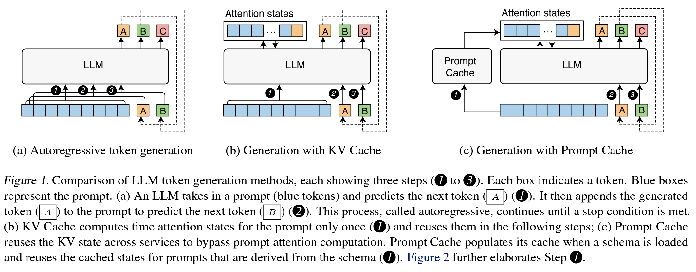
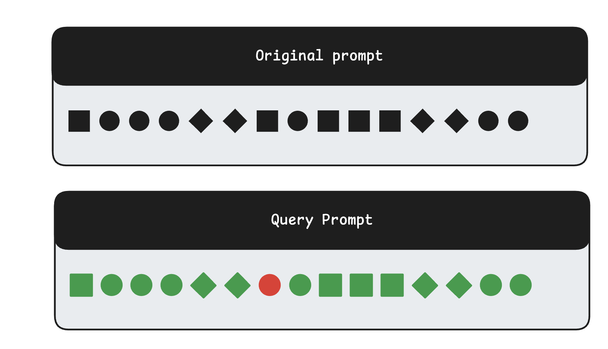
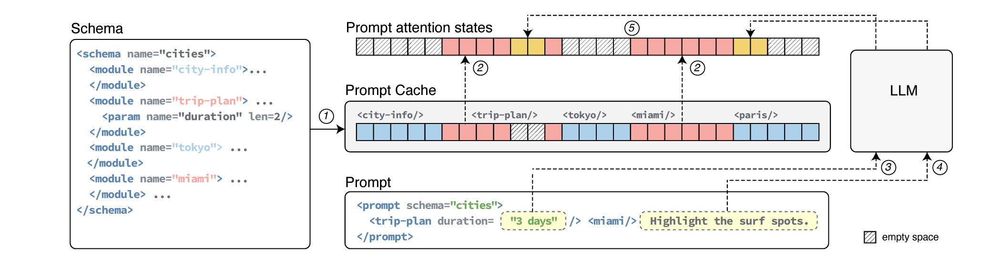
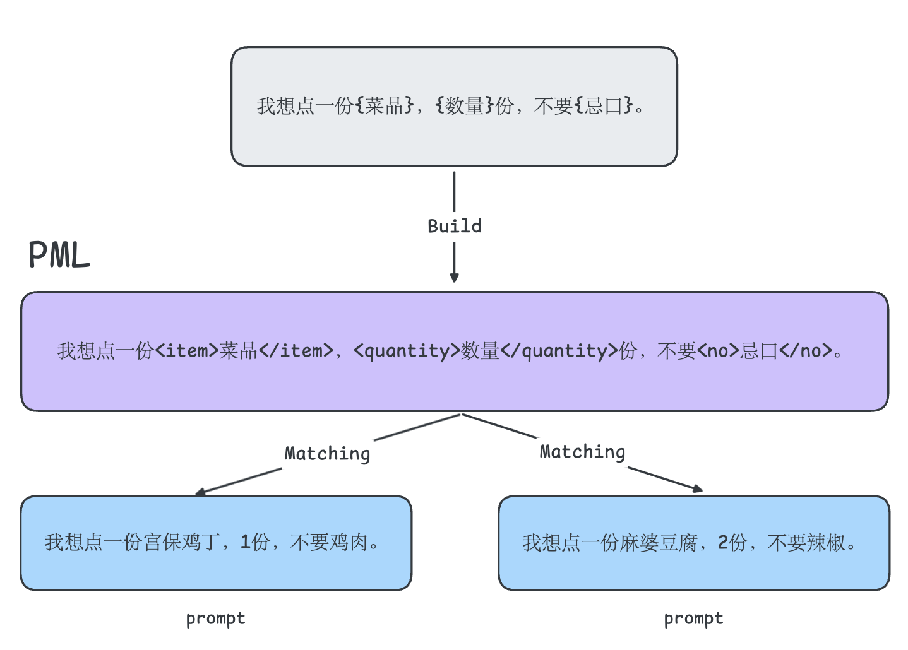

# LLM Best Practice：Prompt caching，一篇就够了。

`⏰ Read: 25 + 30min`

我第一次听到 prompt caching 可能是 DeepSeek 当时推出了缓存命中 0.1 元每百万 tokens（[DeepSeek API 创新采用硬盘缓存，价格再降一个数量级](https://api-docs.deepseek.com/zh-cn/news/news0802))，随后各大厂商陆续推出了自己的 prompt caching 特性。

**本文旨在回答四个问题**：

- 什么是 prompt caching ？为什么需要 prompt caching？
- prompt caching 的原理是什么？
- 我们作为 user 和 developer 如何更好的利用 prompt caching 呢？
- prompt caching 和 KV caching 有关系吗？使用 prompt caching 时是否会反过来影响输出的质量呢？

我会基于 OpenAI 的[博客](https://platform.openai.com/docs/guides/prompt-caching)，论文 [Prompt Cache: Modular Attention Reuse for Low-Latency Inference](https://arxiv.org/abs/2311.04934) 和我自己检索的信息，带着上面这四个问题尽力构建一篇足够简洁的博客。

当然，对于用户，我们追求的**可能只是如何高效的利用这个特性**。如果把原理混杂在 **best practice** 中非常影响阅读的流畅性，因此我会分成**如何使用**和**深入理解**两个章节，力求一气呵成的阅读流畅性。水平有限，欢迎指正！

## 如何使用

`⏰ Read: 25min`

> [!NOTE]
>
> **指令缓存 (prompt caching) 是一种用于降低延迟和成本的技术。**

这句话介绍了 prompt caching 的具体作用。

**model prompt = system prompt + user prompt**

这是一个基本知识。通常情况下 model prompt 是包含许多重复内容的，例如 system prompt 和在 user prompt 中出现的常用指令（比如角色扮演的指令，数据分析的指令）。

因此，prompt caching 便是旨在**“存储”并“利用”**这些 model prompt 中的重复内容，来达到同时降低延迟和成本的好处。实现用户降低了成本，提升了速度；厂商减少了算力消耗，双赢的局面。

例如 OpenAI 会将 API 请求路由到最近处理过相同 prompt 的服务器，这比从头开始处理 prompt 更便宜、更快速。对于较长的 prompt，这可以**将延迟降低高达 80%，并将成本降低 50%**。prompt caching 会在你所有的 OpenAI API 请求中自动生效 (无需更改代码)，并且不存在任何额外费用。

要理解这个优化效果，我们需要了解 LLM 响应中的一个重要概念：首 Token 延迟（TTFT, Time to Frsit Token）。这是从发送请求到收到模型第一个 token 响应所需的时间。

“在线服务场景中，如聊天机器人，大语言模型推理一般都采用流式输出（streaming）的形式，LLM 推理的 TTFT 就是**用户感受到的 LLM 推理服务的响应时间，直接影响用户体验**。”对于在线服务，为了提升用户体验，所以都希望 TTFT 要足够小，这也是我们为什么需要 prompt caching。

TTFT 和 prompt 的长度密切相关，对于长 prompt 来说，大部分延迟都发生在这个阶段，因为模型需要先**处理完整个输入才能开始生成输出**。 通过 prompt caching，模型可以直接利用已缓存的处理结果，显著减少这个首次等待时间。这就像是模型已经"预习"过这段内容，可以更快地开始响应（和 KV Cache 很像，可以思考下他们的不同之处，我会在后文给出我的思考）。特别是在处理包含大量重复内容（如系统提示词、固定指令等）的请求时，这个优势更为明显。

> [!TIP]
> TTFT 的理解可能涉及到了小部分 LLM Inference 相关的知识，推荐阅读我的另一篇博客：[Basic LLM Inference/Generation，一篇就够了。](https://zhuanlan.zhihu.com/p/694176507)

上面这一小段内容已经回答了问题1，已经了解到 prompt caching 是如此的 **重要且实用**，作为用户我们该如何**高效的利用呢？**

### Structuring prompts

当前绝大部分的 LLM API，只有当两个请求的前缀内容相同时（从第 0 个 token 开始相同），才存在缓存命中。为了利用缓存的优势，请**将静态内容** （例如说明和示例） **放在 prompt 的开头，并将可变内容** （例如用户特定的信息） **放在结尾**。这也适用于图像和工具，它们在不同请求之间必须相同。



使用方法就是如此简单：“将需要缓存的内容放到 prompt 开头即可”。接下来，我综合了 OpenAI 和 Anthropic 的博客给出 best practices。

> [!TIP]
> **问题：为什么是 caching 是通过前缀匹配识别？必须使用前缀匹配吗？**
>
> **思考：** 前缀匹配的重要性在于其能够**高效地**识别出重复的 prompt 片段，进而实现缓存的复用。
>
> 为什么能**高效地识别呢**？从技术原理上讲，因为可以使用类似于计算机科学中的“字典树”(Trie) 数据结构。通过将 prompt 的前缀作为路径存储在树状结构中，系统可以快速地查找是否存在匹配的前缀。这种方式的优势在于查找速度快，时间复杂度通常为 $O(m)$ ，其中 $m$ 为前缀的长度。此外，前缀匹配也符合实际应用场景，**因为大多数情况下， prompt 的变化主要集中在尾部，而开头部分往往是相对固定的。**
>
> 那么必须是前缀匹配吗？在特定情况下我们可能只有中间某个位置不同，例如：
>
> ```
> Original Prompt:
> "你是一个专业的文章翻译助手。请将下面这篇关于人工智能的文章翻译成中文。
>  [文章内容...]
>  请保持专业术语的准确性。"
> ```
>
> 这一个 prompt 只是一个例子，但是我们发现，它只用中间会有变动，在这种情况下基于前缀匹配的 prompt caching 会无法 caching 后半部的静态内容。
>
> 这时候 Claude 支持的 `cache_control` 特性就更具灵活性（因为我们可以把上面的 prompt 拆成三个部分，然后分别用 `cache_control` 修饰第一个和第三个部分） 。当然，后文中我们还会介绍另外一种方法， 但是我认为它不够**用户友好**，前缀匹配是一个非常简洁也在绝大部分情况下都奏效的匹配策略，这里的选择是工程上的 tradeoff。如果你觉得该方法不够好用那么恭喜你你已经是 advanced 的用户了！

### Best practices for effective caching

- **合理选择缓存内容** 妥善缓存那些稳定且可重复使用的内容。这类内容包括：**系统指令、背景信息、大段上下文或常用的工具定义等**。这些内容往往是"一劳永逸"的基础组件，善加利用可事半功倍。
- **优化内容位置** 将需要缓存的静态或重复内容放置在提示词的开头位置，将动态内容放在结尾。这种布局能够最大程度地发挥缓存机制的优势。
- **持续监控和优化** 定期检查缓存相关的指标，例如缓存命中率、延迟和缓存的 token 百分比，根据实际使用情况优化 prompt 和缓存策略。这能确保缓存机制始终保持良好的效果。
- **优化请求策略** 请**使用较长的 prompt** 并在**非高峰时段**发起 API 请求，因为在高峰时段缓存淘汰更为频繁。并且最近未使用的 prompt 会自动从缓存中移除。为了最大限度地减少淘汰，请**保持使用相同 prompt 前缀的连续请求流**。（通常情况下，API 只对长度超过某个阈值的 prompt 进行缓存，阈值通常是 1024）
- **[Claude Only]** Claude 并不会像 OpenAI 一样自动的启用 prompt caching，它需用手动的添加 `cache_control` 标识。因此，通过巧妙设置缓存断点，将不同的可缓存前缀部分加以区分。这样做既可以让缓存更有条理，又能提高缓存命中率。

到这里，前三个问题我们都有了大致的回答。作为一个用户，我们知道了什么是 prompt caching 以及如何最佳的使用 prompt caching 了！接下来，我们尝试进一步的理解其背后的逻辑。

## 深入理解

`⏰ Read: 30min`

### How prompt caching works

这里引用 OpenAI 官方博客中的内容（Claude 会更复杂一些，感兴趣的推荐阅读：[Build with Claude - Prompt caching](https://docs.anthropic.com/en/docs/build-with-claude/prompt-caching)）

对于**长度为 1024 个 token 或更长的 prompts** ，缓存会自动启用。当你发起 API 请求时，将执行以下步骤：

1. **缓存查找 (Cache Lookup)**：系统检查 prompt 的初始部分 (前缀) 是否存储在缓存中。
2. **缓存命中 (Cache Hit)**：如果找到匹配的前缀，系统将使用缓存的结果。这将显著降低延迟并减少成本。
3. **缓存未命中 (Cache Miss)**：如果没有找到匹配的前缀，系统将处理你的完整 prompt 。处理后， prompt 的前缀将被缓存以供将来的请求使用。

缓存的前缀通常在 5 到 10 分钟的不活动状态后失效。但是，在非高峰时段，缓存可能会持续长达一小时。

当然，具体较大家如何使用 API 不是我这篇博客的目的，我会在附录中 refer 上对应的 API 文档以及他们提供的常见用例，关于一些 FAQ 也可以直接参考对应的文档～ 

### Differences from KV Caching

对于熟悉 KV Caching 的朋友，prompt caching 和它有诸多相似之处。它们都是避免计算重复的注意力 embedding，通过缓存手段加速推理过程。

这里简单的 review 下 KV Cache 在干什么。所谓自回归推理，就是每次都要基于之前的内容来预测（计算）下一个 token。如果没有任何优化手段，自回归中预测下一个 token 的计算量是递增的（因为某些 token 被重复计算了多次），所以 KV Cache 就出现了，也就是常用的“以空间复杂度换时间复杂度”的思路。引用我之前博客中的动图，灰色的部分是被保留的 KV cache，我们可以在下次自回归计算时直接使用。



prompt caching 也是干这事的，“**复用**之前计算的结果”，那么他们的区别到底在哪呢？下图引用自“Prompt Cache：Modular Attention Reuse for Low-Latency Inference“ 论文。



我认为其区别在于：KV Cache 是 single session 的 cache，而 prompt cache 是支持 cross session 的 cache（也许这里用 sequence 而非 session 会更好）。我们来分析这张图：

- 图（a）代表的是最原始的自回归计算过程，如上文所述，某些 token 需要重复多次计算。
- 图（b）则是 KV cache，多出了一个 `attention states` 的部分，这部分可以存储已经计算过的结果，再下一次自回归计算中复用，这大大降低了计算量。（至于为什么可以 KV cache，这是我很久之前挖的坑了，有机会补上后在此处更新引用）。
- 图（c）则是我们的主角 prompt cache，它在 KV cache 的基础上多了一个 prompt cache。本质上就是增加了一个全局的管理器，来实现跨序列的缓存。它可以将其他序列中缓存的结果提供给本次推理使用，所以**它提供的是一个 overall 的加速而非单次推理的加速**。（讲到这里有点类似 PagedAttention，通过降低显存占用来间接地提升吞吐，当然这是我粗糙的理解，欢迎指正）这里的缓存不一定在显存/内存上，甚至可能是磁盘。至于性能，我们一次性读取大量的 tokens 其实也没那么慢。（相比计算的开销来说）

所以回过来 prompt cache 和 kv cache 的区别在于： **prompt cache 提供的是一个跨序列的 cache，它的效果也是作用于全局（多次）而非单次推理。**

KV cache 不会影响推理的效果，同理使用 prompt cache 也不会影响推理的效果。大家不用担心影响任务质量。而 prompt cache 最大的问题就是如何**维护与识别**，区别于 kv cache 本质上是“**一定**”会被复用，prompt cache 可能会面临存储后无人问津的尴尬情况，并且**如何识别**也是影响缓存命中的关键因素。

### Prompt Cache Matching Mechanisms

在 **如何使用** 的 part 中，我们介绍的是最粗暴的前缀匹配（即 OpenAI 使用的）。同时，我们在思考环节遇到了一个问题：**“如果我们只有中间某处 prompt text 不同怎么办呢？”**进一步推广：**“如果我们的 prompt 的存在一个范式，只在某些固定位置不同怎么办呢（例子可以参考 python 的 String Formatting）？**

比如下图，两个 prompt 只有某个特定位置的 token 不同，这时候简单的前缀匹配就会失效。



因此，论文中提到了 Prompt Markup Language（PML），什么是 PML 呢？提示标记语言（PML）旨在以结构化的方式表示提示，特别是突出 prompt 中的**不变 （固定）** 部分和**可变 （可更改）** 部分。



正如我们在问题中提到的，当前缀匹配遇到只有中间某处不同的 prompt 时，它就失效了。而 PML 通过明确标记出这些可变部分，巧妙地解决了这个问题。我举一个简单的例子大家一看便知：



- `<item>`、`<quantity>` 和 `<no>` 是**可变槽位**，代表可以更改的部分。
- 其余部分是**固定文本**。

现在，即使两个顾客点了不同的菜品、数量和忌口，PML 都能识别出它们遵循相同的模板，并准确地识别出哪些部分是可变的。所以相较于粗暴的前缀匹配，PML 可以基于模版识别实现更准确的匹配， 并且得到更高效的缓存。

同时，如何前文所说：Claude 提供的 `cache_control` 特性某种程度上可以实现**类 PML**的效果。对比 OpenAI 和 Claude：

- OpenAI 提供一个更直接的 caching 策略，更用户友好，但是在特定情况下容易失效。
- Claude 提供的是一个更专业的caching 策略，初学者可能难以看懂，但是学会后可以实现最佳的缓存性能。

本篇到此完结，当前其实还有一些细节可以深入挖掘，但是我觉得我已经回答了文章开始处的四个问题。就像 OpenAI 一样，我这里就提供一个“简单粗暴”的概览，以供大家了解什么是 prompt caching 以及 prompt caching 的 best practice。

## References

- 文档和代码资料：
  - [Claude: Prompt caching examples](https://docs.anthropic.com/en/docs/build-with-claude/prompt-caching#prompt-caching-examples)
  - [Google: Context caching](https://ai.google.dev/gemini-api/docs/caching)
  - [Anthropic: Prompt caching cookbook](https://github.com/anthropics/anthropic-cookbook/blob/main/misc/prompt_caching.ipynb)
  - [Anthropic: news prompt caching](https://www.anthropic.com/news/prompt-caching)
- 技术博客：
  - [OpenAI: Prompt caching Best Practices](https://platform.openai.com/docs/guides/prompt-caching)
  - [Paper: Prompt Cache: Modular Attention Reuse for Low-Latency Inference](https://arxiv.org/abs/2311.04934)
  - [知乎：LLM推理：首token时延优化与System Prompt Caching](https://zhuanlan.zhihu.com/p/687685636)
  - [知乎：Prompt Cache：模块化注意重用实现低延迟推理](https://zhuanlan.zhihu.com/p/706709303)
  - [怎么理解Contextual-Retrieval ？（顺手讲一下prompt-cache）](https://www.linkedin.com/pulse/%E6%80%8E%E4%B9%88%E7%90%86%E8%A7%A3contextual-retrieval-%E9%A1%BA%E6%89%8B%E8%AE%B2%E4%B8%80%E4%B8%8Bprompt-cache-boyang-zhou-4of4c/)
