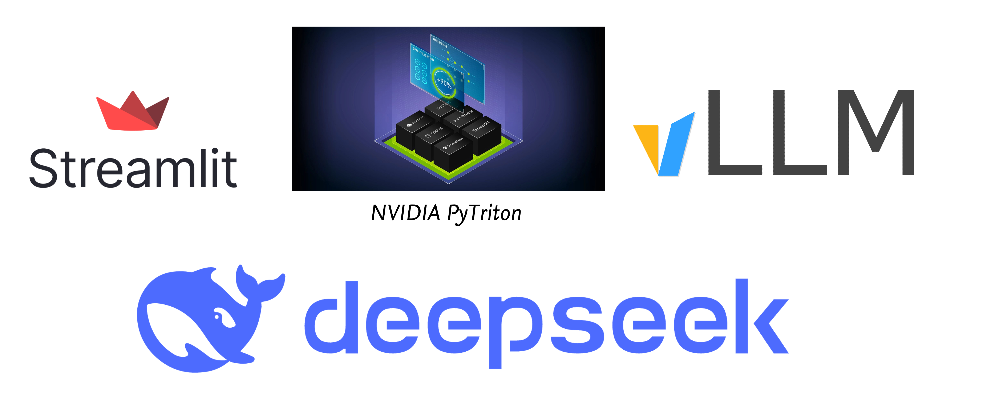

# Chat-LLM DEMO V1

我一直希望写一写模型推理，部署和 DEMO 的全流程。因为个人学习时总希望能对整个流程有一个认知。如果仅仅是让模型运行起来很简单，如何做 DEMO 也有很多精品博客。而我的爱好是做 minimum example，**确保每行 code 的必要性，避免不必要的炫技**，符合当前博客主题（入门 or 深入）。同时享受跑通 DEMO 带来的更高的满足感。

本篇主要作为一个 Base，旨在先从实战出发。后续我会基于此给出，`PyTriton`（部署） 和 `vLLM`（推理） 的相关博客。虽然这个 topic(chat-bot) 比较烂大街，但是胜在简单，容易出效果。我会尽力用最精简的语言，带大家了解一下整个的 pipeline。

在我之前尝试做一个 Internal DEMO 的时候，我发现我对除了 Training 之外的内容了解极少，对于各种部署，推理方案更是一无所知。检索了一堆资料，东拼西凑才有了一个大概的概念。由此发现中文互联网上这方面内容有所缺乏，因此我尽力选择了一些比较热门的工具和项目（Triton Inference Server 和 vLLM），保证内容时效性的同时尽力让大家脑海里有一个简单的认知雏形。

提前声明：我的这篇博客仅仅是为了让大家有一个概念，看看实际的 Code 是如何串联起这几个环节的，扫一扫盲，内容非常简单，欢迎大家讨论。

Example 计划会有两个版本，内容包括：
- [x] `transformers` for model.
- [x] `streamlit` for front-end.
- [x] `pytriton` for model deployment. (non-batch infer)
- [ ] `pytriton` for model deployment. (dynamic batching infer)
- [ ] `vLLM` for inference optimization. (maybe in the V2)
- [ ] Streaming ouput for better user experience. (maybe in the V2)


## Model Selection
模型选择的是 `🐳deepseek` 的 [`llm-7b-chat`](https://huggingface.co/deepseek-ai/deepseek-llm-7b-chat)。我本地运行当前配置大约需要单卡 15GB 的显存。（个人建议 24GB 及以上）


## Installation
如下为 Example 所需的依赖。欢迎大家进行补充。
> ⚠️ 如果存在网络问题，请使用 `export HF_ENDPOINT=https://hf-mirror.com`。

```bash
# For front-end.
pip install streamlit

# For model.
pip install accelerate
pip install --upgrade transformers

# For NVIDIA-PyTriton.
export LD_LIBRARY_PATH=$LD_LIBRARY_PATH:$CONDA_PREFIX/lib
pip install -U nvidia-pytriton
```

## Running example locally
```bash
# You can omit it.
cd code-examples/chat-llm

# In one terminal. The CUDA_VISIBLE_DEVICES is optional.
CUDA_VISIBLE_DEVICES=7 python server.py

# In another terminal. 
streamlit run client.py --server.port 8080 --server.address 127.0.0.1
```

## Client ( frontend )

Client 端主要负责 UI 展示和与 Server 端的交互。包括 Streamlit 和 PyTriton Client。由于是 Version1，所以一切从简，并没有尝试集成诸如 streaming ouput 等特性，避免引入不必要的困惑。

### Streamlit

Chat-bot 的页面主要使用 Streamlit 框架的组件实现。整体实现非常**简洁**，如需深入推荐阅读该文档 [Streamlit: Build a basic LLM chat app](https://docs.streamlit.io/knowledge-base/tutorials/build-conversational-apps)，大约需要 `30` 分钟。

Streamlit 是一个基于 Python 的前端框架，也是简洁地实现该 DEMO 的关键框架之一。为避免大家无法理解 Streamlit 的语法，我会用最简单，最直接的语言进行介绍。

首先，只需要理解 Streamlit 的一个特性。它的特点是：**每次用户的交互都会触发整个页面的重新渲染**。简单来说：它是从头重新执行整个脚本来进行交互的。**显然，如果只是从头执行脚本，那么所有的状态都会丢失**（你重新执行后如何知道上一个交互操作是什么？）。Streamlit 提供一个 `st.session_state` 字典用于每次重新执行时的状态保持（只有这里面的信息才是持久化的信息）。拿 Example Code 举例：
- `Line 15`，对于一些特殊的对象，诸如网络连接，我们不希望每次交互时需要重新连接。所以，我们把 `ModelClient` 初始化后存在 `st.session_state` 中避免重复构造。（当然，Streamlit 也提供更高级的 `cache` 方法，但是该版进行最小限度的实现）。
- `Line 24`， 对于 chat-bot 我们需要保留用户和 bot 的所有消息记录，所以在 `st.session_state` 中用  `history_message` 保存。

如果你能理解上面这部分，那么 DEMO 这块将不再有任何 block。代码中的注释应该已经足够帮助你理解。


### PyTriton Client

> ✨ PyTriton 是 NVIDIA 对于 Triton Inference Server 的纯 Python 实现，用来简化 Python 环境下的模型部署。可以理解为提供模型推理的前后端配套接口即可。个人还是比较看好 PyTriton 的，但是目前文档有一些不完善，社区资料也较少（因为太新了），之后会尝试多记录一些 PyTriton 的内容。PyTriton 的优势我会在后续的博客中进行分析，现在你只需要继续实现下去。


PyTriton 中有多种可用的 `Client`，这里选择最简洁的 `ModelClient`。只需要我们传入对应的 `url` 和 `model_name` 即可构造。这里的 `url` 前缀为 `grpc://`，代表我们使用的是 `gRPC` 协议。PyTriton 支持 `HTTP` 和 `gRPC` 两种协议，但是 `gRPC` 通常更稳定。

从 `Line 42` 开始模型推理部分。

`Step1` 看起来有一些不必要的冗长。这是因为：**PyTriton 仅支持传输 `numpy.ndarray` 类型的数据**。所以我们需要进行一些简单的编码与转换操作。你可以略过这部分并当作是一个黑盒处理。

> 💎 如果你想了解更多，我给出每个操作对应的类型转换：
> ```python
> List[Dict[str, str]] -(json.dumps)-> str -(str.encode)> -> bytes -(np.frombuffer)-> np.ndarray(dtype=np.uint8)
> ```

`Step2` 中我们使用预构造的 `client` 发送推理请求，注意 `PyTriton` 的 `client` 提供两种推理函数：`infer_sample` 和 `infer_batch`，分别对应单个推理和批处理推理。为了避免引入更多的内容，这里我们使用的是 `infer_sample` 代表我们传入的是一个单个（而非批处理）的推理请求。

`Step3` 中我们将推理结果进行解码。这里的解码操作与编码操作相对应。你可以理解为：**我们将推理结果从 `numpy.ndarray` 类型解码为 `List[Dict[str, str]]` 类型**。

至此，我们已经理解了 Client 端的所有代码。仅需几十行代码，我们就完成了一个简单的 chat-bot 的前端实现。

## Server ( backend )

Server 端主要负责模型的加载与 client 端推理请求的响应。包括 Huggingface Transformers 和 PyTriton Inference Server。

### Huggingface Transformers

关于模型的加载部分，我基本参考了 DeepSeek LLM HuggingFace 页面的[官方实现](https://huggingface.co/deepseek-ai/deepseek-llm-7b-chat#chat-completion)。官方实现的代码也可以抽象为：**加载**和**推理**两个阶段。加载的代码是完全可重用的（后续集成 `vLLM` 时可能需要变化）。目前，只需修改推理代码以匹配 PyTriton 的输入输出即可。

```python
import torch
from transformers import AutoModelForCausalLM, AutoTokenizer, GenerationConfig

# Sec1 Load.
model_name = "deepseek-ai/deepseek-llm-7b-chat"
tokenizer = AutoTokenizer.from_pretrained(model_name)
model = AutoModelForCausalLM.from_pretrained(
    model_name, torch_dtype=torch.bfloat16, device_map="auto"
)
model.generation_config = GenerationConfig.from_pretrained(model_name)
model.generation_config.pad_token_id = model.generation_config.eos_token_id

# Sec2 Infer.
messages = [{"role": "user", "content": "Who are you?"}]
input_tensor = tokenizer.apply_chat_template(
    messages, add_generation_prompt=True, return_tensors="pt"
)
outputs = model.generate(input_tensor.to(model.device), max_new_tokens=100)

result = tokenizer.decode(
    outputs[0][input_tensor.shape[1] :], skip_special_tokens=True
)
print(result)
```

### PyTriton Inference Server

PyTriton Server 端的配置流程主要包括：

1. 配置 `TritonConfig` 并启动 `Triton`。(easy)
2. 🔥 使用 `Triton.bind()` 配置模型信息，输入输出为度，推理设置与绑定推理函数 `_infer_fn`。 (key)
3. 使用 `triton.server()` 以 [Blocking mode](https://triton-inference-server.github.io/pytriton/0.5.3/initialization/#blocking-mode) 启动服务。 (easy)

这三步中仅有第二步非常关键。我们重点研究一下 `Triton.bind()`。 `Triton.bind()` 包含如下[参数](https://triton-inference-server.github.io/pytriton/0.5.3/reference/triton/#pytriton.triton.Triton.bind)：

- `model_name`：一个字符串，代表 Triton Inference Server 中可用的 Model 名，在发送请求时有用。
- `infer_func`：Python 函数，代表 Triton Inference Server 该如何处理推理请求。
- `inputs`：定义模型输入参数的数量，类型和形状。
- `outputs`：定义模型输出参数的数量，类型和形状。
- `config`：用于对 Triton Inference Server 上的模型部署进行更多定制，比如 `batching` 和 `max_batch_size` 等。
- `strict`：启用对**推理输出**的数据类型和形状进行验证，以确保其符合提供的模型配置（默认为：`False`）。

由于我们旨在实现一个最简化的版本，其他的参数基本都是默认值或者最简易的填充（比如 `config` 中的 `batching=False`）。我们把目光聚焦于 `inputs`， `outputs` 和 `infer_func` 这几个与具体场景相关的参数。

首先，我们需要针对场景定义 `input` 和 `output` 的维度与数据类型。这里有一些小坑（也是目前 PyTriton 文档中略有欠缺的地方）。

如果我们在 `config` 中设置了 `batching=True`，那么 `input` 和 `output` 会默认把第一维度为 `batch` 维度。否则不存在 batch 维，举几个例子：

```python
# config.batching = True
# 下面的 input 需求的是一个 [x, 1, 3] 的输入。
inputs = [Tensor(name="input0", dtype=np.float32, shape=[1, 3])]

# config.batching = False
# 下面的 input 需求的是一个 [1, 3] 的输入。
inputs = [Tensor(name="input0", dtype=np.float32, shape=[1, 3])]
```

如果使用 `-1` 则表示 `input` 或 `output` 的动态形状。在这里由于我们没有使用 `batching`，所以 `input` 仅为一维的，形如 `(x,)` 的序列，而 `output` 则为一个形状固定的 `(1,)` 序列。

之后，只需要实现一个 `_infer_fn` 函数即可。记得前端进行的数据转换操作嘛？现在需要先进行一步逆操作还原回 `List[Dict[str, str]]` 类型的数据。之后便可直接复用上文中 Huggingface Transformers 段中 Sec2 的推理代码。仍然需要注意的是：**我们的返回值应为 `numpy.ndarray` 类型**。

> ❕这里可能有人会想知道代码中的 `@sample` 的 decorator 有什么作用。
> 
> 这里如果详细分析可能会不必要的复杂，通常情况下我们会使用两种选择：
> - `@sample`, 适用于 non-batch 推理，即每次推理请求只有一个输入。
> - `@batch`, 适用于 batch 推理，即每次推理请求有多个输入。
> 
> `@batch` 的使用会出现在 DEMO V2 中，如果你还希望了解更多，我会在之后详细介绍 PyTriton 的博客中提及或你可以参考 NVIDIA 的官方文档：[PyTriton: Decorators](https://triton-inference-server.github.io/pytriton/0.5.3/inference_callables/decorators/)。

```diff
@sample
def _infer_fn(messages: np.ndarray) -> np.ndarray:
-   messages = [
-       {"role": "user", "content": "Who are you?"}
-   ]
+   # Reverse the encoding operation.
+   messages = json.loads(messages.tobytes().decode("utf-8"))

    input_tensor = tokenizer.apply_chat_template(messages, add_generation_prompt=True, return_tensors="pt")
    outputs = model.generate(input_tensor.to(model.device), max_new_tokens=100)

    result = tokenizer.decode(outputs[0][input_tensor.shape[1]:], skip_special_tokens=True)
-   print(result)
+   # Convert the result to `np.ndarray` type.
+   return {"response": np.char.encode([result], "utf-8")}
```

## Summary and Future Work

至此，我们已经完成了一个简单的 chat-bot 的前后端实现。该代码是 Version1，旨在以最小的 example 来展示整个 DEMO 推理与部署的流程，并不涉及更多高级特性。

在 Version2 中我会进行更多的拓展，补充诸如 `vLLM` 的推理优化，PyTriton 的 `Dynamic Batching` 与文本流式输出等高级特性。

更进一步，我会尽力的做出 PyTriton 相关的专业技术博客与 vLLM 源代码分析。希望能帮助大家更好的理解模型推理与部署的全流程。在 Applied AI 中更进一步。

## Reference
- [🤗 Huggingface: deepseek-llm-7b-chat](https://huggingface.co/deepseek-ai/deepseek-llm-7b-chat#chat-completion)
- [Streamlit: Build a basic LLM chat app](https://docs.streamlit.io/knowledge-base/tutorials/build-conversational-apps)
- [PyTriton: Decorators](https://triton-inference-server.github.io/pytriton/0.5.3/inference_callables/decorators/)
- [PyTriton: Blocking mode](https://triton-inference-server.github.io/pytriton/0.5.3/initialization/#blocking-mode)
- [PyTriton: Triton.bind()](https://triton-inference-server.github.io/pytriton/0.5.3/reference/triton/#pytriton.triton.Triton.bind)
- [NVIDIA: Triton Shape Tensors](https://docs.nvidia.com/deeplearning/triton-inference-server/user-guide/docs/user_guide/model_configuration.html#shape-tensors)
