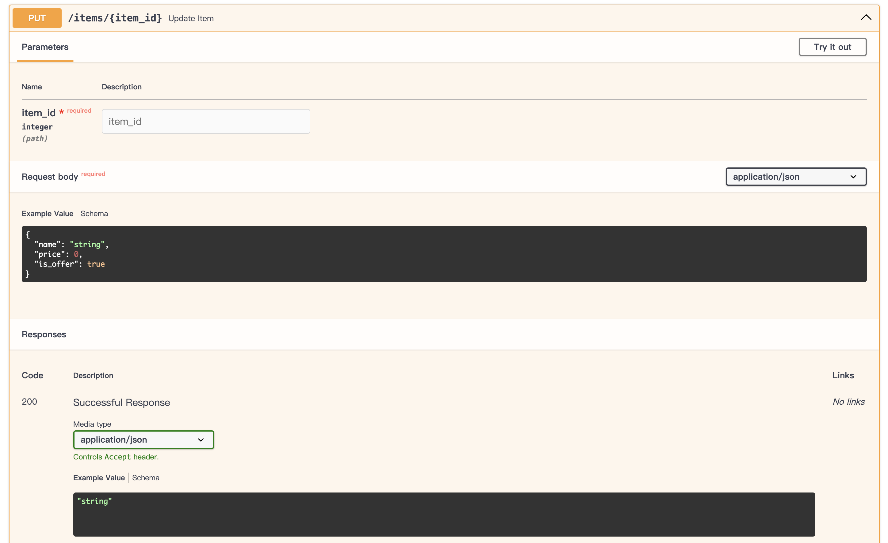

# FastAPI探索（LLM 领域）

## Introduction

FastAPI is a modern, fast (high-performance), web framework for building APIs with Python 3.8+ based on standard Python type hints.

The key features are:

- **Fast**: Very high performance, on par with **NodeJS** and **Go** (thanks to Starlette and Pydantic). [One of the fastest Python frameworks available](https://fastapi.tiangolo.com/#performance).
- **Fast to code**: Increase the speed to develop features by about 200% to 300%. *
- **Fewer bugs**: Reduce about 40% of human (developer) induced errors. *
- **Intuitive**: Great editor support. Completion everywhere. Less time debugging.
- **Easy**: Designed to be easy to use and learn. Less time reading docs.
- **Short**: Minimize code duplication. Multiple features from each parameter declaration. Fewer bugs.
- **Robust**: Get production-ready code. With automatic interactive documentation.
- **Standards-based**: Based on (and fully compatible with) the open standards for APIs: [OpenAPI](https://github.com/OAI/OpenAPI-Specification) (previously known as Swagger) and [JSON Schema](https://json-schema.org/).

FastAPI 是一个现代化的、快速（高性能）的Web框架，用于使用 Python 3.8+ 构建 API，基于标准 Python 类型提示。

主要特性包括：

- **快速**：非常高的性能，与 NodeJS 和 Go 相媲美（得益于 Starlette 和 Pydantic）。这是目前可用的最快的 Python 框架之一。
- **快速编码**：通过提高大约 200% 到 300% 的开发功能速度。*
- **更少的错误**：减少大约 40% 的人为（开发者）引起的错误。*
- **直观**：出色的编辑器支持。到处都是自动完成。减少调试时间。
- **简单**：设计易于使用和学习。减少阅读文档的时间。
- **简洁**：最小化代码重复。每个参数声明都有多个功能。更少的错误。
- **健壮**：获取生产就绪的代码。带有自动交互式文档。
- **基于标准**：基于并完全兼容 API 的开放标准（以前称为 Swagger 和 JSON Schema）。

*注：上述“快速编码”和“更少的错误”的数据来源于开发者的经验，具体效果可能因实际应用场景和开发者能力而异。

## Install

```
$ pip install fastapi
$ pip install "uvicorn[standard]"
```

> **Q：为什么我们需要额外下载 `uvicorn` 包呢？**
>
> 官方描述：“You will also need an ASGI server, for production such as [Uvicorn](https://www.uvicorn.org/) or [Hypercorn](https://github.com/pgjones/hypercorn).”
>
> 这是因为 FastAPI 本身只是一个用于创建 API 的框架，而不是一个完整的 web 服务器。为了在生产环境中运行 FastAPI 应用，你需要一个 ASGI（Asynchronous Server Gateway Interface）服务器。这就是 `uvicorn` 或 `hypercorn` 等包的作用。
>
> 其中有一些属于是我这种非前端人士不太了解的：
>
> - **ASGI 服务器**：ASGI 是 Python 的异步服务器网关接口，是 WSGI（同步服务器网关接口）的异步版本。它是一种标准，定义了如何在 Python 异步 Web 应用和服务器之间进行通信。
> - **Uvicorn**：Uvicorn 是一个轻量级、高性能的 ASGI 服务器，用于运行异步 Python Web 应用。

## Example

> 其实这部分就是简单的翻译了下官方的英文 Doc，感兴趣的还是推荐阅读官方英文文档。

### Basic

```python
from typing import Union

from fastapi import FastAPI

app = FastAPI()


@app.get("/")
def read_root():
    return {"Hello": "World"}


@app.get("/items/{item_id}")
def read_item(item_id: int, q: Union[str, None] = None):
    return {"item_id": item_id, "q": q}
```

<details>
    <summary>About the command <code>uvicorn main:app --reload</code>...</summary>
    <p>The command <code>uvicorn main:app</code> refers to:</p>
    <ul>
        <li><strong>main</strong>: the file <code>main.py</code> (the Python "module").</li>
        <li><strong>app</strong>: the object created inside of <code>main.py</code> with the line <code>app = FastAPI()</code>.</li>
        <li><strong>--reload</strong>: make the server restart after code changes. Only do this for development.</li>
    </ul>
</details>
现在你已经创建了一个 API ，通过访问 http://127.0.0.1:8000/items/5?q=somequery你会得到如下的 JSON 格式回复：

```json
{"item_id":5,"q":"somequery"}
```

除此之外，FastAPI 一大优势是可以**直接动态的生成 API 文档**，你可以通过访问：http://127.0.0.1:8000/docs#/ 直接得到。

> 除了访问 `docs#/`，FastAPI 还提供了一个替代的选择。通过访问：http://127.0.0.1:8000/redoc。你可以浏览另一个自动文档（由[ReDoc](https://github.com/Rebilly/ReDoc)提供）。

### Further

前面的 Example 仅仅是简单的介绍了下 FastAPI 处理 `GET` 操作，接下来我们将引入 `PUT` 操作。

> - **GET**：获取数据，参数在 URL 中。
> - **PUT**：更新数据，参数在请求体中。
> - **POST**：创建数据，参数在请求体中。

使用 `pydantic` 和标准的类型声明，可以方便的进行类型检查。这在实际应用场景中非常有用。当我们做了如下修改时：这个服务应该被自动的加载，这归功于我们之前添加的 `--reload` 选项。

```diff
from typing import Union

from fastapi import FastAPI
+ from pydantic import BaseModel

app = FastAPI()


+ class Item(BaseModel):
+     name: str
+     price: float
+     is_offer: Union[bool, None] = None


@app.get("/")
def read_root():
    return {"Hello": "World"}


@app.get("/items/{item_id}")
def read_item(item_id: int, q: Union[str, None] = None):
    return {"item_id": item_id, "q": q}


+ @app.put("/items/{item_id}")
+ def update_item(item_id: int, item: Item):
+     return {"item_name": item.name, "item_id": item_id}
```

对于新的 Example 你还可以像之前那样打开 Doc 浏览，使用如下代码或者点击 Doc 中的 `Try it out` 按钮进行尝试。这个 Example 主要进一步介绍 FastAPI 在较为复杂的场景下的应用示例。

```shell
curl -X 'PUT' \
  'http://127.0.0.1:8000/items/5' \
  -H 'accept: application/json' \
  -H 'Content-Type: application/json' \
  -d '{
  "name": "string",
  "price": 0,
  "is_offer": true
}'
```



### More

> 这段由于我对于 web 开发了解太少不敢妄加翻译，敬留下官方文档用以保持文章的覆盖面。

For a more complete example including more features, see the [Tutorial - User Guide](https://fastapi.tiangolo.com/tutorial/).

**Spoiler alert**: the tutorial - user guide includes:

- Declaration of **parameters** from other different places as: **headers**, **cookies**, **form fields** and **files**.
- How to set **validation constraints** as `maximum_length` or `regex`.
- A very powerful and easy to use **Dependency Injection** system.
- Security and authentication, including support for **OAuth2** with **JWT tokens** and **HTTP Basic** auth.
- More advanced (but equally easy) techniques for declaring **deeply nested JSON models** (thanks to Pydantic).
- **GraphQL** integration with [Strawberry](https://strawberry.rocks/) and other libraries.
- Many extra features (thanks to Starlette) as:
  - **WebSockets**
  - extremely easy tests based on HTTPX and `pytest`
  - **CORS**
  - **Cookie Sessions**
  - ...and more.

## FastAPI with LLM

> 目前 LLM 的发展如火如荼。在这个 DEMO 即产品的情况下，FastAPI 在许多知名 LLM 原型产品中出现。**本文的侧重点也是 FastAPI 在 LLM 领域中的使用（或者说在 DEMO 领域中的使用）**

- [ ] TODO
