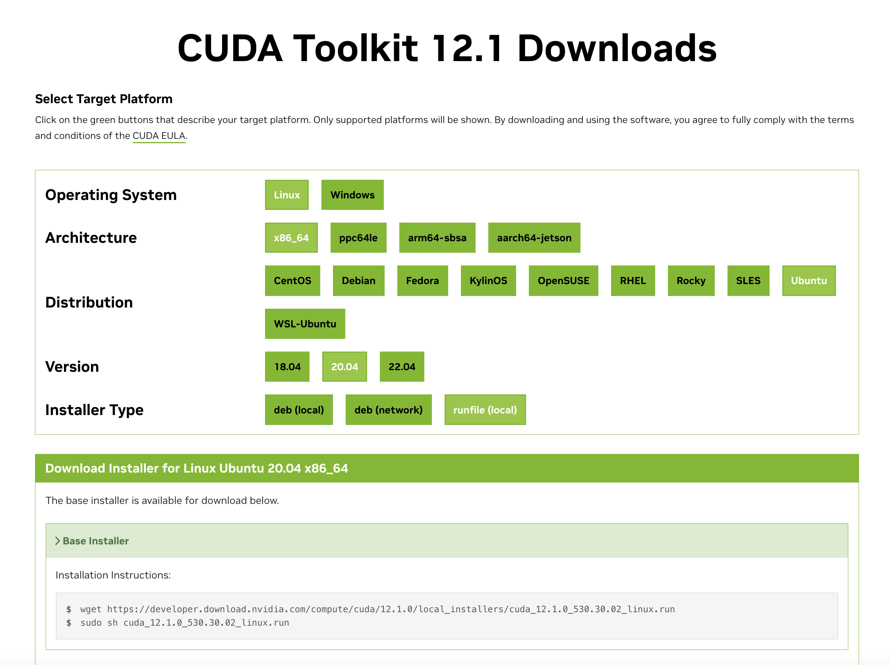
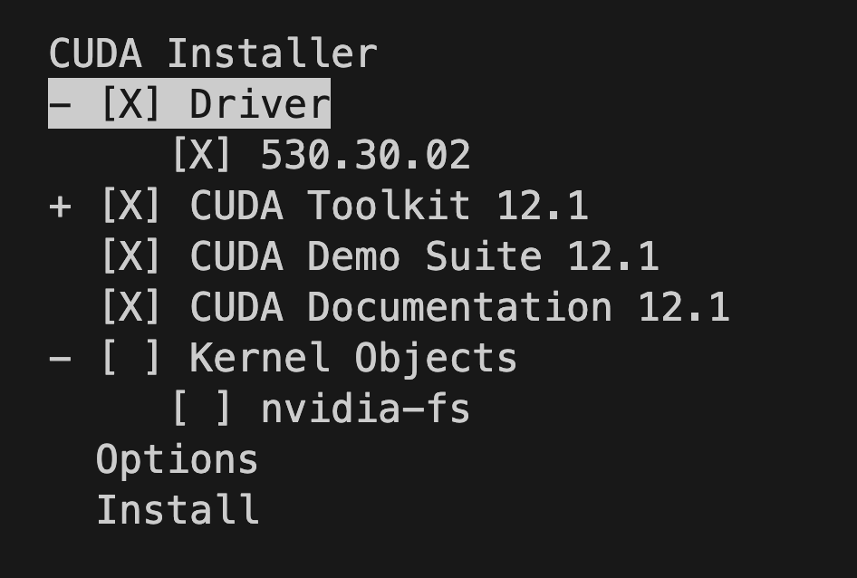

# CUDA-Related Env Config
- [CUDA-Related Env Config](#cuda-related-env-config)
  - [1. 🔥 Update (Cuda) GPU Driver and CUDA Toolkit.](#1--update-cuda-gpu-driver-and-cuda-toolkit)
  - [2. Update GPU Driver Only](#2-update-gpu-driver-only)
  - [3. Multi-CUDA Management](#3-multi-cuda-management)
  - [BUG](#bug)
    - [X 服务器问题](#x-服务器问题)

在进行 CUDA 相关的环境配置前，我们需要先搞清楚，CUDA-Related Env 的配置的基础知识。

我们通常会使用两个命令： `nvcc --version` 和 `nvidia-smi`。我这里用我自己的服务器举例：

```
$ nvcc --version
nvcc: NVIDIA (R) Cuda compiler driver
Copyright (c) 2005-2019 NVIDIA Corporation
Built on Sun_Jul_28_19:07:16_PDT_2019
Cuda compilation tools, release 10.1, V10.1.243
$ nvidia-smi
Wed Jan 24 11:43:58 2024       
+-----------------------------------------------------------------------------+
| NVIDIA-SMI 470.182.03   Driver Version: 470.182.03   CUDA Version: 11.4     |
|-------------------------------+----------------------+----------------------+
| GPU  Name        Persistence-M| Bus-Id        Disp.A | Volatile Uncorr. ECC |
| Fan  Temp  Perf  Pwr:Usage/Cap|         Memory-Usage | GPU-Util  Compute M. |
|                               |                      |               MIG M. |
|===============================+======================+======================|
|   0  NVIDIA A100 80G...  On   | 00000001:00:00.0 Off |                    0 |
| N/A   30C    P0    41W / 300W |     47MiB / 80994MiB |      0%      Default |
|                               |                      |             Disabled |
+-------------------------------+----------------------+----------------------+
                                                                               
+-----------------------------------------------------------------------------+
| Processes:                                                                  |
|  GPU   GI   CI        PID   Type   Process name                  GPU Memory |
|        ID   ID                                                   Usage      |
|=============================================================================|
|    0   N/A  N/A      1472      G   /usr/lib/xorg/Xorg                 46MiB |
+-----------------------------------------------------------------------------+
```

第一个命令返回的文本说明我们 nvcc 的版本是 `10.1`。

第二个命令返回的有用信息主要是这一行：`NVIDIA-SMI 470.182.03   Driver Version: 470.182.03   CUDA Version: 11.4`。

我们惊讶的发现，具有有两个不同的 CUDA Version，他们有什么区别呢？具体的区别有很多博客/回答中有很优秀的回复，可以参考：[StackOverflow - Different CUDA versions shown by nvcc and NVIDIA-smi](https://stackoverflow.com/questions/53422407/different-cuda-versions-shown-by-nvcc-and-nvidia-smi).

我这里提供**通俗的解释**。NVCC 是 Nvidia Cuda Compiler 的缩写，NVIDIA-SMI 是 NVIDIA System Management Interface 的缩写。

- NVCC 代表的是当前计算机中 CUDA 编译器，那么 `nvcc -v` 得到的是你当前计算机中**安装和使用的** CUDA Compiler 的版本或者说 CUDA Toolkit 的版本。
- NVIDIA-SMI 实际上展示的是 GPU Driver 版本，例如 `Driver Version: 470.182.03`，它后面跟随的 CUDA Version 代表的是当前 GPU Driver 所能**支持的最高 CUDA 版本。**

**一般情况下，**我们可以认为 NVCC 得到的 CUDA Version 会**小于等于** NVIDIA-SMI 得到的 CUDA Version。因为一个是实际使用的 CUDA Version，一个是最高可支持的 CUDA Version。

假设你的期望 CUDA 版本是 $X$，NVCC 得到的版本是 $Y$，NVIDIA-SMI 得到的版本是 $Z$。如果你需要进行 CUDA-Related Env 配置，大致流程为：

1. 首先应该看，$X$ 是否大于 $Z$。如果大于 $Z$，则需要先**更新 GPU Driver**，然后跳转至步骤 2。
2. 如果 $X$ 小于 $Z$，那么我们只需要**更新 NVCC 即可**。

## 1. 🔥 Update (Cuda) GPU Driver and CUDA Toolkit.

> 【推荐方案】如果你需要更新 CUDA 版本，这个小节可以同时更新 GPU Driver 和 Cuda Toolkit 的版本。你只需要确定自己需求的 CUDA 版本即可。（也就是同时更新 NVCC 和 Nvidai-smi）

首先，我们可以在 NVIDIA 的官方网站 [CUDA Toolkit Archive](https://developer.nvidia.com/cuda-toolkit-archive) 中选择对应的 **Archived Releases**。这里我选择的是 [CUDA Toolkit 12.1](https://developer.nvidia.com/cuda-12-1-0-download-archive)。这里需要你根据自己服务器的具体情况进行选择：



> 当然，如果你不清楚自己服务器的具体信息，可以使用命令  `lsb_release`。在 Linux 系统中，`lsb_release` 是一个非常有用的命令行工具，用于显示有关 Linux 发行版的信息：
>
> ```
> $ lsb_release -a
> No LSB modules are available.
> Distributor ID: Ubuntu
> Description:    Ubuntu 20.04.6 LTS
> Release:        20.04
> Codename:       focal
> ```

随后我们使用如下命令安装对应的 CUDA Toolkit。（注意，**这里是 12.1 版本的**，请自行寻找自己对应的版本）

```
$ wget https://developer.download.nvidia.com/compute/cuda/12.1.0/local_installers/cuda_12.1.0_530.30.02_linux.run
```

如果我们此时直接执行 CUDA Toolkit 的安装程序可能会报错。**会报错：当前的 driver 正在被某系统程序使用。** 所以我们需要先卸载当前的 Driver：

```
$ sudo apt purge nvidia-*
$ sudo apt autoremove
$ sudo reboot
```

> **命令解析**
>
> `$ sudo apt purge nvidia-*`
>
> `purge`: 这个选项比 `remove` 更彻底。它不仅会移除软件包，还会删除其配置文件和数据。这对于彻底清除软件的所有痕迹很有用。这个命令会删除所有以 `nvidia-` 开头的包，包括它们的配置文件。
>
> `$ sudo apt autoremove`
>
> `autoremove`: 这个命令用于自动移除那些被安装了但现在不再需要的软件包。这些通常是在安装某些软件时作为依赖被安装的包，但现在由于原软件包被删除，这些依赖包也不再需要了。

然后运行最终的安装命令：

```
$ sudo sh cuda_12.1.0_530.30.02_linux.run
```

在运行安装命令后会得到如下的界面，你可以根据你的需求进行更新，如果不需要更新 Driver 或者不需要更新 CUDA Toolkit 则取消勾选即可。



接下来按下 Install 就会安装成功了，安装成功后会得到这样的 Summary 信息：

```
$ sudo sh cuda_12.1.0_530.30.02_linux.run
===========
= Summary =
===========

Driver:   Installed
Toolkit:  Installed in /usr/local/cuda-12.1/

Please make sure that
 -   PATH includes /usr/local/cuda-12.1/bin
 -   LD_LIBRARY_PATH includes /usr/local/cuda-12.1/lib64, or, add /usr/local/cuda-12.1/lib64 to /etc/ld.so.conf and run ldconfig as root

To uninstall the CUDA Toolkit, run cuda-uninstaller in /usr/local/cuda-12.1/bin
To uninstall the NVIDIA Driver, run nvidia-uninstall
Logfile is /var/log/cuda-installer.log
```

你可以运行 `nvidia-smi` 或者 `nvcc --version` 检查你的 GPU Driver 和 CUDA Toolkit 的版本。

## 2. Update GPU Driver Only

个人目前并没有遇到只需要更新驱动的场景。但流程也是类似，首先在下面的官方链接中找到 target 版本。

- https://www.nvidia.cn/Download/index.aspx?lang=cn
- https://www.nvidia.cn/Download/Find.aspx?lang=cn

然后卸载之前的旧版驱动，命令与之前相同。

```
$ sudo apt purge nvidia-*
$ sudo apt autoremove
$ sudo reboot
```

随后使用， `wget` 进行下载。同样得到一个 `.run` 文件，使用命令安装：

```
sudo sh NVIDIA-Linux-x86_64-<version>.run --no-x-check
```

这里的 `--no-x-check` 可以避免后续的 X Server 的潜在运行问题。

由于我本人还没有遇到这种场景，我这里推荐两个写的不错的博客：

- [linux 命令行下适配 nvidia 驱动](https://www.cnblogs.com/chua-n/p/13208398.html)
- [NVIDIA显卡驱动更新，NVIDIA Driver、CUDA Toolkit、cuDNN安装指南（稍微有点乱，但是bug收集的比较多）](https://blog.csdn.net/aiaidexiaji/article/details/131973342)

## 3. Multi-CUDA Management

TODO

## BUG

### X 服务器问题

我在首次安装途中遇到一个 BUG。错误的原因是在安装 NVIDIA 驱动时，X 服务器（X Window System）正在运行。这貌似是导致 NVIDIA 驱动安装失败的常见原因。

> **X 服务器概念**：X 服务器是 Linux 系统中处理图形显示的基础组件。它负责管理所有的图形输出和用户输入。

我刚开始遇到的错误信息很模糊，就让我 `See log at /var/log/cuda-installer.log for details.` 但是我查看后发现里面也是啥都没讲。**后续才知道，有两个 log 可以查看，但是这里只说了第一个**：

- `/var/log/cuda-installer.log`
- `/var/log/nvidia-installer.log`

后面根据第二个 log 的输出，我才最终定位到 X server 的问题（`ERROR: You appear to be running an X server; please exit X before installing.`）。

**解决方案**

我的解决方案仍然是参考这篇博客：[linux 命令行下适配 nvidia 驱动](https://www.cnblogs.com/chua-n/p/13208398.html) 里的解决方法。

> 为了能够安装新的 nvidia 驱动，我们需要关闭这个 X 服务，我的 Ubuntu 是基于 lightdm 类型的桌面系统，采用如下命令：
>
> ```
> sudo /etc/init.d/lightdm stop
> sudo /etc/init.d/lightdm status
> ```
>
> 对于其他的 linux 版本，如果桌面系统是基于 gdm 类型，应该把命令中的 lightdm 改为 gdm 即可；非这两种桌面系统类型的，百度一下你的 linux 版本关闭 X 服务的相关命令吧。
>
> 关闭 X 后，可再次用 ps 命令查看相关进程以确认，我这里显示如下，确实没有运行的 X 服务了：
>
> ```
> $ ps aux | grep X
> root      1656  0.0  0.0  15984  1084 pts/40   S+   19:15   0:00 grep X
> ```

**具体日志📔**

```
$ sudo sh cuda_12.1.0_530.30.02_linux.run
 Installation failed. See log at /var/log/cuda-installer.log for details.
 
$ cat /var/log/cuda-installer.log 
[INFO]: Driver not installed.
[INFO]: Checking compiler version...
[INFO]: gcc location: /usr/bin/gcc

[INFO]: gcc version: gcc version 9.4.0 (Ubuntu 9.4.0-1ubuntu1~20.04.1) 

[INFO]: Initializing menu
[INFO]: nvidia-fs.setKOVersion(2.15.1)
[INFO]: Setup complete
[INFO]: Components to install: 
[INFO]: Driver
[INFO]: 530.30.02
[INFO]: Executing NVIDIA-Linux-x86_64-530.30.02.run --ui=none --no-questions --accept-license --disable-nouveau --no-cc-version-check --install-libglvnd  2>&1
[INFO]: Finished with code: 256
[ERROR]: Install of driver component failed. Consult the driver log at /var/log/nvidia-installer.log for more details.
[ERROR]: Install of 530.30.02 failed, quitting

$ cat /var/log/nvidia-installer.log
nvidia-installer log file '/var/log/nvidia-installer.log'
creation time: Tue Jan 30 15:45:55 2024
installer version: 530.30.02

PATH: /tmp/makeself.swEEBxz4:/usr/local/sbin:/usr/local/bin:/usr/sbin:/usr/bin:/sbin:/bin

nvidia-installer command line:
    ./nvidia-installer
    --ui=none
    --no-questions
    --accept-license
    --disable-nouveau
    --no-cc-version-check
    --install-libglvnd

Using built-in stream user interface
-> Detected 24 CPUs online; setting concurrency level to 24.
-> The file '/tmp/.X0-lock' exists and appears to contain the process ID '1366' of a running X server.
ERROR: You appear to be running an X server; please exit X before installing.  For further details, please see the section INSTALLING THE NVIDIA DRIVER in the README available on the Linux driver download page at www.nvidia.com.
ERROR: Installation has failed.  Please see the file '/var/log/nvidia-installer.log' for details.  You may find suggestions on fixing installation problems in the README available on the Linux driver download page at www.nvidia.com.

$ sudo /etc/init.d/lightdm stop
htdm status
Stopping lightdm (via systemctl): lightdm.service.

$ sudo /etc/init.d/lightdm status
● lightdm.service - Light Display Manager
     Loaded: loaded (/lib/systemd/system/lightdm.service; indirect; vendor preset: enabled)
     Active: inactive (dead) since Tue 2024-01-30 16:02:53 UTC; 34ms ago
       Docs: man:lightdm(1)
    Process: 1308 ExecStart=/usr/sbin/lightdm (code=exited, status=0/SUCCESS)
   Main PID: 1308 (code=exited, status=0/SUCCESS)

Jan 30 16:02:53 GCRAZGDL1522 systemd[1]: Stopping Light Display Manager...
Jan 30 16:02:53 GCRAZGDL1522 systemd[1]: lightdm.service: Succeeded.
Jan 30 16:02:53 GCRAZGDL1522 systemd[1]: Stopped Light Display Manager.
Warning: journal has been rotated since unit was started, output may be incomplete.

$ ps aux | grep X
xxx+   62621  0.0  0.0   8172  2404 pts/0    S+   16:03   0:00 grep --color=auto X
```
