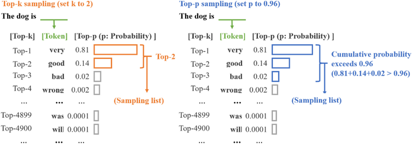

# Basic LLM Inference/Generation

⏰ Read : `35min`

> 惭愧，在我阅读很多其他 LLM 相关的文章时，发现我对 LLM 的 Inference/Sampling 的过程不够了解。基础不牢，地动山摇。所以我尝试首先理解基础的 LLM Inference Pipeline。

## 0. Goal

本文旨在回答之后的两个问题：

- **Question1：输入 N 个 tokens （prompt），LLM 是如何得到下一个 token？又是如何进行自回归采样（Auto- regressive Sampling）呢？**
- **Question2：LLM 是如何处理不定长的 batch inference？**

## 1. Pre-knowledge

> 后续 Inference/Generation 涉及到的最基础的元知识。【📖预计：5min】

### 1.1. Temperature

在进行 generation 的时候，我们有时候被要求设定 temperature 的值，那么它到底有什么作用呢？

通常模型的输出是一些值（logits）而不是分布（probability distribution），我们需要将其转换成分布，转换通常使用的是softmax 函数：

$$
\dfrac{\exp(z_i)}{\sum \exp(z_j)}
$$

虽然 Softmax 可以得到一个分布，但同时也有其缺点。容易扩大/缩小内部元素的差异（异化成 max / mean），如（这里是借鉴的例子）：

- `[11, 12, 13]` 进行 softmax 后为 `[0.0900, 0.2447, 0.6652]`， 这导致最终采样后的结果**不够丰富**。

- `[0.01, 0.02, 0.03]` 进行 softmax 后为 `[0.3300, 0.3333, 0.3367]`，这将导致最终采样方法是在随机采样，**生成不合理的序列**。

Temperature $T$ 便是用来解决这个问题，用于调节 softmax ，让其分布进一步符合我们的预期。

$$
\dfrac{\exp(z_i / T)}{\sum \exp(z_j / T)}
$$

如图所示，我们能快速的理解 T 对于 Softmax 分布的影响。


- 当 $T$ 越大，分布会越趋近于 uniform distribution，采样结果的随机性越大。
- 当 $T$ 越小，分布会越趋近于 one-point distribution，采样结果越趋近于一致。

所以为什么叫 temperature 呢？我们知道：温度越高，布朗运动越剧烈；同理，temperature 越高，采样得到的结果越随机。

### Top-p/Nucleus Sampling

Top-p sampling 核心思想是选择**累积概率超过某个阈值 p 的最小集合，然后从这个集合中随机选择下一个词**。这个集合被称为 `nucleus`，即核心，这也是 `nucleus sampling` 名称的来源。

用一个图来形象的解释整个流程（图右），即先选择出 nucleus 集合后，重新进行概率的归一化再进行采样。如果你还是不太理解 Top-p sampling 可以参考 `llama2` 中的 [`sample_top_p`函数实现](https://github.com/meta-llama/llama/blob/main/llama/generation.py#L398-L421)。



## 2. Learn by `llama` code 

### 2.1. `generate` function signature

网上肯定有许多关于 `llama` 库整个代码的讲解。为了差异化，这里仅重点介绍和主题有关的 `generate` 函数。（并且会略去一些不影响叙述 generate 逻辑的部分）并不会在文章内逐行的解释代码（会在 repo 中放一个注释版本）。

首先浏览函数签名：

- [`torch.inference_mode()`](https://pytorch.org/docs/stable/generated/torch.inference_mode.html)： 可以理解为与 `torch.no_grad()` 类似的优化，用于加速推理。
- `prompt_tokens`：二维列表用来存储 prompts tokenized 后的 tokens id。其中第一维代表的是 batch size。
- `max_gen_len`：生成的文本序列的最大长度。
- `temperature`：参考前文中的介绍。用来控制采样的随机性。
- `top_p`：同样参考前文中的介绍。用于设置 top-p sampling 的阈值。
- 其他的参数我们可以 skip 掉，在本文中并不重要。

```python
@torch.inference_mode()
def generate(
    self,
    prompt_tokens: List[List[int]],
    max_gen_len: int,
    temperature: float = 0.6,
    top_p: float = 0.9,
    logprobs: bool = False,
    echo: bool = False,
) -> Tuple[List[List[int]], Optional[List[List[float]]]]:
```

### 2.2. Goal1: How to auto-regressive sampling?

假设我们有 $N$ 个 tokens：

1. 第一步， $N$ 个 prompt tokens 同时输入到模型，并得到 $N$ 个 distribution（用于预测下一个token的），仅最后一个为我们需要的分布。（`图 Step1 右侧`）
2. 同时，第一次输入到模型中的 prompt tokens 的计算结果会被缓存到 kv cache 中（`图 Step2 左侧灰色块`），因此之后的自回归采样只需要输入上一次预测得到的 token。
3. 重复这个过程，直到得到**结束 token**或者超过模型设定的**最大序列长度**。


### 2.3. Goal2: How to batch inference?

[[TODO]]

## References

- [Blog: LLM Inference串讲](https://xv44586.github.io/2023/03/10/llm-inf/index.html)
- [Github Repo: meta-llama/llama](https://github.com/meta-llama/llama)
- [TORCH.MULTINOMIAL](https://pytorch.org/docs/stable/generated/torch.multinomial.html#torch.multinomial)
- [Blog: 2023年的深度学习入门指南(19) - LLaMA 2源码解析](https://juejin.cn/post/7259738325031944247)

## Next Read

[[TODO]]