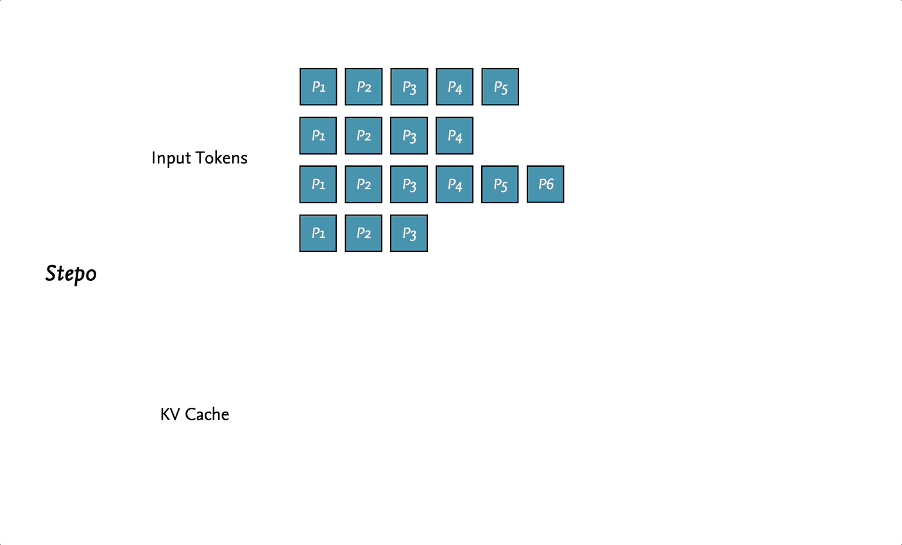

# Basic LLM Inference/Generation

⏰ Read : `40min`

> 惭愧，在我阅读很多其他 LLM 相关的文章时，发现我对 LLM 的 Inference/Sampling 的过程不够了解。基础不牢，地动山摇。所以我尝试先理解基础的 LLM Inference Pipeline。

## 0. Goal

本文旨在回答两个问题，所有的 Inference 操作主要基于 `meta-llama` 代码进行交叉讲解。

- **Question1：输入 N 个 tokens （prompt），LLM 是如何得到下一个 token？又是如何进行自回归采样（Auto- regressive Sampling）呢？**
- **Question2：LLM 是如何处理不定长的 batch inference？**

## 1. Pre-Knowledge

> 该章节介绍 Generation 将涉及到的元知识。【📖预计：`8min`】

### 1.1. Temperature

在进行 generation 前，有时模型要求给定 temperature 的值，那么它是什么？又有什么作用呢？

通常模型的输出是一些值（logits）而不是分布（probability distribution），我们需要将其转换成分布，转换通常使用的是 Softmax 函数：

$$
\dfrac{\exp(z_i)}{\sum \exp(z_j)}
$$

虽然 Softmax 可以得到一个分布，但同时也有其缺点。容易扩大/缩小内部元素的差异（退化成 max / mean），如（这里是借鉴的例子）：

- `[11, 12, 13]` 进行 Softmax 后为 `[0.0900, 0.2447, 0.6652]`， 这导致最终采样后的结果**不够丰富**。

- `[0.01, 0.02, 0.03]` 进行 Softmax 后为 `[0.3300, 0.3333, 0.3367]`，这将导致最终采样方法是在随机采样，**生成不合理的序列**。

Temperature $T$ 便是用来解决这个问题，用于调节 Softmax ，让其分布进一步符合我们的预期。

$$
\dfrac{\exp(z_i / T)}{\sum \exp(z_j / T)}
$$

如图所示，该动图方便我们快速地理解 T 对于 Softmax 分布的影响。

<div align=center>

</div>

- 当 $T$ 越大，分布会越趋近于 uniform distribution，采样结果的随机性越大。
- 当 $T$ 越小，分布会越趋近于 one-point distribution，采样结果越趋近于一致。

所以为什么叫 temperature 呢？我们知道：温度越高，布朗运动越剧烈；同理，temperature 越高，采样得到的结果越随机。

### Top-p/Nucleus Sampling

Top-p sampling 核心思想是选择**累积概率超过某个阈值 p 的最小集合，然后从这个集合中随机选择下一个词**。这个集合被称为 `nucleus`，即核心，这也是 `nucleus sampling` 名称的来源。

用一个图来形象的解释整个流程（图右），即先选择出 nucleus 集合后，重新进行概率的归一化再进行采样。如果你还是不太理解 Top-p sampling 可以参考 `llama2` 中的 [`sample_top_p`函数实现](https://github.com/keli-wen/meta-llama2-explain/blob/main/llama/generation_cn_comment.py#L448-L490)（这里给出了中文注释后的版本）。

<div align=center>

</div>

## 2. Learn by `llama` code 

### 2.1. `generate` function signature

网上已经有许多关于整个 `llama` 库的代码讲解。为了差异化同时也为了让阅读体验更流畅，这里仅重点介绍和主题有关的 `generate` 函数。（并且会略去一些不影响叙述逻辑的代码部分）并不会在文章内逐行的解释代码（会尝试专门制作一个 repo，用来帮助 meta-llama 的学习）。

首先浏览函数签名：

- [`torch.inference_mode()`](https://pytorch.org/docs/stable/generated/torch.inference_mode.html)： 可以理解为与 `torch.no_grad()` 类似的优化，用于加速推理。
- `prompt_tokens`：二维列表用来存储 prompts tokenized 后的 tokens id。其中第一维代表的是 batch size。
- `max_gen_len`：生成的文本序列的最大长度。
- `temperature`：参考前文中的介绍。用来控制采样的随机性。
- `top_p`：同样参考前文中的介绍。用于设置 top-p sampling 的阈值。
- 其他的参数我们可以 skip 掉，在本文中并不重要。

```python
@torch.inference_mode()
def generate(
    self,
    prompt_tokens: List[List[int]],
    max_gen_len: int,
    temperature: float = 0.6,
    top_p: float = 0.9,
    logprobs: bool = False,
    echo: bool = False,
) -> Tuple[List[List[int]], Optional[List[List[float]]]]:
```

### 2.2. Goal1: How to auto-regressive sampling?

`prompt_tokens` 是二维的，是考虑 batch inference 的版本。我们尝试解构问题，先考虑最简单的情况：`prompt_tokens` 是一维序列，这种情况下自回归采样是什么流程呢？

所谓一图胜千言，人从图片中学习会更高效，结合下图我们进行分析。不妨假设我们有 $N$ 个 tokens：

1. 第一步， $N$ 个 prompt tokens 同时输入到模型，并得到 $N$ 个 distribution（用于预测下一个token的），仅最后一个为我们需要的分布，其余计算得到的分布会被忽略。（`图 Step1 右侧`，仅最后一个分布执行进一步的采样）
2. 同时，输入模型中的 prompt tokens 的一部分计算结果会被缓存到 kv cache 中（`图 Step2 左侧灰色块`），因此之后的自回归采样只需要输入上一次采样预测得到的 token 便可完成计算。
3. 重复这个过程，直到生成代表着**结束的 token**或者生成的序列超过模型设定的**最大序列长度**。


> 当然，我必须承认如果你不了解 KV Cache 的原理，可能比较难理解 tokens 在模型内部是如何计算的。但是，我认为这并不影响你去理解/去感受 LLM 基本的 generation pipeline，如果在此深入分析反而破坏了阅读的流畅性。你目前可以假设这是直觉的，正确的，我会尽力在后续的博客中介绍并在此引用，现在请你继续阅读吧。

### 2.3. Goal2: How to batch inference?

在 Goal1 中我们已经理解了没有 batch 情况下的自回归采样。接下来我们尝试回答第二个也是最后一个问题：**LLM 是如何处理不定长的 batch inference？** 同样需要注意的是，我们这里讲解的是 basic inference，所以是最简单的情况，当前各种集成库中肯定做了各式的优化（我们会在后续的文章中尝试一步步解构）。

假设输入的 `prompt_tokens` 的 batch 大小为 `B`，每个序列长度都不一定相等。

我们重点关注两个长度 `min_prompt_length` 和 `total_length`，第一个长度很好理解就是输入 batch 中最短 prompt 的序列长度；第二个长度稍为复杂一点，代表 batch 可能的最长长度。

> `total_length` 的计算代码为 `total_len = min(params.max_seq_len, max_gen_len + max_prompt_len)`。看了代码就很容易理解，在 inference 前我们需要申请内存（tensor），`total_length` 就是计算用来内存预分配的。

现在第一个要点来了，我们应该从哪个位置开始生成？最理想的情况下肯定是 batch 中的每个 sequence 能直接生成它们的下一个 token，做到一点不浪费（包括我最开始也在想难道就是这样，哈哈）。但是，model 处理的肯定是相同长度的 tensor 而我们无法保证 batch 中各 sequence 长度一致。所以 **batch inference 最开始上是从 `min_prompt_length` 开始生成**。（参考动图中的 Step1）

之后的流程便比较简单，参考 Goal1，除了第一次 inference，后续的 inference 每次只需要输入一个形如 `[B, 1]` 的 tokens 序列。

唯一不同的是，在 Goal1 中，model 最终采样得到的 token 一定是我们所需要的。但是在 batch-inference 中（参考动图中是 Step1/2/3），由于我们不得不从 `min_prompt_length` 开始生成，如果当前位置已经有了用户给定的 token，model 采样得到的 token 会被丢弃。

再总结一下，相较于 non-batch inference 的主要不同：

- 我们需要考虑 batch 中的 `min_prompt_length`，自然 inference 的效率也会受其约束（考虑一个长度为 $1$ 的 token 和三个长度为 $100$ 的 token），batch 中不均匀的序列长度分布会极大制约推理性能？在 batch inference 中，生成的 token 可能是无效且被浪费的。



> Goal 1/2 中的两张图片可能对你了解 llm-inference 很有帮助。由于我花了挺长时间制作这个图片和动图，为了节约大家的时间（也不想打水印），我将可视化 PPT 开源到了 [`visualization/Basic-LLM-Inference.pptx`](https://github.com/keli-wen/AGI-Study/blob/master/visualization/Basic-LLM-Inference.pptx) 文件中。

通过理解 LLM 是如何进行 batch inference 后，我们也能发现该范式存在大量的冗余计算和性能浪费，存在很大的优化空间。这也是后续 Continuous batching 推出的必然原因。

## References

- [Blog: LLM Inference串讲](https://xv44586.github.io/2023/03/10/llm-inf/index.html)
- [Github Repo: meta-llama/llama](https://github.com/meta-llama/llama)
- [Github Repo: keli-wen/meta-llama2-explain](https://github.com/keli-wen/meta-llama2-explain)
- [TORCH.MULTINOMIAL](https://pytorch.org/docs/stable/generated/torch.multinomial.html#torch.multinomial)
- [Blog: 2023年的深度学习入门指南(19) - LLaMA 2源码解析](https://juejin.cn/post/7259738325031944247)

## Next Read

- Continuous batching.
- KV Cache in LLM.
