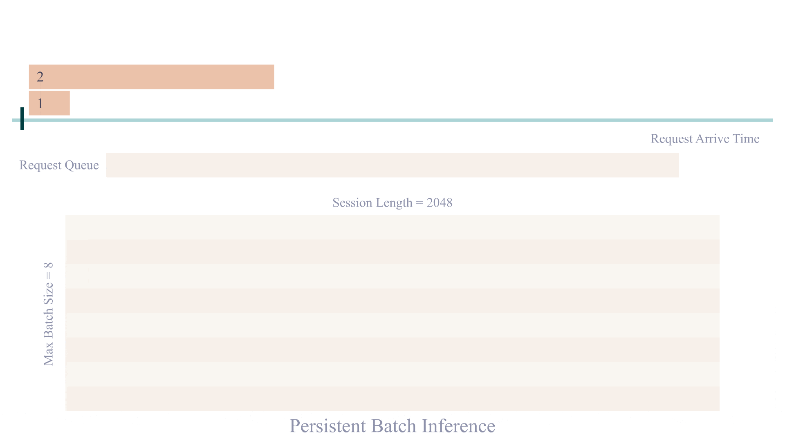
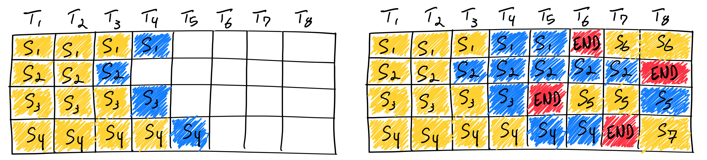
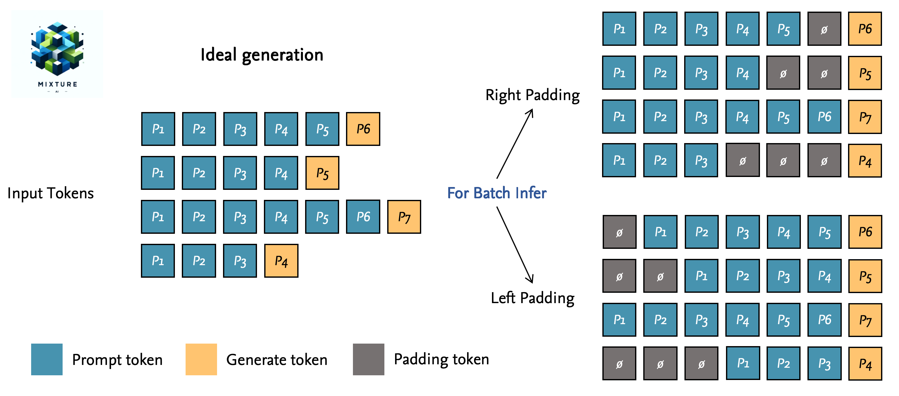

# Continuous Batching for LLM Inference

⏰ Read : `30min`

📖 Pre-read: `Basic LLM Inference/Generation`

书接上回，我们在理解了原始的 Batch inference 后，能发现其中存在显著的性能问题。因此，本文将介绍针对原始 Batch Inference 的优化方案：Continuous Batching。

> 网络上有许多针对 Continuous Batching 的博客，但是与 Basic LLM Inference/Generation 相反，大部分博客缺少结合代码介绍的部分，我将从这个角度出发，简单的介绍完原理后，结合当前一些主流框架的代码实现进行介绍。

## Theory

{动图}

通过动图我们会发现，基于原始的 Batch Inference 的实现，如果 batch 中的某个序列很早的就**结束生成**，会导致算力和空间的双重浪费。

这显然是需要优化的，行业意识到这种批处理的低效性，并提出了更有效的解决方案。OSDI 2022 上发表的 [Orca](https://www.usenix.org/conference/osdi22/presentation/yu) 是第一篇解决这个问题的论文。它采用了 Continuous Batching，其中 `batch_size` 根据每次迭代确定。结果是，一旦 batch 中的某个序列生成完成，就可以**在其位置插入一个新的待生成序列**，从而实现比静态批处理更高的 GPU 利用率。具体可以通过下面的动图理解：

*(Courtesy: https://github.com/InternLM/lmdeploy)*

到此，我认为关于 Continuous Batching 的理论知识以及介绍完毕。当然， 在现实实现中，调度器的设计需要考虑非常多的细节问题：KV Cache 的计算，如何保证预填充（prefill）和生成（generation）的时间比较接近？关于这些问题我在附录中给出进一步的解释。如果你只追求一个直觉的 Insight，恭喜你，你已经完成了！

---

在这里要额外说的是一个出场率很高的图。在绝大部分 continuous batching 的博客中它都会出现，但是对其详细的解读却不多。

博客中的解释如下：“*如上图所示，在第一遍迭代（左）中，每个序列从提示词（黄）中生成一个标记（蓝色）。经过几轮迭代（右）后，完成的序列具有不同的尺寸，因为每个序列在不同的迭代结束时产生不同的结束序列标记（红色）。尽管序列3在两次迭代后完成，但静态批处理意味着 GPU 将在批处理中的最后一个序列完成。*”

让我们暂时忘掉这部分，我要引入一个额外的概念，`left_padding`。

**Q：什么是 `left_padding`，我们为什么需要使用 `left_padding`？**

我首先制作了一张图来说明什么是 `left_padding`，顺带介绍了与之对应的 `right_padding`。

在理想情况下，我们希望每次 Generation 都是我们需要 tokens，但是这并不现实。所以我们通常情况下有 `left_padding` 和 `right_padding` 两种方法来帮助我们进行 Batch Inference （值得注意的是 Llama2 中没有做任何 padding）

继续回答另一个问题，**为什么使用 `left_padding` 而非 `right_padding` 呢？**有些博客解释说可能是和位置编码有关，实际上在使用设计正确的 `attn_mask` 可以避免这个问题。总的来说，我认为的原因是：某些框架在 generation 阶段如果不使用 `left_padding` 会出现错误，并且 `left_padding` 能让输出更方便处理。

回到上面那张图，你会发现左图的 batch inference 实际上是**理想情况**。正常情况下，我们需要做 padding 才能进行 batch inference。所以我会将其修正为如下图片：

{图片}

## Benchmark

我认为，博客中讲不重要的实验细节只会加重大家的理解负担，如果你需要一些具体的数据进行描述，请浏览：

- [实验验证](https://www.high-flyer.cn/en/blog/continuous-batching/#%E5%AE%9E%E9%AA%8C%E9%AA%8C%E8%AF%81)
- [Benchmark](https://www.anyscale.com/blog/continuous-batching-llm-inference#benchmarking-setup)

## Codelab

> 在 Google 后发现，大家内部都喜欢用一个完整的 Codelab 来帮助大家快速的上手一个项目，这里我也效仿一二。

***🚀 Goal. Implement a Continuous Batching Scheduler to acclerate our LLM.***

## Appendix. Scheduler Details

## References

- [Paper: 《Orca: A Distributed Serving System for Transformer-Based Generative Models》](https://www.usenix.org/conference/osdi22/presentation/yu)
- [Blog: 幻方AI: Continuous Batching：一种提升 LLM 部署吞吐量的利器](https://www.high-flyer.cn/en/blog/continuous-batching/)
