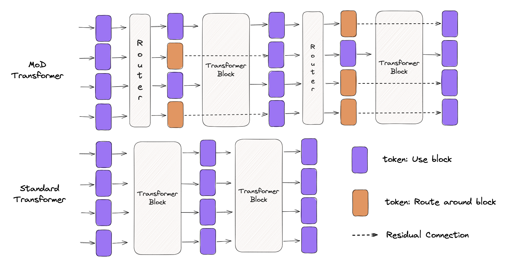
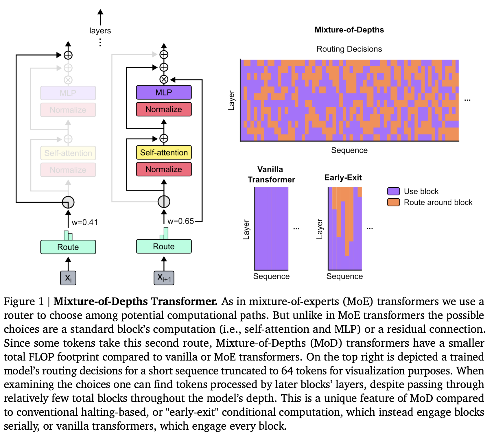
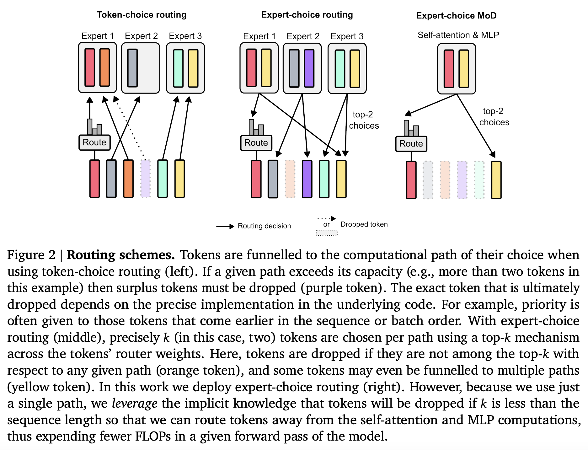
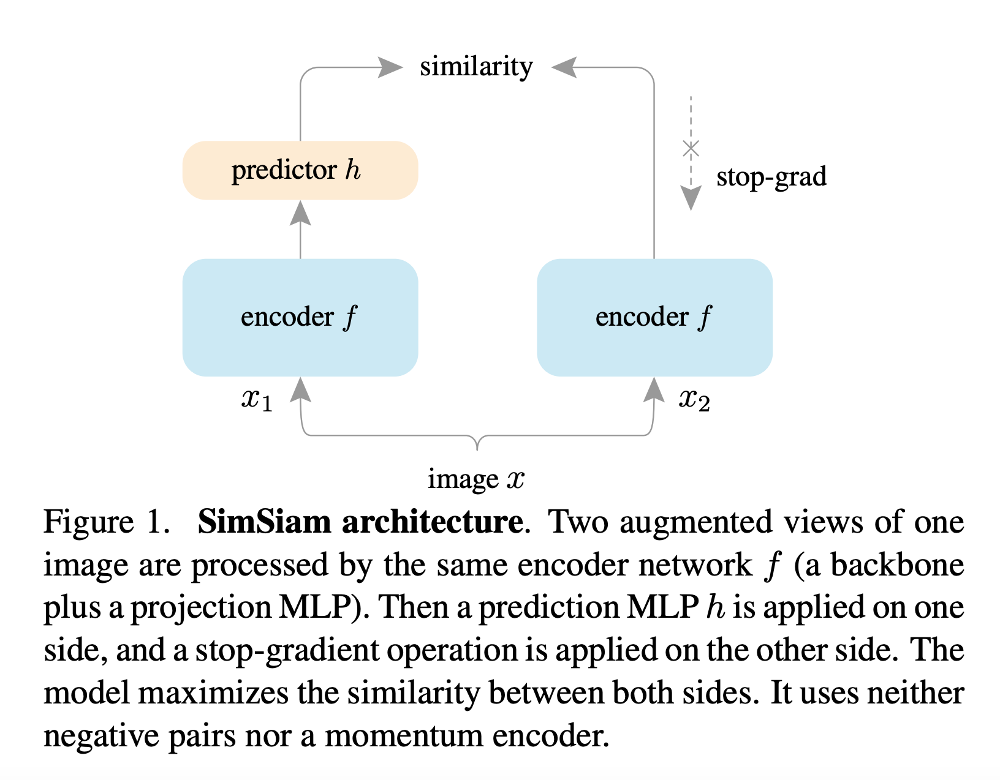
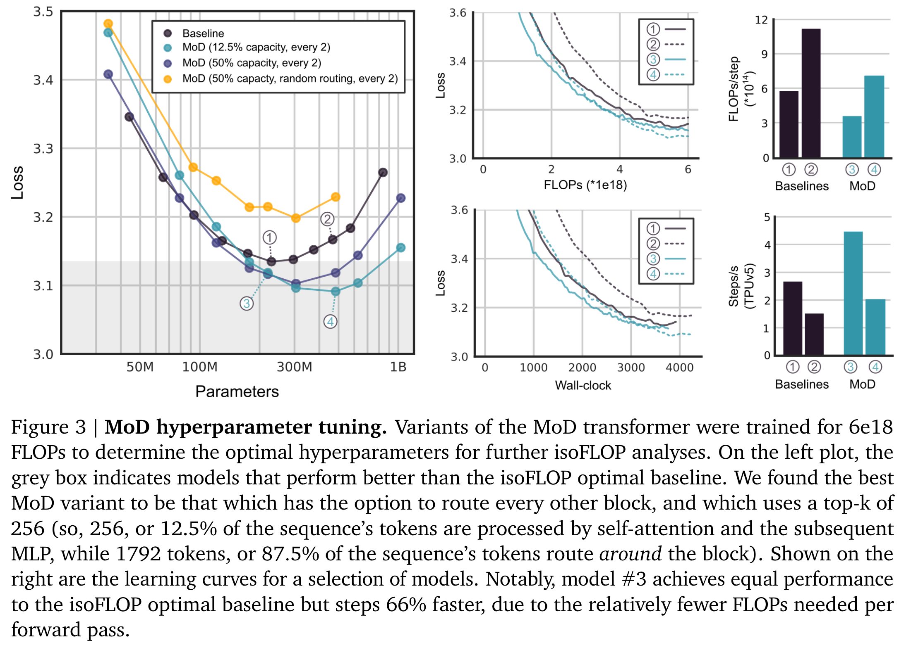
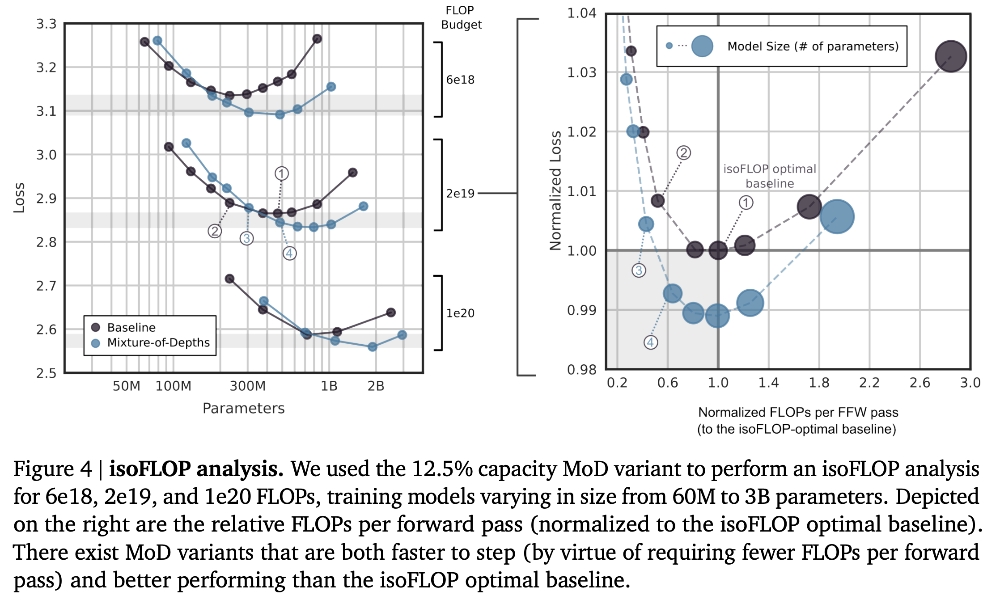
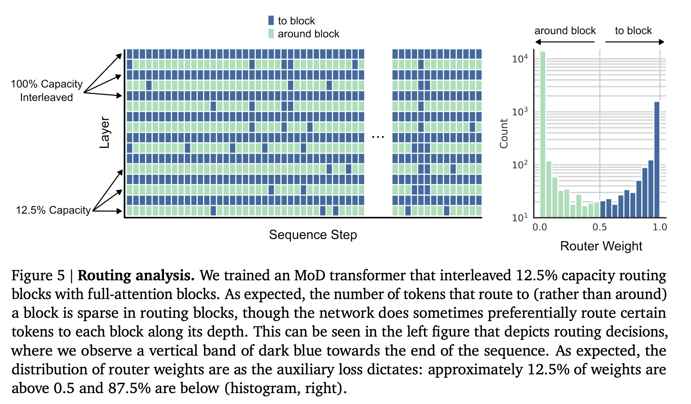
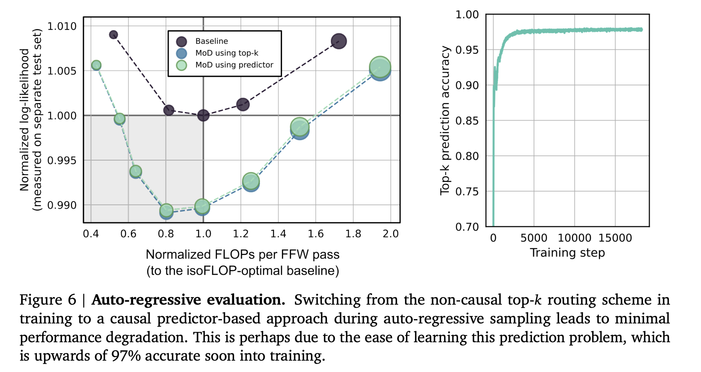
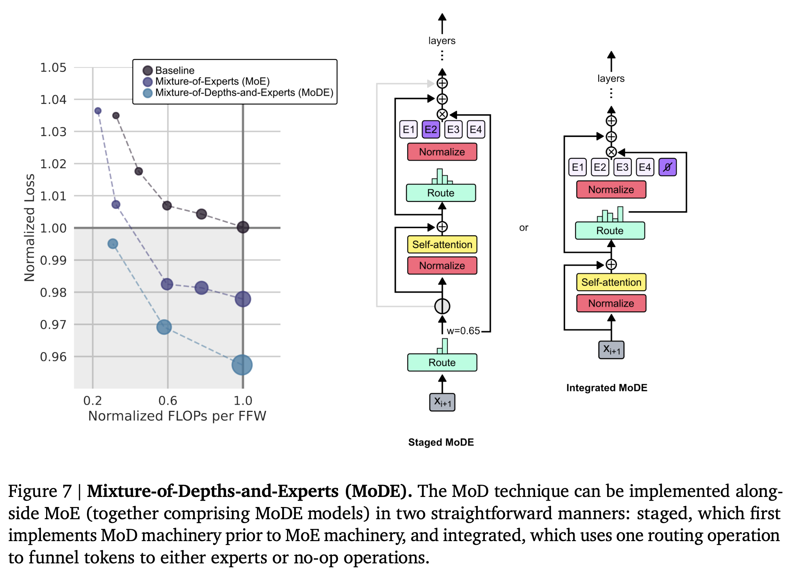

# Mixture-of-Depths: Transformer-based LLM 动态算力分配，一篇就够了？

- author: @LastWhisper

本文是我精读的第一篇 Conditional Computation 领域的 paper。我会尽量深入，保证知其所以然。

虽说是“一篇就够了”，但是实际上目前的解读我自认为还有很多的不足。由于个人水平有限，我希望这个帖子不仅能提供对于 MoD 文章的解读，还能作为一个讨论的平台方便大家讨论相关细节和实现。

由于 MoD 是没有开源的，我这里做了非官方版本的代码实现，但还存在一些设计没有和原始论文中对齐。[代码仓库](https://github.com/Mixture-AI/Mixture-of-Depths)



该图是为了方便快速理解 MoD 的大致流程所做草图，隐去了诸多细节，仅给出一些直觉上的信息。

## 0. Abstract

基于 Transformer 的语言模型通常会将 FLOPs （运算量） 均匀分配给整个输入序列。然而，Mixutre-of-Depths 证明了 Transformer 可以学会动态地将 FLOPs（或计算资源）分配给序列中的**特定位置**，从而可以在不同深度（不同 Layer）上优化序列的计算资源分配。

MoD 通过限制**可参与**标准 Transformer block（Self-Attention 和 MLP）计算的最大 token 数量 $k$ 来强制实现总计算量的限制。由使用 top-k 的路由架构来决定哪些 token 需要处理。与其他的条件计算技术不同，由于 $k$ 是预定义的，MoD 具有已知 tensor 大小的静态计算图。然而，由于具体参与计算的 $k$ 个 token 是动态（由路由）决定的，该方法可以在时间和模型深度维度上**非均匀地分配** FLOPs。因此，FLOPs 在总量上是可预测的，但在 token 级别上是动态分配的和与上下文敏感的。

经过这种方式训练的模型不仅能动态地分配计算资源，并且还会更加高效。与 baseline 相比，这些模型在等效的 FLOPs 和训练时间下达到了相同的性能，但每次前向传播所需的 FLOPs 只是 baseline 的一小部分，并且在后续推理阶段速度可提高 50% 以上。

## 1. Introduction

平时工作中，我们能感受到**并非所有的问题都需要相同的资源来解决**，有些任务更重要需要投入更多的计算资源，有些任务不重要可以简单处理甚至略过。同样地，在语言建模中，并非所有的 tokens 都需要投入相同的资源（即算力）来进行处理。然而，transformer 模型在前向传播中对每个 token 都花费相同的计算量。**如果前面的假设正确，理想情况下，Transformers 可以通过避免不必要的计算来减少总计算开销。**（参考最开始的那张图）

这其实就涉及到了 Conditional Computation （条件计算）。该技术试图通过在需要时才进行计算来减少总计算开销。有兴趣的可以阅读[《ICLR2016: CONDITIONAL COMPUTATION IN NEURAL NETWORKS FOR FASTER MODELS》](https://arxiv.org/pdf/1511.06297)。

但是 MoD 作者们认为，现有的工作都会**引入动态计算图**，因此效果不佳，最有前途的条件计算工作应该是使用静态计算图和确定的 tensor 大小，这样可以最大化硬件的利用率。

> ⚠️ 其实关于这块的动态图/静态图的计算优势，本人理解的不是非常深刻，希望有大佬能补充一些见解。
>
> 我之前简单阅读过一个利用静态图加速的工作 JAX-LOB，该论文整个性能增益全都来源于固定的 tensor 大小和 JAX JIT 的优化，实现了最高达 8 倍的性能优化。

因此，MoD 考虑使用 **static compute budget（静态计算预算）** 进行语言建模，该预算可以小于标准 Transformer 所使用的计算预算。**而网络必须学会如何在每一层为每个 token 做出计算分配决策，从而动态地分配可用的计算资源**。

在 MoD 的实现中，总计算量并非由网络的即时决策的，而是在训练前由用户定义，并在训练期间保持不变。因此，MoD 的计算性能一定是提升的，比如模型内存占用将减少，或者每次前向传递所需的 FLOPs 会降低等。重要的是如后文阐述的，**这些效率提升是可以在不影响整体性能的情况下实现。**

MoD 采用的是一种类似 Mixture of Experts (MoE) Transfomers 的理念，在不同深度（不同 Layer）上动态的决定 token 的路由结果。但是与 MoE 不同的是（MoE 选择不同的 MLP），我们选择的是不同计算路径：决定是对一个 token 进行计算（等同标准 Transformer Block），或者通过残差连接跳过它（节省计算开销）。同样与 MoE 不同，MoD 将这种路由操作应用于标准 Transformer block （MLPs 和 Self-Attention）。而 MoE 通常只在 MLP 部分选择性地激活不同的子网络，而 Attention 仍然会处理所有的输入 token。**因此，这不仅影响我们处理的 keys 和 queries，还影响路由决定哪些 tokens 进行更新，以及哪些 tokens 可供关注。我们将这种策略称为Mixture-of-Depths（MoD），来强调 token 在 Transformer 模型不同深度下，可以被不同数量的 layer 进行处理。**

MoD 技术还允许在模型的性能和效率上进行权衡。MoD 可以用相同的计算了计算出比标准 Transformer 效果更好的模型，同时 MoD 还支持训练一个效果与标准 Transformer 性能对齐，但是前向传播仅需要 50% FLOPs 的模型。总结下来，实验证明 MoD 能够智能地路由 token，因此他们可以使用更少的计算量实现更好的模型。



***Figure1.Explanation*** Mixture-of-Depths Transformer. 与专家混合（MoE）Transformer类似，我们使用路由在可选的计算路径中进行选择。但不同于 MoE Transformer，这里的选择是**1）参与标准 Transformer Block 的计算**或**2）残差连接**。由于某些 token 会选择第二种路径，MoD Transformer 的总 FLOPs 一定比标准或 MoE Transformer 要小。右图上方展示了一个训练后的模型在处理短序列时的路由决策（为了可视化，序列被截断为 64 个 token）。通过观察这些选择，可以发现一些 token 虽然仅经过了很少量的处理（紫色），但却能在模型较深的位置被处理。相较于传统的基于 **提前退出（early stop）** 的条件计算方法（会连续计算直到退出）或标准 Transformer（所有块都参与计算），MoD 展现了独特的计算方式。

## 2. Implementing Mixture-of-Depths Transformers

我们整体的设计策略如下：

- 通过限制可以参与 Transformer Block 计算的 tokens 数量，设置一个低于标准 Transformer 的静态计算预算。例如，标准 Transformer 允许序列中的所有 tokens 进行 Self-Attention 的计算，我们则限制只有 50% 的 tokens 能进行 self-attention 的计算。
- 利用一个逐块的路由来估计为每个 token 计算一个标量权重，用于表示路由对于该 token 的偏好程度（参与计算或残差链接）。
- 然后确定每一个序列的所有 token 在每个 Transformer block 中路由权重位于 top-k 的集合，这个集合便是参与计算的 token 集合。由于仅有确定的 $k$ 个 token 将参与 Transformer block 的计算，因此计算图和 tensor 大小在整个训练过程中保持不变，仅仅只有参与计算的 token 集合是动态的和上下文敏感的。

### 2.1 Defining a compute budget

为了在每次前向传播控制总的计算预算，我们需要利用容量这个概念。**容量（capacity）** 定义了每次输入中参与计算的总 tokens 数量。例如，假设在普通的 transformer 中，所有 batch 中所有序列总参与计算的 tokens 数则可以被定义为容量 $T$。在使用了 Mixture of Experts 的 transformer 中，每个专家 MLP 的容量是小于 $T$​，但是由于每个块存在多个专家，所以 MoE 的总计算量与普通 transformer 是接近等价的。

> 这里有两个容易混淆的概念，分别是：**容量**和计算预算。
>
> - 静态计算预算（static computation budget）可以理解为整个模型的总计算量或 FLOP 数。
> - 容量（Capacity）代表整个 transformer 中参与计算的总 tokens 数。
>
> 依据我的理解，在该文章中，我们可以这样理解：“**通过修改容量修改了计算预算**“。更进一步的描述是“**通过控制 top-k 中的 k 来控制参与计算的总 token 数，进而一步控制整个静态计算预算**”。这对于后文实验部分的理解也许有帮助。

通常情况下，使用条件计算的 Transformer 的总 FLOPs 是由**容量**决定的，而非任何路由的结果。这是因为**静态图的实现**考虑的是最差情况。**例如，如果路由之后只有少部分的 token，我们会填充到对应的容量大小，或者会删除超出容量部分的 tokens**。

> ✨个人思考：如果不是这样的设计，MoDTransformerBlock 将不支持原生的支持 batch 操作。因为多 batch 的情况下，各个序列在某个 layer 参与计算的 token 集合大小不一定一致，例如下面刚路由后的情况。
>
> ```
> [1, 2, 3]             [1, 2]                 [1, 2, o]
> [1, 2, 3] - Router -> [3]       - Padding -> [3, o, o]
> [1, 2, 3]             [1, 2, 3]              [1, 2, 3]
> ```

我们可以通过降低计算的**容量**来实现更少的计算预算（相比标准 Transformer）。然而，如果不加选择地减少计算预算，可能会导致性能恶化。我们的假设某些特定的 tokens 可能不需要像其他 tokens 那样被多次处理，并且这些 tokens 可以通过学习被识别出来。因此，如果网络能够学习如何选取合适的 tokens 用来**填充容量**，则有可能保持模型性能不变。下面将介绍为此目的而设计的路由架构。

### 2.2 Routing around transformer blocks

路由实际上是把 tokens 在该层的行为进行二分类：

- 路径一：参与计算，即参与标准 Transformer Block 的计算，包括 Self-Attention 和 MLP。
- 路径二：残差链接，即跳过标准 Transformer Block，不进行任何计算。

如果我们将路径一的容量设置为小于 $T$（序列和 batch 中的总 token 数）的任何值，那么每次前向传递的总 FLOPs 将小于标准 Transformer。例如，如果我们将块的容量设置为 $\dfrac{T}{2}$ （即与标准 transformer 相比只有一半的 token 数），那么在 Self-Attention 过程中的 query 与 key 矩阵乘法将只需要标准 Transformer 的 $25$% 的 FLOPs（ $\dfrac{T^2}{4}$ 与 $T^2$ ​​)。类似的计算可以确定 MLP 对应的 FLOPs 减少量。

直观上来说，随着我们不断缩小块容量，每次前向传递的总 FLOPs 会减少（并且完成 forward 所需的时间也会减少）。但是，下游的性能也会受到我们缩小块容量的激进程度的影响，以及我们实现的路由算法的影响。

分析极端情况，如果我们保持每个块的容量为 $T$，并将每个 tokens 都正常通过块进行计算，我们就恢复成了标准的 transformer。另一个极端情况下，如果我们将每个块的容量设置为 $0$，并将所有 tokens 都路由为不参与块的计算，那么我们最终将得到一个非常快的模型，它不会参与 Transformer 绝大部分参数的计算，显然这会导致很差的下游性能。MoD 假设：**在这两个极端之间存在一个最优模型，它比标准 Transformer 更快，同时性能却不差甚至更好，而且 step 速度（可以理解为 training）更快。**

### 2.3 Routing schemes

**如何路由 token 决定了该方法的性能**。举一个不恰当的例子，假设有一位学生正在学习英语，老师每次只是随机地从句子中挑选几个词来教学。如果我们考虑这样的一个句子：`She is a very good teacher`，如果老师随机挑选词汇，**且在某些极端情况下挑选的结果很差**，比如只教授 `she, a, good`，那么学生最终可能会对句子的真实含义产生误解，或者根本无法理解完整的语义结构。（好吧，我承认这个例子不是很恰当，大家意会即可）

最基础的路由方案就是在 tokens 中**随机选择并丢弃**（类似于 `dropout`）。后续实验将以该方式作为对比，展示过分简单的路由实现会导致性能急剧下降（相较于标准 Transformer ）。

与随机丢弃对应的是可学习的路由（learnable routing）。我们首先假设 learnable routing 是可行的，即假定网络应该能学到哪些 token 需要更多或更少的处理。如果 Transformer 确实做了很多无用的计算，那么问题便从 **“Transformer 是否存在冗余计算”** 转化为 **“Transformer 冗余了多少计算量”**，这是一个经验问题，我们通过实验来确定减少 Transformer 计算容量的激进程度，以及我们最多能允许多少 token 在每层 Transformer block 中不被计算。

目前有两种主流可学习的路由架构（见图 2），token-choice（自选）和 expert-choice（反选）。

在 token-choice 中，会训练一个路由为每个 token 生成到所有可能的 **（计算）路径** 上的概率分布（例如，在 MoE 中选择 token 经过哪个 expert)。然后，token 会被发送到概率最高的那条路径。并且为避免所有的 token 选择相同的路径，可以引入辅助 loss。但是，**即使引入辅助 loss，token-choice 路由架构仍可能因为大部分 token 仅选择趋同的少部分路径，从而出现负载均衡问题。**

在 expert-choice 中，每条路径通过路由挑选 top-k 个 token。这种架构保证不会出现负载均衡问题，因为每个路径**分配且仅分配** $k$ 个 tokens。但是，这种架构同样存在局限，因为有些 tokens 可能出现在所有路径的 top-k 集合从而被过度使用，而有些 token 则不出现在任何路径中。

> 思考接下来几个小问题会对理解该小节更有帮助：
>
> - 在 token-choice 架构中，**如何保证计算容量的准确利用**？每个 token 都存在一个概率分布并将选择一条路径，由于任意路径容量有限，tokens 之间存在竞争，可能导致容量仅被利用了一部分。
> - 对于任意一条路径，如果选择该路径的 token 超过它的容量，我们如何确定哪些 tokens 要被丢弃呢？



***Figure2.Explanation*** 当使用 token-choice 路由架构时（左图），token 会选择它们倾向的路径。如果一条路径中的 token 超过了其容量，那么超过容量的 token 将被丢弃（例如图左中的 Expert1 的容量为 2，紫色的 token 便因无法再选择 Expert1 而被丢弃）。同时论文中提到，当选择某条计算路径的 token 数超过其容量时，**由底层实现决定具体是哪些 token 被丢弃**。例如，优先级可能按先来后到决定（序列中的先后关系或者是**batch 中的先后关系**）。当使用 expert-choice routing 架构时（中间图），我们则能依据 tokens 的 路由权重和 top-k 为每个路径**选择恰好 $k$ 个 tokens**。没有被任何路径选择的 tokens 将被丢弃（橘色）同时有些 tokens 会被重复选择（黄色）。在 MoD 中，我们将采用 expert-choice 路由架构（右图）。在 MoD 中，仅有一条计算路径（即参与 Transformer Block 的计算），那么没有被选择的 tokens 会被直接残差连接，从而减少前向传播中 FLOPs 的消耗。

MoD 选择 expert-choice 路由架构基于以下几个原因：

- 不需要引入额外的辅助损失来解决可能的负载均衡问题。
- top-k 操作暗含了相对大小的比较，路由可以通过比较所有 token 的权重来选择它认为最需要计算的 token。如果路由能得到（学习到）正确权重，那么该架构可以保证最重要的 token 一定位于 top-k 集合中，而 token-choice 架构则无法做到这一点。因为在 token-choice 架构中，每个 token 的选择仅取决于自己的路由权重，无法进行相对大小的比较。对于 MoD 来说，实际上另外一条计算路径是**空操作**，所以确保重要的 tokens 参与计算至关重要。所以 top-k 操作更能满足这个需求。
- 最后，**参考前文我提出的小问题，token-choice 架构难以保证使用准确的计算量**，可能会出现过处理和欠处理的情况，这是因为不同 tokens 选择路径的情况，参与计算的 tokens 数可能不同，计算量自然也不同，并且还需要一些额外的优先级设计来判断抛弃哪些多余的 tokens，**因此 token-choice 的实现会不必要的复杂**。反观 expert-choice 可以**仅用一个 top-k 操作划分出两个不相交的结合，并且能保证计算量的精准控制**。

### 2.4 Routing Implementation

在进行路由架构实现前，可以简单的回顾一下路由的流程。简单流程示意：

```
(tokens) - router -> (tokens router weight) - TopK -> (top-k tokens router weight) - SelfAttention, MLP -> (output)
```

token 经过路由得到对应的权重，然后结合 top-k 选择对应的 token 集合作为 Transformer block 的输入。

假设，对于给定的 layer $l$ ，我们有长度为 $S$ 的序列所有 token 的 embedding， 即 $X^{l} = \{ x_{i}^{l} | i \text{ is an integer, } 1\le i \le S\}$ 。那么对于给定的 token embedding 其路由权重是一个通过线性层计算得到的标量（Scalar）值： $r_{i}^{l} = w_\theta^{T} x_{i}^{l}$​ 。

除了使用路由权重进行 top-k 集合的选择，**我们的目标是使用路由权重来决定每个 token 通过 Transformer block 的计算输出**。假设 $P_{\beta}(R^l)$ 表示路由权重集合 $R^l$ 中的 $\beta$  分位数，其中 $\beta = 1 - \frac{C}{S}$ 且 $C$ 是用户定义好的每个 batch 中的计算容量（再回顾计算容量就是用来定义将会被处理的 token 数，显然我们需要保证 $C < S$ ） 。对于给定的 token，Transformer block 输出为：

$$
x_i^{l+1}= \begin{cases}  r_i^l f_i (\tilde{X}^l)+x_i^l, & \text{ if } r_i^l>P_\beta (R^l) \\\\ x_i^l, & \text{ if } r_i^l < P_\beta ( R^l ) \end{cases}
$$

其中 $\widetilde{X}^l$ 是指对应路由权值为 top-k 的 tokens embedding 集合（即所有满足 $r_i^l > P_\beta(R^l)$ 的 tokens embedding）， $f$ 则代表 Transformer block 中的算子（Self-Attention 和 MLP）。你会发现 token $i$ 的结果 $x_i^{l+1}$ 同时受到其他 token $x_{i\neq j}^{l}$ 的影响， 这是因为 Self-Attention 操作的存在。由于输入到 $f$ 的 token 数量更少（因为 $\widetilde{X}^l$ 的集合大小为 $C$ 且 $C < S$ ），从而降低了用于 Self-Attention 和 MLP 的计算开销，因此 MoD Transformer 仅需要比标准 Transformer 更少的计算量。

你还会发现，我们会将 $f$ 的输出乘上 router 的权重 $r_i^l$ 。**这样会将 router 权重置于梯度路径上，从而在语言建模的过程中受到梯度下降的影响**（也就是 train router）。Google 也说他们尝试了**不同版本的实现**，即在残差链接的计算路径中也考虑引入路由权重的影响（可以理解为 $x_i^{l+1} = r_i^l x_i^l$ ）但是后面发现，**目前的版本已经能取得更好的效果， 并且实现起来更为简单。**

### 2.5 Sampling

虽然 expert-choice 架构有许多优势，但是它存在一个显著问题：**top-k 操作是没有因果关系的**。

> 在最开始写博客的时候，我便在此处 block 了许久。我完全无法理解为什么存在原文中的这个限制："While expert-choice routing has a number of advantages, it has one distinct problem: the top-$k$ operation is non-causal. **This means that whether a given token’s routing weight is among the top-$k$​ for the sequence depends on the values of the routing weights for tokens that come after it, which we don’t have access to when autoregressively sampling."**
>
> 后面发现，这是因为我不了解 LLM 基本的 Inference 原理。强烈推荐阅读一下这篇博客：[Basic LLM Inference/Generation，一篇就够了](https://zhuanlan.zhihu.com/p/694176507)。我相信这能解决你的一部分困惑。如果你想从代码的角度去理解 LLM 生成，推荐阅读我注释过的[ `Llama` 源代码片段](https://github.com/Mixture-AI/meta-llama-explain/blob/main/llama/generation_cn_comment.py#L225-L416)。

如何理解这个因果关系呢？在 training 阶段，整个完整的 token 序列会被输入到 Transformer block 并得到下一次输出。因此，路由在训练阶段可以浏览到完整的 sequence 序列（尽管我们有 mask），然后进行 top-k 操作。然而，当我们在进行自回归采样（Autoregressively Sampling） 时，我们只有当前的序列（而非完整生成后的序列），此时我们无法判断已经生成的这些 token 的 路由权重是否在**完整生成序列**中的 top-k。

> **Q:** 为什么我们需要判断当前 sampling  tokens 是否在**完整生成序列**中的 top-k ，为什么不是在当前已经采样生成的 token 中使用 top-k 操作呢？
>
> **A:** 我认为，除了为了和训练的设定保持一致外，我们可能还需要考虑一个问题，使用**完整**和**当前**的 top-k 有什么区别呢？如果从 KV Cache 的角度来考虑，**完整的 top-k** 能够保证如果一个 token 在 top-k 集合中，那么它后续一定在 KV Cache 中，从实现角度更为简单，并且更满足：“**决定哪些 tokens 进行更新，以及哪些 tokens 可供关注**。”的设计目的。
>
> 而使用**当前的 top-k** 则存在许多问题，首先是每次可能需要重新计算 top-k 集合，我认为这存在计算开销。其次，**如果某个 token 之前在当前 top-k 集合中，然而之后却不在 top-k 中，那么 KV Cache 的存储空间就浪费了。**

我们分别用两种方法来解决这个问题。

第一种方法是**引入一个简单的辅助损失**。实验结果表明它会影响主要的语言建模目标大约 0.2 - 0.3% 但是可以解决自回归采样中存在的问题。该损失的原理是：

1. **模型输出 logits**：在训练阶段，模型（这里是路由 ）输出一组 logits，这些 logits 是未归一化的分数，可以是任意实数。
2. **计算 top-k**：根据这些 `logits` 计算 top-k，即选择分数最高的 k 个 token。
3. **生成目标标签**：生成一个与 `logits` 大小相同的 `target` 张量。对于属于 top-k 的 token，其对应的 target 设为 1，其余设为 0。
4. **计算损失**：使用二元交叉熵损失，将 logits 进行 `sigmoid` 后与 `target` 进行比较，计算损失并进行反向传播。

直观的说，这个辅助损失能够使得在 top-k 中的 token 经过路由输出的 `logits` 在 `sigmoid` 后大于 0.5 （趋近 $1$ ），而不在 top-k 中的 tokens 则小于 $0.5$ （趋近于 $0$ )

> 📖：由于 `BCEWithLogitsLoss` 会自动使用 `sigmoid` 处理输入，所以我们在代码中不需要显式的调用。

第二个方法是引入一个小型的辅助 MLP（类似于第二个路由），它会接受与路由相同的输入，但是会 stop gradient （也就是禁止梯度回传，避免影响输入的梯度）。它的输出是预测该 token 的路由权重是否在该序列的 top-k 集合中。由于 stop gradient 的存在，该方法不会影响语言建模的目标，并且实验证明也不会影响 `step` 的效率。

> **Q:** 什么是 **stop gradient** ？它和 `PyTorch` 中常见的 `no_grad` 有什么区别？
>
> **A:** 这个概念在 Kaiming 的 [《Exploring Simple Siamese Representation Learning》](https://openaccess.thecvf.com/content/CVPR2021/papers/Chen_Exploring_Simple_Siamese_Representation_Learning_CVPR_2021_paper.pdf) 中有所提及。其原理非常简单，就是**阻止**梯度回传到输入 `input`。其 `PyTorch` 实现可以理解为 `input.detach()`。
>
> 
>
> 它与 `no_grad` 是完全不同的概念，`no_grad` 代表这部分操作**都**不计算任何梯度。
>
> **Q:** 为什么方法二不会影响语言建模的目标而方法一会？
>
> **A:** 因为方法一中，路由引入了辅助任务，辅助损失会影响路由的权重从而影响语言建模。而方法二中，我们用了辅助 MLP 来处理这个问题，并且 stop gradient 保证了该辅助任务的训练不会影响到输入的梯度，自然不会影响语言建模的效果。

借助这两个新方法，我们可以在**自回归**采样中仅通过路由的输出判断 token 是否参与 Transformer block 的计算，而不需要依赖未来的 token。**经验证明判断一个 token 是否在 top-k 集合中是个相对简单的辅助任务，可以快速实现到 99% 的准确率。**

### 2.6 Training methods

所有模型使用相同的基本超参数配置（例如，余弦调度等于训练步数的 1 倍，批次大小为 128，序列长度为 **2048**），只是改变了层数、头数（多头自注意力）和嵌入大小，用于在 isoFLOP 分析中生成不同规模的模型。

## 3. Result

> 📖 这里是实验部分，个人主要做的是一个转述，由于文章没有开源，所以我会尽量保留原文的所有内容。

### 3.1 Training, isoFLOP comparisons

我们首先选用较小的 FLOP budget (6e18) 来进行最优超参的确定。可以发现在 **Figure3 左图**中，最优的 MoD 模型可以在训练更多的参数量的情况下有**更小的损失**（向下且向右）。通过这个现象不难推断：存在一个参数量更小的 MoD 模型，能接近 SOTA baseline 的性能，同时训练的更快。

**Figure3 右图**便是在解释这种可能。我们选择了 MoD Model#3 （大约有 220M 的参数，左图中的 `3`）和 isoFLOP SOTA baseline Model#1（也是 220M 的参数，左图中的 `1`）进行比较。Model#3 在性能上能略好于 Model#1，**且每次训练步骤的执行速度提升了接近 60%**。更为关键的是，在相同硬件上运行时，这两模型所需要的训练时间大致相同。（也就是在相同的时间内训练一个效果略好且性能更优的模型）

> **Q:** 什么是 `isoFLOP` 分析？
>
> **A:** 这个术语可以理解为**等效浮点计算（操作）分析**，即在保持浮点数运算操作次数（FLOPs）相同的条件下，比较不同模型和不同算法的效果。所以这里的 `iso` 也许是 `isometric` 的意思。在初次阅读的时候，全网找来找去也没检索到该术语的起源，后面发现它可能是起源于 NIPS2022 的《[Training Compute-Optimal Large Language Models](https://proceedings.neurips.cc/paper_files/paper/2022/file/c1e2faff6f588870935f114ebe04a3e5-Paper-Conference.pdf)》，有趣的是这同样是 DeepMind 的 Paper。所以这应该是 DeepMind 首创的？（欢迎指正）
>
> **Q:** **为什么在参数量相同，模型性能接近，训练效率更优秀的情况下，训练时间相同是值得注意的呢？**
>
> **A:** 有些读者可能匆匆跳过了这段话。但是我觉得这里还是挺值得思考的，不应该是只需要更短的训练时间来达到相同的模型性能嘛？！
>
> 这是因为，虽然我们仍然需要相同的训练时间（**考虑到训练效率提升，意味 MoD 需要训练着更多 epochs**）才能得到一个性能相近的模型，但是考虑到 MoD 能优化 forward 操作的性能。这等价于我们能得到了一个性能接近但 Inference 效率大大提升的**推理模型**。我相信这在生产端是很有帮助的。
>



***Figure3.Explanation*** MoD hyperparameter tuning. 该图片用于展示对 MoD 模型的超参进行调优。在固定 6e18 的 FLOPs budget 下寻找最优的超参进行 isoFLOP 分析。**在左图中，灰色框表示性能优于 isoFLOP 最优 baseline 的 MoD 模型**。我们发现，**最优的 MoD 模型是在每隔一个 Transformer Block 进行路由，并且 top-k 设定为 $k=256$** （即，12.5% 的 tokens 参与 Transformer Block 的计算，而 87.5% 的 tokens 则残差连接不进行计算）。右图则主要展示一些模型的学习曲线。可以发现，模型#3 的性能与 isoFLOP SOTA baseline 相当，但由于每次前向传播所需的 FLOPs 较少，训练速度提升了 66%。

我们测试了两种路由方式：在**每个 Transformer Block 前**路由或**每隔一个 Transformer Block** 进行路由，使用的容量从序列总量的 12.5% 到 95% 不等。虽然**间隔路由**的方案对于性能至关重要，但我们发现激进的减少容量效果反而更好（当将容量减少到总序列的12.5%时，即87.5%的tokens绕过块时，性能逐渐提升，而超过这一点则性能开始下降）。**因此，只要有频繁的机会通过全容量的 Transformer Block，网络在面对容量显著减少的情况下，依然能表现出很强的鲁棒性。**

> ✨个人思考：如果 MoD 使用了间隔路由，那么其模型训练/前向传播的效率提升上限就是 100% ，感觉没有那么劲爆。

同时通过图 3 可知，**可学习的路由至关重要**（参考橙色曲线），如果 MoD 只使用一个随机的路由（基于高斯采样得到的路由权重选择 top-k token 集合）会导致性能急剧下降，与 baseline 和基于可学习路由的 MoD 之间存在较大差距。



***Figure4.Explanation*** isoFLOP analysis. 我们采用了上一个实验中选出的 12.5% 容量的 MoD 模型进行 FLOPs 为 6e18，2e19 和 1e20 的等效浮点计算分析。训练的模型参数量也从 60M 到 3B 不等。右图展示的是：相对于最优 baseline，其他模型每次前向传播所需 （经过归一化的）浮点运算量。研究发现,**存在一些 MoD 模型不仅训练的更快(由于每次前向传播所需的 FLOPs 更低)，而且其性能也超过了 SOTA Baseline**。

本质上图 4 就是在做等效浮点计算分析，尝试在不同数量级的参数下进行实验。结果证明了我们可以训练出效果更好且训练速度/前向传播更快的 MoD 模型。

训练速度的提升主要来自两个方面：

1. 在 MoD Transformers 中，每个参数所需要的 FLOPs 比率低于 baseline，因为有一部分 tokens 跳过了计算。因此，对于给定的模型大小，MoD Transformers 每次前向传播所需的 FLOPs 更少。
2. 由于 isoFLOP 最优的 MoD Transformers 比 isoFLOP STOA baseline 参数量更大且 loss 更低，因此存在一些较小的 MoD 模型，它们的性能与 isoFLOP SOTA baseline 相当或更好，而且由于参数量更小，step 效率更高。

**总体来看，存在一些 MoD Transformers，它们的性能与 isoFLOP SOTA baseline 相当，同时 step 速度更快**，这是因为它们每参数使用的 FLOPs 更少且参数总量更少。

图 4 还解释了一个重要方向：**最优的 MoD Transformer 是那些每次前向传播使用的 FLOPs 与 isoFLOP SOTA baseline 相同的模型（横坐标为 1.0 的黑色 marker）**。利用这个性质，我们可以**直接预测**在给定 isoFLOP 训练预算下，哪种参数大小的 MoD Transformer 表现最佳：因为我们只需调整模型大小直到给定 MoD 配置（即容量和路由频率）下的每次前向传播使用的 FLOPs 与 isoFLOP SOTA baseline 相同，就能得到该配置下最优的 MoD 模型。**并且经验表明，在增加 FLOPs 时，增加深度（layer 数量）比增加宽度（特征维度）效果更好**。

然而，尽管在给定总计算预算和 MoD 设定下，我们能通过 isoFLOP SOTA baseline 的前向传播 FLOPs 来确定最优的 MoD 模型，但是这无法保证我们能找到**最优的 MoD 设定**。最优的容量是通过经验确定的，**论文发现使用 12.5% 容量且交替路由通常是最优的 MoD 设定。**

**我们注意到，在更大参数规模下，相对于等效大小的 baseline，MoD Transformers 在内存方面有所节省**，某些 MoD 模型需要的设备总数更少（即更小的 TPU 拓扑结构）。论文没有对此进行广泛研究，**但预计随着模型规模的扩大，这些节省在选择训练 MoD Transformer 时可能成为一个重要的考虑因素，并且在自回归采样期间对 KV 缓存大小有显著的积极影响。**

> **Q:** 为什么会对 KV cache 大小有积极影响呢？
>
> **A:** 由于路由机制的确定，我们可以认为每层 Transformer block 仅需要使用 大小为 $k$ 的 KV Cache，这是因为**我们只需要记录并提供位于 top-k 集合中 tokens 的 KV Cache 用来参与 Attention 计算**。相比标准 Transformer 中使用无限制大小的 KV Cache，随着序列增长内存肯定能显著降低。我感觉这个特点还挺有价值的，毕竟能显式的优化 KV Cache 的适用。



***Figure5.Explanation*** Routing analysis. 我们训练了一个 MoD Transformer，在其中交替使用了 12.5% 容量的 Transformer block 和标准的 Transformer block。正如我们所预想的，使用了路由的 Transformer Block 中仅有稀疏的 token 参与计算，尽管网络有时候仍倾向于**让某些 token 一直参与计算**。（可以参考左图中序列的尾部，存在部分连续且垂直的蓝色色块）同时，如右图所示，路由器权重的分布与辅助 loss 的要求一致：大约 12.5% 的权重超过 0.5，87.5% 的权重低于 0.5（右侧直方图）。

图 5 展示了基于**间隔路由**训练的 MoD Transformer 的路由架构。尽管路由的策略非常激进（设置了非常小的容量），MoD Transformer 相对 baseline 仍存在性能提升。同时，图 5 也展示了一些有趣的现象值得进一步研究。即有些 tokens 似乎随着 Transformer 计算的深入参与每个块的计算，而其他 tokens 则尽可能选择跳过计算。**初步分析表明，那些频繁参与计算的 tokens 与具有更高熵的输出预测相关，这可能对应于更难预测的情况**。

> **Q:** 如何理解更高熵的输出预测？以及这里说的更难预测是什么意思？
>
> **A:** 首先，熵（entropy）是衡量不确定性的一种度量。在上下文中，预测的熵越高，表示模型对该预测的信心越低，可能性分布更加分散。这意味着模型难以确定哪个输出是正确的，**存在较大的预测不确定性**。
>
> 假设我们在做语言模型的任务，比如文本生成或机器翻译。对于一些 token，如常见的单词或结构简单的句子，模型可能很容易做出准确预测，因为它们的上下文明确，模型的信心高，熵低。然而，对于一些复杂的句子结构、多义词或需要长距离依赖的信息，模型在预测时可能会遇到困难，这些情况下的预测熵更高。
>
> 例如（该例子源自 GPT4o）：
>
> - **简单预测**：在句子 `The cat sits on the mat` 中，预测 `sits` 可能是相对容易的，因为上下文明确，模型对预测的信心高，熵低。
> - **困难预测**：在句子 `She noticed the man with the telescope` 中，预测 `telescope` 可能更困难，因为这句话有歧义（`telescope` 是修饰 `man` 还是 `noticed` ？），模型的预测不确定性更高，熵更高。
>
> 所以说，这里更难预测应该是指，该 token 需要看到更多其他 token 的信息，所以需要参与多次 Transformer block 的计算。

### 3.2 Auto-regressive Evaluation

我们在自回归采样过程中评估了 MoD 的不同模型设定（见图6）。每个模型都在相同的**保留数据**上进行了测试，这些数据包含 256000 个序列（500M 个 token）。当我们**从 top-k 路由架构切换到基于预测器的路由架构时**，观察性能几乎没有下降。与训练实验一致，存在一些 MoD 模型的性能优于 isoFLOP SOTA baseline，同时每次前向传递所需的 FLOPs 更少。这些结果表明， MoD Transformer 减少的计算开销在各个场景都是通用的（训练，采样，测试等）。

> **Q:** 什么是保留数据呢？
>
> **A:** 保留数据即 held-out data，是机器学习和统计学中的一个常见术语，指的是在模型训练过程中没有用来训练模型的数据集。
>
> **Q:** 为什么在该 Auto-regressive Evaluation 中，存在 `MoD using top-k` 的方法呢？前文中不是提及该方法是不可行的吗？论文中为什么能以此方法作为对比，进行实验？
>
> **A:** 一个非常相当然的猜想是，我们只使用保留数据中的序列进行一次 next token 的预测。由于此时只需要进行一次预测，可以假设 top-k 是因果的。但是这又和该小节的标题 "Auto-regressive Evaluation" 存在矛盾，很是奇怪。



***Figure6.Explanation*** Auto-regressive evaluation. 在自回归采样过程中，从训练中的非因果 top-k routing 架构切换到基于因果预测（也就是 MLP）的方法，性能几乎没有下降。出现这个现象的原因，可能是由于学习这一预测问题相对容易，训练不久即可达到 97% 以上的准确率。

### 3.3 Mixture-of-Depths-and-Experts (MoDE)

MoD 和 MoE 两个技术的名字非常统一，那么很自然的会联想到两者能否互相叠加。结果证明 MoD 不仅可以集成到标准 Transformer 模型中，也可以与 MoE (Mixture of Experts) 模型相结合，组成 **MoDE (Mixture of Depths and Experts) 模型**。**在图 7 中**，论文展示了 MoD 与 MoE 相结合时的结果，可以发现二者的性能提升是可以互相叠加的。而关于 MoDE 的实现，论文尝试了两种 MoDE 架构（但是从实验结果看不出哪个更好，依据上下文，我猜测图表中的结果源自 Integrated MoDE）：

**Stage MoDE**：

- 在 Attention 步骤之前，路由决定 token 参与 block 的计算或者残差连接跳过计算。
- 该架构优势在于允许 tokens 跳过 Attention 阶段。

**Integrated MoDE**：

- 通过在常规 MLP 专家中集成 **无操作（no-op）** 专家来实现等价于 MoD 的路由效果。
- 该架构的优势在于简化了路由机制（避免了 Staged 中多次路由可能引发的效率以及各种问题）。

我们注意到，Integrated MoDE 要明显优于简单地减少传统 MoE 模型中专家的容量（能接收到 token 数），并依赖 token dropping 来实现残差路由。**我们认为这是因为在 Integrated MoDE 架构中，token 可以明确地学习选择绕过专家的残差路径，而非由于容量减少的限制，token 希望选择专家但是因为容量问题被丢弃。**



***Figure7.Explanation*** Mixutre-of-Depths-and-Experts (MoDE). MoD 可以通过两种直接的方式与 MoE 集成：Staged MoDE 是先实现 MoD，再实现 MoE；Integrated MoDE 则只需一次路由操作，将 token 分配给标准 MoD 专家或对应 MoD 的无操作（no-op）专家。

## 4. Discussion

### 4.1. MoD Transformer 的优势

实验证明，MoD Transformer 可以在前向传播使用更少 FLOPs 的情况下，性能超越 isoFLOP SOTA baseline。这意味着，在给定的训练 FLOP 预算内，我们可以训练出比基线模型更快且性能更好的模型。在 MoD 之前，要训练出既快速又性能优于或等同于 isoFLOP SOTA baseline 的模型，需要使用额外的计算资源对较小的模型进行过度训练（值得注意的是，这种过度训练技术对 MoD Transformer 仍然适用，并且速度提升会更加显著，因为我们可以训练 capacity 更小的 MoD 模型）。

### 4.2. FLOPs 存在更有效利用

虽然 MoD Transformer 每次前向传播需要的 FLOPs 更少，但这不意味着我们能随意减少 FLOPs。我们必须使用学习到的路由（类似于 MoE Transformer 中的路由）来确定 token 是否参与自注意力和后续的 MLP 计算（需要 FLOPs），或者绕过这些计算（节省 FLOPs）。然后，对于节省下来的 FLOPs 我们可以另作他用，例如，通过扩大模型参数规模或延长模型训练时间。**更重要的是我们的结果表明，在 标准 Transformer 模型中，FLOPs 的使用可能不够高效，而存在理论上更高效的使用方式。**

### 4.3. 路由方案的重要细节

> 🔥整段都非常重要，可以反复多读几次。

学习的路由机制有时是非因果性的，也即**使用未来的信息来确定当前某个 token 的路由决策**。这在 top-k 路由机制中尤为常见，因为它们避免了对辅助平衡损失的需求。然而，top-k 路由机制在训练后自回归采样时会遇到困难，因为在此情况下无法使用未来 token 的信息来做路由决策。**本论文展示了可以在训练期间成功使用 top-k 路由方案，但在后续自回归采样中不需要它。通过一个简单的辅助分类器或在路由器上的 auxiliary loss，就足以学习 top-k 路由决策，使其在自回归采样期间能够模仿 top-k 决策，且几乎不影响性能。**

### 4.4. MoD Transformer 机制的强大前景

想象一下，由于在某个步骤中的预测较为简单，因此不需要太多计算，token 可能会选择绕过该 Transformer block。然而，这种路由策略显然不是网络所学到的全部。**如果一个 token 在某个块中不参与自注意力，那么后续的 tokens 也无法关注到它。因此，token 是否决定绕过计算不仅影响当前步骤的预测，还通过因果自注意力影响未来的预测**。网络通过它们对整体语言建模目标的影响来权衡路由决策。

> ✨个人理解：“如果一个 token 在某个块中不参与自注意力，那么后续的 tokens 也无法关注到它。” 这一句其实告诉了大家 MoD 的大致代码结构。

这种观点为 MoD 的变体打开了新思路，比如使其能够对 queris，keys 和 values 的路由进行解耦（三个不同的路由）。例如，某个 token 可能希望在 Self-Attention 计算中作为 query 但不作为 key。可以进一步想象，将这个想法扩展到 long-term memory （长期记忆）领域：某些 tokens 作为 keys 非常有价值，而它们在出现时是否作为 queries 并不重要。**这意味着一个token可以在当前步骤中不参与查询计算，但它依然可以作为键（keys）存储在长期记忆中，以便在未来的步骤中被其他查询（queries）访问**。学习路由可以成为一个强大的机制，用于决定哪些 tokens 适合进入长期记忆缓冲区，在未来的自注意力中使用。**这样的长期记忆方法的一个优势是，tokens 在 “记忆编码” 时刻便决定是否应在未来被检索。这比在未来的每一步中对整个记忆缓冲区进行全面的基于内容的查找更为高效，并且可能是大幅增加可用上下文长度以进行预测的一步。**

> ✨个人理解：因为这样，我们不需要缓存大量的可能无用的 keys，我们在该 token 第一次被编码的阶段便可以通过路由机制判断该 key 是否应该加入到某些 long-term buffer 中。由于我们可以控制计算预算？我们可以在超长上下文环境下保证有限且有价值的 keys caching？

### 4.5. MoD 与 MoE Transformers 的区别

> ✨个人想法：想法听起来很 Fancy，可以 support 一些非常复杂的计算，并且由于我们可以进行容量控制，这样可以很方便的集成这些 heavy 的操作（计算）且不会让计算开销不必要的大。但是听下来感觉和 MoE 区别不是很大？而且有点虚的感觉。

不同于 MoE Transformers 在相同类型的计算之间进行路由（通常是 MLPs），MoD Transformers 阐明了在不同类型的计算之间进行路由的价值。在 MoD 中，计算类型要么是常规的 Transformer block，要么是零计算。然而，可以想象将这个想法进一步扩展到更多类型的计算之间进行路由。例如，某些 token 可以路由到 “记忆查找” 功能，而其他 tokens 可以路由到 “工具使用” 功能。一般来说，我们部署的路由机制提供了一个调节网络可用计算类型及其相对成本（总 FLOPs）的旋钮，**如果想引入一种昂贵的计算，可以通过设置其容量为较小量来抵消其成本，从而仅将少量 tokens 路由到该计算**。

## 5. Summary

总之，MoD Transformers 是另一种可以用来**调节模型每次前向传播 FLOPs**（从而影响推理时间）的工具。用于实现 MoD 的机制也是通用的，为许多扩展和与其他技术（如 MoE）的集成打开了大门。这种灵活性和可扩展性使得 MoD Transformers 在计算效率和模型性能优化方面具有巨大的潜力。

## Reference

- [Blog: FLOPS vs FLOPs](https://blog.csdn.net/Caesar6666/article/details/125102569)
- [Paper: Training Compute-Optimal Large Language Models](https://arxiv.org/pdf/2203.15556)
