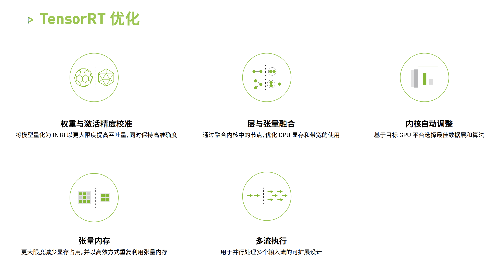
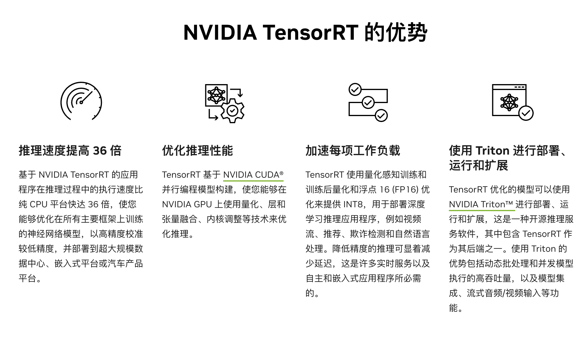

# Inference Optimization: TensorRT 系列

首先吐槽下，NVIDIA 的文档读起来不是很友好。（感觉配色有点怪）

TensorRT 的具体实现过于底层，我的能力有限，无法进行详细的技术角度分析。主要从 User 的角度来简单的使用分析。

## TensorRT

### 是什么？

首先，我们需要了解什么是 TensorRT，TensorRT 是 NVIDIA 推出的一款高性能深度学习推理SDK。此 SDK 包含深度学习推理优化器和运行环境,可为深度学习推理应用提供低延迟和高吞吐量。

我们可以通过一个简短的 example 来说明它的用处。这里主要是基于 NVIDIA 官方提供的 ONNX 使用 Example。


TensorRT 就是针对不同的后端，去继续网络结构等各种优化，最后加速推理性能。更进一步描述：“**根据网络结构、输入、输出tensor、目标GPU的资源，通过实际运行，在候选Kernel库中择优的一个Hardware Aware优化器。**”

### 优化技术

TensorRT 是半开源的，这些核心的优化并没有实际开源。



### 框架优势

TensorRT 的优势主要是：

- 推理速度提升。
- 支持多种模型量化。
- **多应用，多卡推理；单卡多流推理**。



## TensorRT-LLM

### 是什么？

> NVIDIA TensorRT-LLM 是一个开源库，可加速和优化 NVIDIA AI 平台上最新大型语言模型 (LLM) 的推理性能。它让开发人员可以尝试新的 LLM，提供高性能和快速定制，而无需深入了解 C++ 或 CUDA。
>
> TensorRT-LLM is a toolkit to assemble optimized solutions to perform Large Language Model (LLM) inference. It offers a Python API to define models and compile efficient [TensorRT](https://developer.nvidia.com/tensorrt) engines for NVIDIA GPUs. It also contains Python and C++ components to build runtimes to execute those engines as well as backends for the [Triton Inference Server](https://developer.nvidia.com/nvidia-triton-inference-server) to easily create web-based services for LLMs. TensorRT-LLM supports **multi-GPU and multi-node configurations (through MPI).**
>
> TensorRT-LLM 是在 TensorRT 基础上针对大模型进一步优化的加速推理库，它号称可以**增加 4 倍**的推理速度。

### 为什么？（为什么要在有 TensorRT 的情况下推出 TensorRT-LLM）

TensorRT-LLM 的推出是为了满足在现代AI应用中对于大型语言模型高效推理的需求。随着模型尺寸的增长，如 GPT-3 和 BERT，以及用例的复杂性增加，对于一个能够快速、有效地执行这些模型的推理引擎的需求也在增长。传统推理工具可能难以处理如此庞大和复杂的模型，而 TensorRT-LLM 通过提供专门的优化和高级调度技术，能够提高性能，降低能耗和总体成本。

所以，综合看来 TensorRT-LLM 的推出是为了**迎接 Generative AI 爆发式增长做的针对性优化**。

### 框架优势

挑一些对个人用户比较直观的优势：

- **性能提升**：提升 LLM 的推理速度，可以提供多达 4 倍多的性提升[[”]](https://www.techrepublic.com/article/nvidia-announces-tensorrt-llm/)。
- **易于使用**：提供了 Python API ，使得开发者可以更快地创建和部署定制的 LLM 应用，而无需深入了解底层技术。
- **多节点支持**：支持多 GPU 和跨服务器的模型推理，使得它可以在大规模的基础设施上运行。（其实感觉是因为 TensorRT 本身就支持）。

最重要的是，TensorRT-LLM **极大地简化了开发流程**，使得开发者无需深入了解底层的技术细节，也无需编写复杂的 CUDA/C++ 代码。总的来说，TensorRT-LLM 让用户可以专注于模型的设计和优化，而将底层的性能优化工作交给 TensorRT 来完成，大大提高了开发效率和生产效率，真正实现了大模型推理的易用性和高效性。

### 性能对比（对比其他的同类型的框架例如 vLLM）

目前并没有官方公开的对比数据。依据 Github 上 NVIDIA 工作人员的发言：

> We do not plan to publish performance numbers that compare TensorRT-LLM with vLLM.
>
> Our internal measurements show that TensorRT-LLM’s in-flight batching and paged KV cache features work well and TensorRT-LLM can deliver great performance. We’d be happy to provide you with performance numbers for relevant cases.
>
> Is there a particular use case that you’d be interested in?

我认为 TensorRT-LLM 对比 vLLM **应该没有巨大的性能提升**。更为可靠的证据源自某个推特 [[”]](https://twitter.com/HamelHusain/status/1719872352694174093) ，该推特内容说明在同样使用 triton server 进行 Llama 的 inference 情况下，vLLM 的性能比 TensorRT 更优。

### 框架使用（Code Example，完整的适配模型的过程）

这里有一个 TensorRT-LLM 优化 llama 的 Example。

```
# Build the LLaMA 7B model using a single GPU and FP16.
python build.py --model_dir ./tmp/llama/7B/ \
                --dtype float16 \
                --remove_input_padding \
                --use_gpt_attention_plugin float16 \
                --enable_context_fmha \
                --use_gemm_plugin float16 \
                --output_dir ./tmp/llama/7B/trt_engines/fp16/1-gpu/
# With fp16 inference
python3 ../run.py --max_output_len=50 \
                  --tokenizer_dir ./tmp/llama/7B/ \
                  --engine_dir=./tmp/llama/7B/trt_engines/fp16/1-gpu/
```

## vLLM 与 TensorRT-LLM 的选择

综合来说，vLLM 和 TensorRT 都是可以和 triton server 一起使用进行模型部署。而他们两者之间的选择，可以参考：

- vLLM 比 TensorRT-LLM 发布的时间更久，**相关技术博客更多**。vLLM 已经被包括 LMSYS Vicuna 和 Chatbot Arena 在内的平台用来支持其自从 2023 年 4 月份的运行，这也表明了 vLLM 项目的实用性和稳定性。TensorRT-LLM 是23年9月发布的，**网络上的相关资料不多**。
- 对比构造 inference engine 的代码，[TensorRT-LLM build llama](https://github.com/NVIDIA/TensorRT-LLM/blob/main/examples/llama/build.py) 比起 [vLLM 部署 llama](https://zhuanlan.zhihu.com/p/645732302) **要复杂很多**。
- TensorRT-LLM，CUDA 和 Triton Server 都是 NV 的产品，可能联动与优化效果更好。并且虽然 TensorRT-LLM 更为复杂，**但是从极致优化和可定制性的角度 TensorRT-LLM 的上限可能更高**。

从易用性的角度可以选择 vLLM，从性能和扩展性的角度出发可以选择 TensorRT-LLM。

## 实战

- [ ] TODO

## Reference

- [NVIDIA: TensorRT](https://developer.nvidia.cn/tensorrt)
- [NVIDAI: Optimizing Inference on Large Language Models with NVIDIA TensorRT-LLM, Now Publicly Available](https://developer.nvidia.com/blog/optimizing-inference-on-llms-with-tensorrt-llm-now-publicly-available/)
- [:desktop_computer: Github, TensorRT-LLM Llama example](https://github.com/NVIDIA/TensorRT-LLM/tree/main/examples/llama)
- [TensorRT是如何做到比其他框架更快的？-- 知乎还没人谈到的内核部分](https://zhuanlan.zhihu.com/p/666638357)
- [vllm vs TGI 部署 llama v2 7B 踩坑笔记](https://zhuanlan.zhihu.com/p/645732302)
- [🔥Continuous Batching：一种提升 LLM 部署吞吐量的利器 (vLLM 和 TensorRT 都用到了)](https://zhuanlan.zhihu.com/p/657586838)