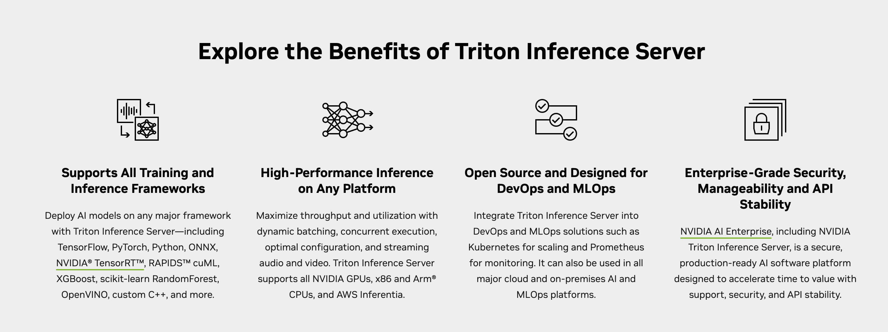
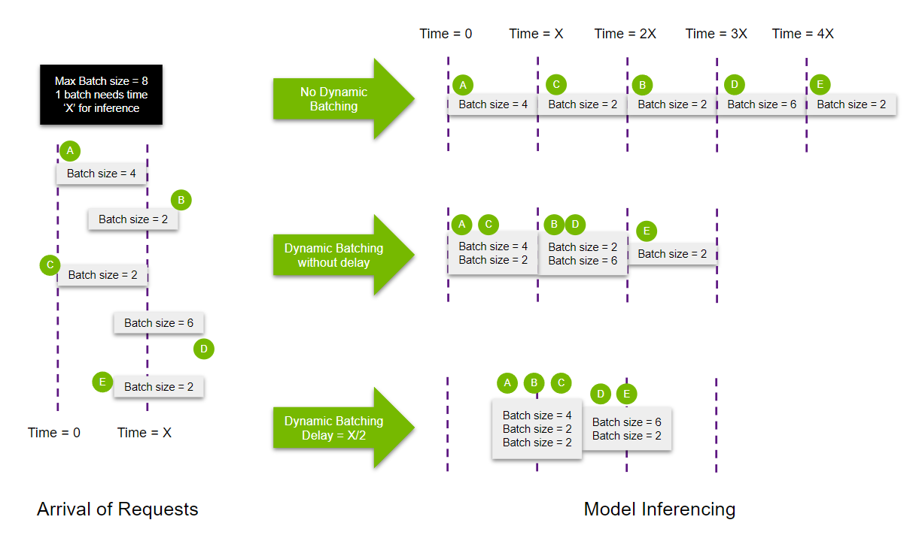
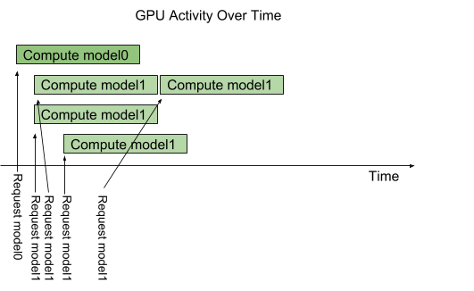
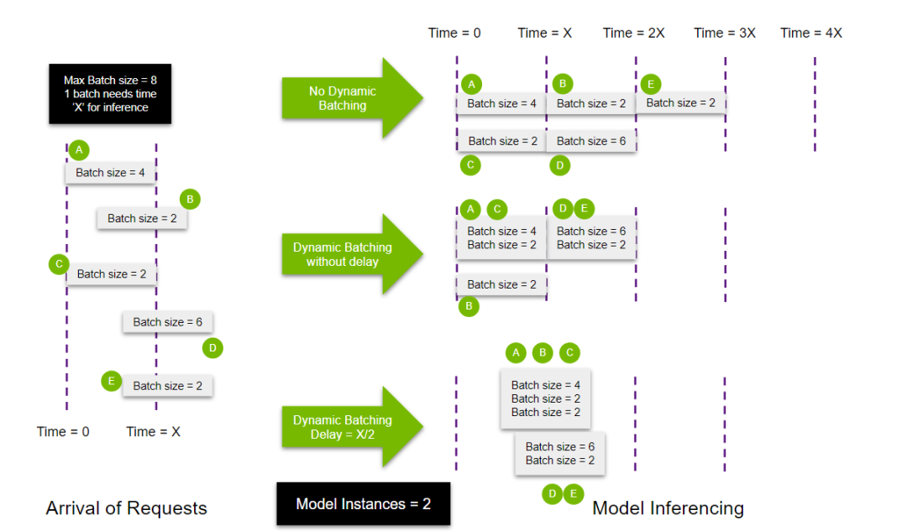

# NVIDIA Triton Inference Server

*Deploy, run, and scale AI for any application on any platform.*

主要有两个 topic 需要探索：

- Triton Inference Server + Client
- PyTriton

我们需要分别搞清楚他们是什么？对 PyTriton 有兴趣的可以直接跳转到 PyTriton 章节。

>  NVIDIA Triton™ 推理服务器是 NVIDIA AI 平台的一部分，它是一款开源推理服务软件，可助力标准化模型的部署和执行，并在生产环境中提供快速且可扩展的 AI。

## Introduction

### What's NVIDIA Triton?

首先一个主要问题是：什么是 Triton？

> Triton 就是一个推理服务器，旨在实现统一的 AI 推理。也就是满足“任何”AI推理需求。
>
> 这是更详细的：Triton 推理服务器可助力团队在任意基于 GPU 或 CPU 的基础设施上部署、运行和扩展任意框架中经过训练的 AI 模型，进而精简 AI 推理。同时，AI 研究人员和数据科学家可在不影响生产部署的情况下，针对其项目自由选择合适的框架。它还帮助开发者跨云、本地、边缘和嵌入式设备提供高性能推理。

### Triton Inference Server Features

这个问题等价于： **Why NVIDIA Triton？**



Triton 的主要优势如上图，**如果对于这部分不感兴趣可以快速的跳到后续的章节**。接下来我需要搞清楚 Triton 的主要优势，为什么 Triton Server 会被这么多专业的产品，团队所使用。

- **🔥 支持多个框架（Supports All Training and Inference Frameworks）**
  - Triton 推理服务器支持所有主流框架，例如 TensorFlow、NVIDIA® TensorRT™、PyTorch、MXNet、Python、ONNX、RAPIDS™ FIL（用于 XGBoost、scikit-learn 等）、OpenVINO、自定义 C++ 等。
  - **重要性：**这个毫无疑问是最重要，也是 Triton 最受欢迎的特效之一，支持大量的框架。
- **🚀 高性能推理（High-Performance Inference）**
  - 中文：Triton 支持所有基于 NVIDIA GPU、x86 和 ARM® CPU 的推理。它具有**动态批处理**、**并发执行**、**最优模型配置**、**模型集成**和**串流输入**等功能，可更大限度地提高吞吐量和利用率。
  - English: Maximize throughput and utilization with **dynamic batching**, **concurrent execution**, **optimal configuration**, and **streaming audio and video**. Triton Inference Server supports all NVIDIA GPUs, x86 and Arm® CPUs, and AWS Inferentia.
  - **重要性：** 推理服务器，最重要的就是推理性能，NVIDAI 作为 AI 计算的行业龙头 Triton 在性能这块优势肯定非常显著。
- 专为 DevOps 和 MLOps 设计（这段暂时忽略 ，感觉和云计算那一套比较沾边）
  - Triton 与 Kubernetes 集成，可用于编排和扩展，导出 Prometheus 指标进行监控，支持实时模型更新，并可用于所有主流的公有云 AI 和 Kubernetes 平台。它还与许多 MLOPS 软件解决方案集成。

> 对于用户来说，我们可能更关系的是高性能推理部分所使用的技术细节（我就是这样）。我们进一步探究。我们将介绍：
>
> - [x] Dynamic Batching
> - [x] Concurrent Execution
> - [ ] Optimal Configuration
> - [ ] Model Ensemble
> - [ ] Streaming audio and Vedio
>
> ### Dynamic Batching
>
> Batch对于GPU上深度学习模型的运行效率影响很大。在 Inference 时，如果同时面临多个请求，如果想提升吞吐量，需要我们把这多个请求组合成一个 batch 由 GPU 进行 Batch Inference。所以 Triton 中的 Dynamic Batching 便是实现了这样的功能。
>
> Triton 支持设置 `max batch size` 大小和 `delay` 区间。我们通过下图可以发现开启 Dynamic Batching 并设置合理的 Delay 可以大幅增强吞吐量。
>
> 
>
> ### Concurrent Execution
>
> Concurrent Execution 在我看来可以立即为**自动管理多线程执行模型推理任务。**
>
> 如下图所示，我们在 GPU 上开了 4 个实例，其中 1 个用来进行 Model0 的推理，3 个用来进行 Model1 的推理。
>
> 
>
> 下图便是 Triton 同时使用 Dynamic Batching 和 Concurrent Execution。上下对比我们发现性能进一步提升。
>
> 
>
> 剩余没有探索的内容可以参考引用如下：
>
> - [知乎：Dynamic Batching！](https://zhuanlan.zhihu.com/p/354633729)
> - [🔥 triton-inference-server的backend（一）——关于推理框架的一些讨论](https://zhuanlan.zhihu.com/p/666655108)
> - [Model Ensemble: Serving ML Model Pipelines on NVIDIA Triton Inference Server with Ensemble Models](https://developer.nvidia.com/blog/serving-ml-model-pipelines-on-nvidia-triton-inference-server-with-ensemble-models/)
> - [NVIDIA: Concurrent inference and dynamic batching](https://docs.nvidia.com/deeplearning/triton-inference-server/user-guide/docs/examples/jetson/concurrency_and_dynamic_batching/README.html)
> - [**最优模型配置**: NVIDIA Triton Model Analyzer](https://github.com/triton-inference-server/model_analyzer)

## Install

如何进行安装。

## Example 实战 Llama-7b


# 🔥PyTriton

## Installation

主要内容可以参考 NVIDAI 的官方文档：[Offical Installation](https://triton-inference-server.github.io/pytriton/latest/installation/)。依据国内的习惯，我推荐参考 Creating virtualenv using `miniconda` 这个 part。我自己的安装经验是：

```bash
# Create your virtual environment.
...

# Export the conda library path
export LD_LIBRARY_PATH=$LD_LIBRARY_PATH:$CONDA_PREFIX/lib

pip install -U nvidia-pytriton
```

（下面的内容可以跳过）之所以需要这个 `export` 语句是因为在安装时遇到了一个小 BUG，在安装后运行了一段 Example 代码但是遇到报错信息：

```
I0212 16:32:55.775014 9771 model_lifecycle.cc:461] loading: Linear:1
/root/.cache/pytriton/workspace_qgciftzs/tritonserver/backends/python/triton_python_backend_stub: error while loading shared libraries: libpython3.9.so.1.0: cannot open shared object file: No such file or directory
```

大概意思是 `libpython3.9.so.1.0` 这么一个动态链接库没找到。其实 Official Installation 里面也有关于这部分的说明。我们只需要在当前的 SHELL 中执行如下命令。

```bash
# Export the conda library path
export LD_LIBRARY_PATH=$LD_LIBRARY_PATH:$CONDA_PREFIX/lib
```

> 其中 `CONDA_PREFIX` 是一个环境变量，它表示当前激活的conda环境的路径。当你使用conda激活一个特定的环境时，conda会自动设置`CONDA_PREFIX`变量来指向那个环境的根目录。而关于 **LD_LIBRARY_PATH** 是什么可以参考我的仓库中的 [`env/cuda-related.md`](https://github.com/keli-wen/AGI-Study/blob/master/env/cuda-related.md#3-multi-cuda-management)。

**⚠️注意我们不能直接在 `~/.bashrc` 或者 `~/.zshrc` 中添加上述命令**。因为我们需要 source 保证更新被应用，但是**通常情况**下 source 会改变当前 conda 虚拟环境，使得 `CONDA_PREFIX` 恒定为 `/opt/conda`（也就是 base 环境）。

## Introduction

> 一个刚发布不久的框架。它其实就是让我们可以在 Python 端直接启动 Triton Inference Server。 

“PyTriton is a Flask/FastAPI-like interface that simplifies Triton's deployment in Python environments. The library allows serving Machine Learning models directly from Python through NVIDIA's [Triton Inference Server](https://github.com/triton-inference-server). The solution is framework-agnostic and can be used along with frameworks like PyTorch, TensorFlow, or JAX.”

PyTriton 提供一种选择让你的 Python 模型可以使用 Triton Inference Server 来处理 HTTP/gRPC 请求。我们使用**阻塞模式**，也就是这个程序会长期运行在你部署的集群上来处理来自 client 的各种请求。

首先，我们要定义好一个 `infer_fn` 回调函数用来处理 inference。如下，这里的修饰器 `@batch` 代表该模型接受 batch 输入。

```py
import numpy as np
from pytriton.decorators import batch


@batch
def infer_fn(**inputs: np.ndarray):
    input1, input2 = inputs.values()
    outputs = model(input1, input2)
    return [outputs]
```

下一步则是通过代码将 Triton 和 `infer_fn` 连接。只需要 `bind` 函数便可以实现。

在阻塞模式下，建议使用 Triton 对象作为上下文管理器。（为什么我也没理解）

通过如下代码便已经定义好了 Triton 该如何处理模型以及 HTTP/gRPC 请求应被定向到何处。

```python
with Triton() as triton:
    triton.bind(
        model_name="MyModel",
        infer_func=infer_fn,
        inputs=[
            Tensor(dtype=bytes, shape=(1,)),  # sample containing single bytes value
            Tensor(dtype=bytes, shape=(-1,)),  # sample containing vector of bytes
        ],
        outputs=[
            Tensor(dtype=np.float32, shape=(-1,)),
        ],
        config=ModelConfig(max_batch_size=16),
    )
    ...
    triton.serve()
```

最后一步之需要使用 `triton.serve()` 便启动了 Triton Inference Serve，所有的请求会被重定向到 `localhost:8000/v2/models/MyModel/infer` 并由 `infer_fn` 执行推理任务。

## Quick Start

如果你想要快速了解 PyTriton 的使用，阅读 [Official: Quick Start](https://triton-inference-server.github.io/pytriton/latest/quick_start/) 是最直接。**它分别介绍了 `server` 和 `client` 的定义与使用。**

对于 `server`，主要是如下几个步骤：

1. 定义 `model`，这里是 `Linear`。
2. 定义 `infer_fn` 用于后续的绑定操作。
3. 通过 `triton.bind(*)` 和 `torch.serve()` 。

```python
import numpy as np
import torch

from pytriton.decorators import batch
from pytriton.model_config import ModelConfig, Tensor
from pytriton.triton import Triton

model = torch.nn.Linear(2, 3).to("cuda").eval()


@batch
def infer_fn(**inputs: np.ndarray):
    (input1_batch,) = inputs.values()
    input1_batch_tensor = torch.from_numpy(input1_batch).to("cuda")
    output1_batch_tensor = model(
        input1_batch_tensor
    )  # Calling the Python model inference
    output1_batch = output1_batch_tensor.cpu().detach().numpy()
    return [output1_batch]


def main():
    # Connecting inference callable with Triton Inference Server
    with Triton() as triton:
        triton.bind(
            model_name="Linear",
            infer_func=infer_fn,
            inputs=[
                Tensor(dtype=np.float32, shape=(-1,)),
            ],
            outputs=[
                Tensor(dtype=np.float32, shape=(-1,)),
            ],
            config=ModelConfig(max_batch_size=128),
        )
        triton.serve()

if __name__ == "__main__":
    main()
```

对于 `client`，可以通过 `curl` 进行访问（具体可以参考上面的链接）。当然，我们更熟悉的是使用 Python。

```python
import torch
from pytriton.client import ModelClient

input1_data = torch.randn(128, 2).cpu().detach().numpy()

with ModelClient("localhost:8000", "Linear") as client:
    result_dict = client.infer_batch(input1_data)

print(result_dict)
```

这样看来，PyTriton 确实大大简化了 Triton Inference Server 的使用流程。

## Deep

### `TritonConfig`

TritonConfig 主要是定制化服务器的一些配置。在**通常情况下我们可能不需要对此进行设置**，如果需要设置请参考 [TritonConfig](https://triton-inference-server.github.io/pytriton/latest/reference/triton_config/)。

### Binding Models to Triton

PyTriton 使用 `bind` 方法来告诉 Triton 如何处理模型推理请求。所以完全的了解 `bind` 操作对于我们熟练使用 PyTriton 非常重要。见这个简单的 Example：

```python
import numpy as np
from pytriton.decorators import batch
from pytriton.model_config import ModelConfig, Tensor
from pytriton.triton import Triton


@batch
def infer_fn(**inputs: np.ndarray):
    input1, input2 = inputs.values()
    outputs = model(input1, input2)
    return [outputs]

with Triton() as triton:
  triton.bind(
      model_name="ModelName",
      infer_func=infer_fn,
      inputs=[
          Tensor(shape=(1,), dtype=np.bytes_),  # sample containing single bytes value
          Tensor(shape=(-1,), dtype=np.bytes_)  # sample containing vector of bytes
      ],
      outputs=[
          Tensor(shape=(-1,), dtype=np.float32),
      ],
      config=ModelConfig(max_batch_size=8),
      strict=True,
  )
```

我们发现 `triton.bind()` 包含如下参数：

- `model_name`：一个字符串，代表 Triton Inference Server 中可用的 Model 名，在发送请求时有用。
- `infer_func`：Python 函数，代表 Triton Inference Server 该如何处理推理请求。
- `inputs`：定义模型输入参数的数量，类型和形状。
- `outputs`：定义模型输出参数的数量，类型和形状。
- `config`：用于对 Triton Inference Server 上的模型部署进行更多定制，比如 `batching` 和 `max_batch_size` 等。
- `strict`：启用对**推理输出**的数据类型和形状进行验证，以确保其符合提供的模型配置（默认为：`False`）。

### Inference Callable

Inference Callable 主要是与 `infer_fn` 相关。正常情况下便是简单定义一个函数处理输入输出即可。接下来我们考虑一些更为复杂的场景。

**❓Q：在多 Instance 背景下，如何定义 `infer_fn`呢？**

当我们存在多个不同场景下的推理任务，我们需要提供一个 Inference Callable 的列表。 **区别于使用 Python 函数，在多任务情况下我们倾向于使用 Wrapper Class，这是因为类可以保持状态，避免开销。** 如下，可以参考一段 code，我们定义了一个 `_InferFuncWrapper` 用来在不同 device 下进行模型推理任务。

```python
import torch
from pytriton.decorators import batch


class _InferFuncWrapper:
    def __init__(self, model: torch.nn.Module, device: str):
        self._model = model
        self._device = device

    @batch
    def __call__(self, **inputs):
        (input1_batch,) = inputs.values()
        input1_batch_tensor = torch.from_numpy(input1_batch).to(self._device)
        output1_batch_tensor = self._model(input1_batch_tensor)
        output1_batch = output1_batch_tensor.cpu().detach().numpy()
        return [output1_batch]
```

然后再使用一个工厂函数来创建各种需要的 `_InferFuncWrapper`。

```python
import numpy as np
from pytriton.triton import Triton
from pytriton.model_config import ModelConfig, Tensor


def _infer_function_factory(devices):
    infer_fns = []
    for device in devices:
        model = torch.nn.Linear(20, 30).to(device).eval()
        infer_fns.append(_InferFuncWrapper(model=model, device=device))

    return infer_fns


with Triton() as triton:
  triton.bind(
      model_name="Linear",
      infer_func=_infer_function_factory(devices=["cuda", "cpu"]),
      inputs=[
          Tensor(dtype=np.float32, shape=(-1,)),
      ],
      outputs=[
          Tensor(dtype=np.float32, shape=(-1,)),
      ],
      config=ModelConfig(max_batch_size=16),
  )
  ...
```

### Defining Inputs and Outputs

如何在使用 Triton Inference Server 时需要定义 input 和 output 的 shape，数据类型，PyTriton 同样需要你进行定义。**这是我在最初进行实践时遇到过最棘手的问题。尤其是当 input 为字符串类型的 prompt 时，我们可以参考 official example 来解决字符串 prompt input 可能的问题。**

举个简单的例子：

```python
import numpy as np
from pytriton.model_config import Tensor

inputs = [
    Tensor(dtype=np.float32, shape=(-1,)),
]
output = [
    Tensor(dtype=np.float32, shape=(-1,)),
    Tensor(dtype=np.int32, shape=(-1,)),
]
```

这里就定义了一个输入和两个输出。并且需要注意的是：`-1` 代表动态的输入或输出 shape（**注意这里的 `-1` 并不意味着支持 batch**），如果想要准确的定义 shape，则需要全部写全，例如：`Tensor(name="image", dtype=np.float32, shape=(224, 224, 3))`。

而 `dtype` 参数可以是`numpy.dtype`，`numpy.dtype.type` 或者 `str`，例如：

```python
import numpy as np
from pytriton.model_config import Tensor

tensor1 = Tensor(name="tensor1", shape=(-1,), dtype=np.float32),
tensor2 = Tensor(name="tensor2", shape=(-1,), dtype=np.float32().dtype),
tensor3 = Tensor(name="tensor3", shape=(-1,), dtype="float32"),
```

> 当使用 `bytes` 数据类型时，NumPy会删除尾随的 `\x00` 字节。因此，如果当时数据可能出现任何字节（原文中说的是 arbitrary bytes），需要使用 `object` 数据类型。
>
> ```python
> > np.array([b"\xff\x00"])
> array([b'\xff'], dtype='|S2')
> 
> > np.array([b"\xff\x00"], dtype=object)
> array([b'\xff\x00'], dtype=object)
> ```
>
> **这里的 `|S2` 有小伙伴可能比较困惑，其实就代表每个元素都是一个 `bytes` 类型。其中 2 代表最长的字节数，不理解的请稍微往下浏览，后续还会通过 example 进行解释。** 
>
> 但是，如果当我们是对 `string` 进行编码时，为了方便我们**可以使用 `bytes` 类型**。
>
> 首先，`\x00` 代表空字符，而标准文本字符串（如UTF-8编码的字符串）一般不包含 `\x00` 字节。所以我们在处理**prompt时可以放心的使用 `bytes`，对于非文本数据（如二进制文件内容、某些特殊格式的字符串或其他任意字节数据），在转换为 `bytes` 时可能会包含 `\x00` 字节。这类数据中的 `\x00` 字节可能是数据的一部分，因此在这种情况下使用 `object` 类型更为安全，以避免在处理（如存储或传输）时丢失这些重要的字节。**
>
> 在 Python 中，`bytes` 类型是一个不可变的序列，用于存储字节（即0到255范围内的整数）。它通常用于处理二进制数据，如文件读写、网络通信中的数据传输，以及在处理原始数据时（如图像或声音文件的内容）。【GPT4解释】

所以当我们处理 prompt 输入时，可以参考 [NVIDIA official example: hugging face bart pytorch](https://github.com/triton-inference-server/pytriton/blob/main/examples/huggingface_bart_pytorch/client.py#L61-L68)。我们使用 [`np.char.encode`](https://numpy.org/doc/stable/reference/generated/numpy.char.encode.html) 为 sequence 中的每个字符次进行编码。这里的 48 代表的便是 np 数组中最长的字符串所占字符数。

```python
sequence = np.array(
    [
        ["one day I will see the world"],
        ["I would love to learn cook the Asian street food"],
        ["Carnival in Rio de Janeiro"],
        ["William Shakespeare was a great writer"],
    ]
)
"""
> sequence
array([['one day I will see the world'],
       ['I would love to learn cook the Asian street food'],
       ['Carnival in Rio de Janeiro'],
       ['William Shakespeare was a great writer']], dtype='<U48')
"""
sequence = np.char.encode(sequence, "utf-8")
"""
> sequence
array([[b'one day I will see the world'],
       [b'I would love to learn cook the Asian street food'],
       [b'Carnival in Rio de Janeiro'],
       [b'William Shakespeare was a great writer']], dtype='|S48')
"""
```

而 Triton 服务端端 input 和 output 设置如下所示，并不是 `(4,1)` ，因为 `4` 是 batch 数，由 `infer_fn` 中的 `@batch` 修饰器处理。

```python
inputs=[Tensor(name="sequence", dtype=bytes, shape=(1,))],
outputs=[Tensor(name="label", dtype=bytes, shape=(1,))],
```


## BUG

这里收集了一些 Installation 和 Runtime 中出现的 bug。

```
$ python example_1.py
...
/root/.cache/pytriton/workspace_oukek3b2/tritonserver/bin/tritonserver: /opt/conda/envs/MS/lib/libstdc++.so.6: version `GLIBCXX_3.4.30' not found (required by /root/.cache/pytriton/workspace_oukek3b2/tritonserver/bin/tritonserver)
...
```

这个 Issue 提到了这个问题[Github Issue: version `GLIBCXX_3.4.30` not found](https://github.com/triton-inference-server/server/issues/5933)。它说明我们系统中缺少特定版本的GLIBCXX库，或者系统中的库版本低于所需版本。

解决方法是在对应的 Conda 虚拟环境下执行 `conda install -c conda-forge libstdcxx-ng=12 -y`。其中 `-y` 代表选择全部为 `yes`。

> 我们可以使用 `strings /opt/conda/envs/MS/lib
> /libstdc++.so.6 | grep GLIBCXX` 来查看当前动态库支持的 GLIBCXX 版本。
>
> 解决方法中提到的术语包括：
>
> 1. **GLIBCXX**：`GLIBCXX` 是 GNU C++ Standard Library（标准C++库）的一部分，是 GCC（GNU Compiler Collection）的一部分。不同版本的 GCC 附带不同版本的 GLIBCXX 库。当软件或代码编译时，它们可能依赖于特定版本的 GLIBCXX，因此运行这些程序时需要确保系统具有相应版本的 GLIBCXX。
>
> 2. **libstdcxx-ng**：`libstdcxx-ng` 是在 Conda 生态系统中提供的 GNU C++ Standard Library 的包。它是 GCC 的 C++ 库的 Conda 版本，包括 `libstdc++.so` 共享库。通过安装特定版本的 `libstdcxx-ng` 包，可以在 Conda 环境中提供对应版本的 GLIBCXX。

## vLLM optimization

> 这个还挺重要的，感觉能出 2～3 个PR。
>
> 如果可以最后还可以实际的测一下性能的对比。

我有一个困惑是 PyTriton + vLLM 的组合能否一起使用呢？经过验证这实际上是可行的。

可以参考的文献：

- [Binding Models to Triton](https://triton-inference-server.github.io/pytriton/latest/binding_models/)
- [NVIDIA PyTriton Example: vLLM](https://github.com/triton-inference-server/pytriton/tree/main/examples/vllm)
  - 问题一，没有清晰的展示单一 prompt 和 batch prompt 的使用区别？
- [NVIDIA PyTriton Example: BART-PyTorch](https://github.com/triton-inference-server/pytriton/tree/main/examples/huggingface_bart_pytorch)
  - 展示了，但是直接使用在 vLLM 中会出现问题。

```

```

# Reference

- [NVIDIA Triton 推理服务器](https://developer.nvidia.cn/triton-inference-server)
- [NVIDIA AI Triton 推理服务器（同上面内容类似）](https://www.nvidia.cn/ai-data-science/products/triton-inference-server/) 
- [NVIDIA Triton Inference Server](https://www.nvidia.com/en-us/ai-data-science/products/triton-inference-server/)
- [Blog: Deploying Llama2 with NVIDIA Triton Inference Server](https://blog.marvik.ai/2023/10/16/deploying-llama2-with-nvidia-triton-inference-server/)
- [Fast and Scalable AI Model Deployment with NVIDIA Triton Inference Server（介绍整体的 Triton 特性）](https://developer.nvidia.com/blog/fast-and-scalable-ai-model-deployment-with-nvidia-triton-inference-server/)
