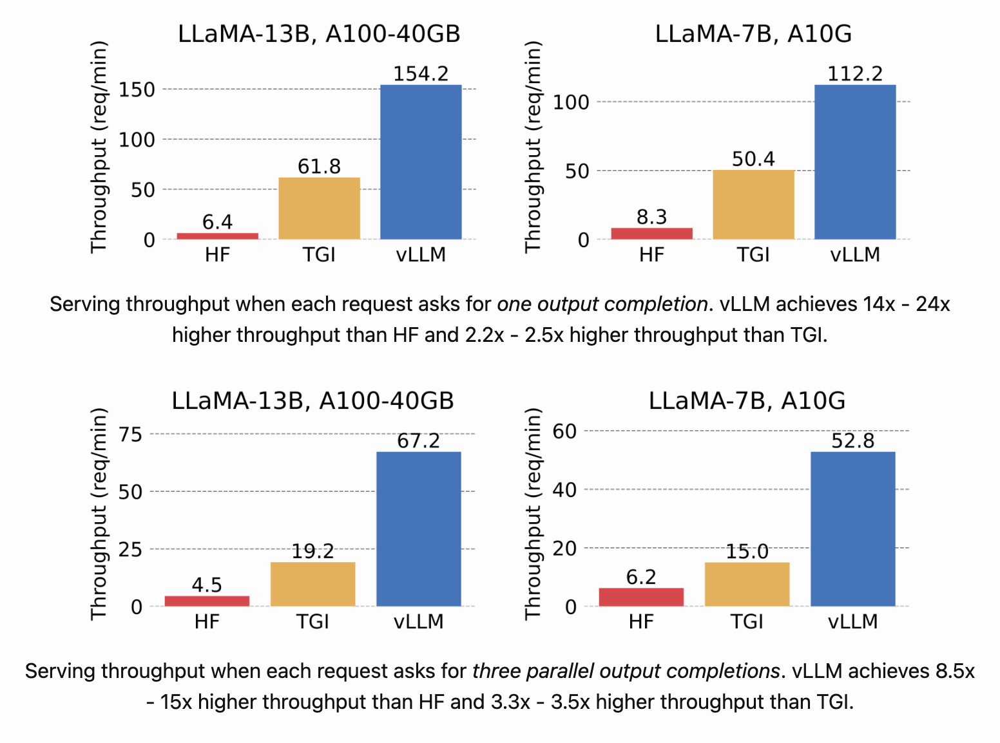

# vLLM Study

*--- vLLM is a high-throughput and memory-efficient inference and serving engine for LLMs.*

***v* means [virtual](https://github.com/vllm-project/vllm/issues/835).**

在这篇博客中，我们将深入探索vLLM，这是目前最热门的几个推理加速引擎之一，并且它是完全开源的。本篇内容将分为两个部分：

1. **vLLM的使用与部署**：这一部分主要基于官方文档，提供vLLM的使用和部署指南，旨在为用户提供清晰、直接的操作步骤。
2. **vLLM源码探索**：在这一部分，我们将深入vLLM的源代码，分析其工作原理和架构，为对技术细节感兴趣的读者提供深度解析。

## vLLM 的使用/部署

vLLM 是一个快速且易于使用的大型语言模型(LLM)推理和服务库。下面是 vLLM 带来的推理速度的可视化结果。



vLLM 之所以快速，主要得益于：

- **最先进的服务吞吐量**：提供业界领先的处理速度。
- **高效的注意力键值内存管理**：通过 PagedAttention 技术实现高效管理。
- **连续批处理来自请求**：能够连续不断地处理输入请求。
- **使用 CUDA/HIP 图的快速模型执行**：借助 CUDA/HIP 技术，提高模型运行效率。
- **量化技术**：包括 GPTQ、AWQ、SqueezeLLM 等先进的量化方法。
- **优化的 CUDA 核心**：通过优化 CUDA 核心提高性能。

vLLM 在灵活性和易用性方面表现出色，具体体现在：

- **与流行的 HuggingFace 模型无缝集成**：方便用户与当前流行的模型进行整合。
- **支持多种解码算法的高吞吐量服务**：包括并行采样、束搜索等多种算法。
- **支持张量并行性的分布式推理**：适用于分布式系统的推理计算。
- **流式输出**：支持连续数据流的输出方式。
- **兼容 OpenAI 的 API 服务器**：易于与 OpenAI 生态系统集成。
- **支持 NVIDIA 和 AMD GPU**：兼容主流的 GPU 硬件。

接下来进行更为详细的使用介绍，从各个角度分析：vLLM 可用性与使用性。

### Install

You can install vLLM using pip:

```
$ # (Optional) Create a new conda environment.
$ conda create -n myenv python=3.9 -y
$ conda activate myenv

$ # Install vLLM with CUDA 12.1.
$ pip install vllm
```

### 🔥 Serve

vLLM 非常方便的支持离线的推理，也能实现完全兼容 OpenAI API 的服务。下面介绍一下目前 vLLM 的优势，及其特效对应的实现或者 Example。

- Distributed Inference and Serving，支持使用  [Megatron-LM’s tensor parallel algorithm](https://arxiv.org/pdf/1909.08053.pdf) 的多级多卡的分布式 inference。其中：
  - 多卡只需要设置 `llm = LLM("facebook/opt-13b", tensor_parallel_size=4)` 
  - 多机需要和 [Ray runtime](https://docs.ray.io/en/latest/ray-core/starting-ray.html) 一起使用。【略复杂】
- Running on clouds with SkyPilot, vLLM 支持通过 SkyPilot 在任何云上直接使用。
  - 首先，需要了解的是SkyPilot 是一个开源的框架，用于在任何云环境上无缝、且经济高效地运行机器学习与LLM任务。这里有一篇很不错的[介绍](https://zhuanlan.zhihu.com/p/591958927)。
  - 这里也已经有一篇完整的博客 [《Sky Pilot：一键在任意云上运行 LLMs》](https://guoxudong.io/post/skypilot/)，用于介绍如何通过 SkyPilot 在 **Azure** 上部署 Llama-2 Chatbot。
- Deploying with NVIDIA Triton，[Triton Inference Server](https://github.com/triton-inference-server) 提供了一个专门的文档用于指导**如何部署一个使用了 vLLM 的模型**：[Deploying a vLLM model in Triton](https://github.com/triton-inference-server/tutorials/blob/main/Quick_Deploy/vLLM/README.md#deploying-a-vllm-model-in-triton)。
- Deploying with Docker，vLLM 提供了官方的 docker image 用来部署。
- Production Metrics，vLLM 公开了许多可用于监控系统健康状况的指标。例如：`gauge_avg_generation_throughput`。并且**还提供了完整的 [benchmark 脚本直](https://github.com/vllm-project/vllm/tree/main/benchmarks)接使用。**

### Model

vLLM 直接支持 hugging face 中的一些模型结构。当然，最简单的方法便是通过以下的流程去实际测试模型能否正常的生成 output。

> The easiest way to check if your model is supported is to run the program below:
>
> ```
> from vllm import LLM
> 
> llm = LLM(model=...)  # Name or path of your model
> output = llm.generate("Hello, my name is")
> print(output)
> ```
>
> If vLLM successfully generates text, it indicates that your model is supported.

#### Adding a new model.

但是，**当 vLLM 不支持我们的模型时**，我们需要通过一系列步骤注册我们的模型。vLLM 提供了一份详细的官方指南 [vLLM: Adding a New Model](https://docs.vllm.ai/en/latest/models/adding_model.html)。对于添加新模型的复杂性，vLLM 团队也给出了一些注意事项：

> The complexity of adding a new model depends heavily on the model’s architecture. The process is considerably straightforward if the model shares a similar architecture with an existing model in vLLM. However, for models that include new operators (e.g., a new attention mechanism), the process can be a bit more complex.
>
> 模型结构越接近 vLLM 已支持的模型，则注册更为简单。

### Quantization

目前 vLLM 支持的是 AWQ （Activation-aware Weight Quantization）量化。但是 vLLM 官方进行了提醒：

> Please note that AWQ support in vLLM is **under-optimized** at the moment. We would recommend using the **unquantized version of the model** for better accuracy and higher throughput. 

也就是 vLLM 目前==不推荐使用量化后的模型==。如果确实需要，则主要借助于 [AutoAWQ](https://github.com/casper-hansen/AutoAWQ) 框架。整体的量化流程也很简单，doc 中提供了一个清晰的 [Example](https://docs.vllm.ai/en/latest/quantization/auto_awq.html)。

### 可能的缺陷

- vLLM 的推理结果和 hf 的不一致。
- `batch_size = 1` 的时候，推理速度的优化力度不明显。

### Comparison with `TensorRT-LLM`

目前并没有官方公开的对比数据。依据 Github 上 NVIDIA 工作人员的发言：

> We do not plan to publish performance numbers that compare TensorRT-LLM with vLLM.
>
> Our internal measurements show that TensorRT-LLM’s in-flight batching and paged KV cache features work well and TensorRT-LLM can deliver great performance. We’d be happy to provide you with performance numbers for relevant cases.
>
> Is there a particular use case that you’d be interested in?

我认为 TensorRT-LLM 对比 vLLM **应该没有巨大的性能提升**。更为可靠的证据源自某个推特 [[”]](https://twitter.com/HamelHusain/status/1719872352694174093) ，该推特内容说明在同样使用 triton server 进行 Llama 的 inference 情况下，vLLM 的性能比 TensorRT 更优。

## vLLM 的实现原理/Code

- [vLLM框架原理——PagedAttention](https://zhuanlan.zhihu.com/p/649537608)

> Q: PageAttention 中：***序列在分块之后，只有最后一个块可能会浪费内存（实际中浪费的内存低于4%）***
>
> 为什么只有最后一个块可能会浪费内存呢？能为我解释下吗？

这里的块是 `block` 的意思，也就是这个 block 中有很多 slot，所以这里的意思是最后一个 `block` 可能填不满。

> 没有 PageAttention 之前为什么会有内存浪费呢？没有 PageAttention 之前的 KV Cache 是怎么管理的呢？

按照物理连续存储的方式可能会造成显存碎片化。普通的huggingface的kv cache是每个用户给一个固定大小的显存空间，有浪费，这个相当于切成几个字几个字所有用户塞在一块，有多少用多少，不会浪费。

- [LLM 高速推理框架 vLLM 源代码分析 / vLLM Source Code Analysis](https://zhuanlan.zhihu.com/p/641999400)
- [vLLM皇冠上的明珠：深入浅出理解PagedAttention CUDA实现](https://zhuanlan.zhihu.com/p/673284781)
- [vLLM & PagedAttention 论文深度解读（一）—— LLM 服务现状与优化思路](https://zhuanlan.zhihu.com/p/656939628)

- [大模型推理性能优化之KV Cache解读](https://zhuanlan.zhihu.com/p/630832593)

- [大模型推理加速：看图学KV Cache](https://zhuanlan.zhihu.com/p/662498827)

> 这篇还不错，通过可视化一步步的计算步骤展示了 KV Cache 的优化。（KV Cache 是基础优化）同时还说明了 KV Cache 是内存刺客的问题。
>

- [极智AI | 大模型优化之KV Cache](https://juejin.cn/post/7287768247889559611)
