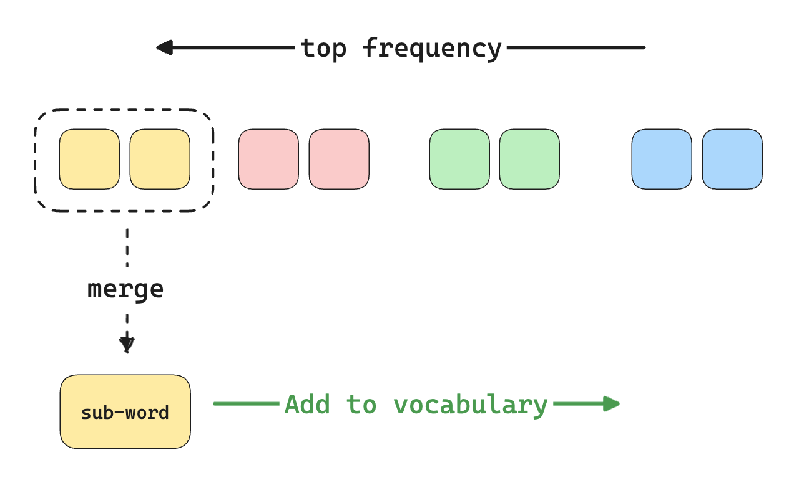
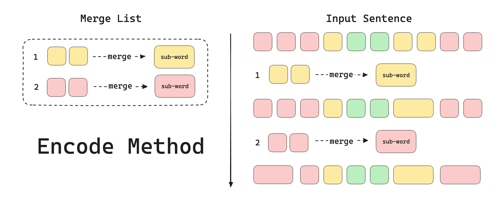

# Byte-Pair Encoding

⏰ Read : `30min`

Tokenize 的原理我认为是 NLP/LLM 领域的 Meta Knowledge 之一。而 BPE 可以说是当前最流行的分词算法，今天我结合一些前辈优秀的工作探索一下 BPE 算法的原理。

## Introduction

首先几个快问快答引导一下大家的思考：

- BPE 原始文章的内容介绍什么？“This article describes a simple general-purpose data compression algorithm, called Byte Pair Encoding (BPE)” 也就是一个压缩算法。
- BPE 现如今的主要职责是？作为分词算法，构建词表并进行编码与解码。
- 为什么需要专门的分词算法，又为什么选择 BPE 而不是其他的压缩编码算法呢，例如 Huffman 编码？

在目前的 NLP 范式中，输入通常是一段文本序列。在任何领域中的研究中，我们倾向于先确定最小单元，比如原子，普朗克时间。尽管后续的研究可能推翻这一结论，但确定最小单元有助于研究的开展。在 NLP 领域中，我们把 token 作为文本/序列数据中的最小离散单元。

所以分词，便是将输入序列拆分为一组 token 的“观测”手段。它也和我们的日常息息相关，例如中文的**字词**，英文中以空格分割的**单词**等。所以一个很直觉的发问是：为什么不直接以空格作为分隔符进行分词呢？例如：`你好世界。 -> [你, 好, 世, 界, 。]` 或者 `I wen to New York last week. -> [i, went, to, new, york, last, week, .]`。

我个人给出一些可能的原因：

- 首先，直接按空格进行分词会**导致词表大小不必要的庞大**，如果希望限定词表大小还需要进一步考虑词表中 token 优先级的设定（即当容量填满时如何淘汰 token）
- 其次，按空格分词会导致分词粒度太大。这会导致大量的 out of vocabulary （OOV） 的问题，并且缺乏**泛化性**。下面我们具体解释下泛化性。

例如按空格分词的词表为 `[rich, old, older, oldest, hard, harder, hardest]` ，而如果使用**子词** `er`，`est` ，词表变为 `[rich, old, hard, er, est]`，即节省了空间，还能在一定程度上学到**词**之间的相关性，避免一部分 OOV 问题（例如现有方案对于 `richest` 也可以进行合理的编码，而在原始的方案中会变成 `unknown`）。

所以，用 sub-word （子词）进行编码的好处呼之欲出。既能节省空间，又能提升泛化性来解决 OOV 问题。

## Why BPE

> 为什么选择 BPE 而不是其他的压缩编码算法呢，例如 Huffman 编码？

这个问题可以参考论文中的解释。，

*“--- The main difference to other compression algorithms, such as Huffman encoding, which have been proposed to produce a variable-length encoding of words for NMT (Chitnis and DeNero, 2015), is that our symbol sequences are still interpretable as subword units, and that the network can generalize to translate and produce new words (unseen at training time) on the basis of these subword units.”* **《Neural Machine Translation of Rare Words with Subword Units》Section2.2**

主要区别在于，BPE 生产的**符号序列**仍然可以理解和解释为子词单位，并且模型可以基于这些子词单位推广，去理解那些没有见过（不在词表中）的新词，解决 OOV 问题。

其中，符号序列我认为可以立即为词表中的 token。对于 Huffman 编码，生成的词表可能是 `101`，`010` 的比特序列，相比于 BPE 生成的类似于 `[low, er, est]`，后者可以更好的进行泛化。

所以总的来说，BPE 的优势是什么呢？

- 简单，基于贪心的算法思想使得其实现更简洁。
- 可以避免词表不必要庞大的问题，并且其范式更科学（可以轻松的指定期望的词表大小）。
- 可以很好的处理 OOV 问题（Out of Vocabulary），且避免陷入使用 Character Embedding 方法导致的分词粒度太细的问题。而后文中提到的字节级 BPE 实现可以直接避免 OOV 问题。

## BPE 原理

<div align=center>

</div>

BPE 的原理很简单，有点类似于[哈夫曼编码](https://zh.wikipedia.org/zh-sg/%E9%9C%8D%E5%A4%AB%E6%9B%BC%E7%BC%96%E7%A0%81)的感觉。我们先介绍一下 BPE 如何构建词表。

这里举一个简单的例子（参考 Hugging Face Blog）

> 一般情况下，在构建词表之前还存在 `Normalization` 和 `Pre-tokenization`。理解起来不难：
>
> - `Normlization` 可以是 **统一转化为小写** 等类似的操作。例如，`Hello World! -> hello wolrd!`
> - `Pre-tokenization` 一般是按空格拆分输入序列。例如，`hello world! -> [hello, world, !]`
>
> 想要了解更多可以参考 Reference 中的 [Hugging Face Learn: Normalization and pre-tokenization](https://huggingface.co/learn/nlp-course/chapter6/4)。

```
"hug", "pug", "pun", "bun", "hugs"
```

**Step1 基础词表** 首先，我们会有一个基础词表。`["b", "g", "h", "n", "p", "s", "u"]`。通常情况下，我们应该至少保证基础词表包括了所有的 ASCII 码字符，甚至一部分 Unicode 字符。如果需要 tokenize 的序列存在训练集中没出现过的字符，那么会导致 unknown token 的出现（也就是 OOV 问题）。

> GPT2 使用了一个小技巧，即把每个字符视为字节组成。那么基础词表的大小就有且仅有 256。任何可能的字符都会被该基础词表包括，不存在任何 OOV 问题。这个技巧称为**字节级 BPE（byte-level BPE）**。更为具体的说，假设我们有一个包含 256 个 ASCII 码的基本词表，现在需要 tokenize 一个字符 `π`，其不存在直接对应的 ASCII 码，如果不用字节级 BPE 该字符会被视为 OOV，而使用字节级 BPE 该字符会被拆分为 `[\xcf, \x80]` 两个 token。

接下来的步骤便是，一步步通过**学习**合并添加新的子词，直到满足我们所需要的词表大小。

**Step2 合并规则** BPE 算法会统计所有连续 token 对的出现频率。（例如 `12123 -> {"12" : 2, "21" : 1, "23" : 1}`）然后合并出现频率最高的 token 对，更新相关信息并循环这个过程。（是不是有点类似于 Huffman）

上图便对应的是 step2 的操作，本质上来说 BPE 还是挺简单的。

网上有很多很精彩的播客通过例子一步步的解释了这个过程，为了避免重复和赘述，我仅附上几个比较经典的：

- [Hugging Face: Byte-Pair Encoding tokenization](https://huggingface.co/learn/nlp-course/en/chapter6/5#training-algorithm) 附带 colab，我觉得很棒，不懂可以逐步调试。
- [Lei Mao Blog: Byte Pair Encoding](https://leimao.github.io/blog/Byte-Pair-Encoding/#Byte-Pair-Encoding-Algorithm) 很多人翻译的佳作。

这里强调和分享一些词表构建中的关键的信息。

- 为什么在 Training 的时候，我们需要为所有句子的结尾添加诸如 `</w>` 等结尾标识符呢？尝试思考下，如果没有结尾标识符， 无法区分 `estimate` 中的 `est` 和 `hardest` 中的 `est`。而通过添加结尾标识符，`est` 和 `est</w>` 便是不同的 sub-word 了（这里的 `</w>` 仅作介绍用途，在实际工程例如 `SentencePiece` 中，会存在其他的优化）。
- 在我的阅读过程中，我发现有两种范式的 BPE，第一种是在进行**合并**的过程中，会将词表中频率为 0 的 token **删除**，这种通常出现在博客理论解释部分中。另一种则是，**合并**只涉及往词表中添加新的 token，不会进行删除操作，这种则多见于代码实现，更工程化。

接下来，`encode` 和 `decode` 的实现原理便十分简单了。

对于 `decode` 方法， 我们只需要对拿 token id 到词表中去查询对应的 token 即可。（可以参考后续的代码解读）

而对于 `encode` 方法，则稍微复杂一点。参考下图，我们需要在构建词表的**合并**步骤中，保留每次合并操作记录（Merge List）。当我们要执行 `encode` 操作时，我们按照 Merge List 中的顺序，逐个尝试应用 Merge List 规则（显然，如果用 Merge List 建图，最终得到的是一组 DAG），当所有 Merge List 应用完成后便得到了最终分词后的结果。

那之前所说的 OOV 问题呢？由于这里我提及的是字节级 BPE，所以不存在 OOV 问题。

<div align=center>

</div>

## 代码实现（解读）

这里主要引用的是 `minbpe` 仓库，该仓库应该是由某 openai 前员工制作的：最简洁的字节级 BPE 算法实现。

首先考虑如何实现 `get_stats` 函数，即统计连续 token 对的频率，`minbpe` 利用 `zip` 方法给出了非常简洁的实现。

```python
def get_stats(ids, counts=None):
    """
    Given a list of integers, return a dictionary of counts of consecutive pairs
    Example: [1, 2, 3, 1, 2] -> {(1, 2): 2, (2, 3): 1, (3, 1): 1}
    Optionally allows to update an existing dictionary of counts
    """
    counts = {} if counts is None else counts
    for pair in zip(ids, ids[1:]): # iterate consecutive elements
        counts[pair] = counts.get(pair, 0) + 1
    return counts
```

然后考虑如何实现 `merge` 函数，即合并对应的 token 对。其中 `ids` 可以理解为 token id 序列（是一组整数数组），`idx` 则为新构造出来的 sub-word token 的索引。

```python
def merge(ids, pair, idx):
    """
    In the list of integers (ids), replace all consecutive occurrences
    of pair with the new integer token idx
    Example: ids=[1, 2, 3, 1, 2], pair=(1, 2), idx=4 -> [4, 3, 4]
    """
    newids = []
    i = 0
    while i < len(ids):
        # if not at the very last position AND the pair matches, replace it
        if ids[i] == pair[0] and i < len(ids) - 1 and ids[i+1] == pair[1]:
            newids.append(idx)
            i += 2
        else:
            newids.append(ids[i])
            i += 1
    return newids
```

剩下的 `train`，`encode` 和 `decode` 便是基于这两个方法实现上述的理论，推荐阅读[源代码](https://github.com/karpathy/minbpe/blob/master/minbpe/basic.py)，仅仅不到 80 行。

## Next Read & TODO

- SentencePiece 探究与使用

## Reference

- [Hugging Face Learn: Normalization and pre-tokenization](https://huggingface.co/learn/nlp-course/chapter6/4)
- [Hugging Face Learn: Byte-Pair Encoding tokenization](https://huggingface.co/learn/nlp-course/en/chapter6/5#byte-pair-encoding-tokenization)
- [WIKI: 霍夫曼编码](https://zh.wikipedia.org/zh-sg/%E9%9C%8D%E5%A4%AB%E6%9B%BC%E7%BC%96%E7%A0%81)
- [Paper: A New Algorithm for Data Compression](http://www.pennelynn.com/Documents/CUJ/HTML/94HTML/19940045.HTM)
- [Paper: Neural Machine Translation of Rare Words with Subword Units](https://arxiv.org/pdf/1508.07909)
- [Lei Mao: Byte Pair Encoding](https://leimao.github.io/blog/Byte-Pair-Encoding/#Byte-Pair-Encoding-Algorithm)
- [Github Repo: minbpe](https://github.com/karpathy/minbpe)

